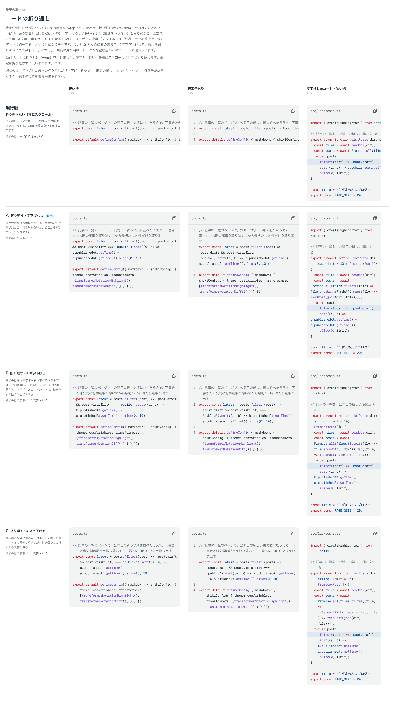

# 0409. CodeBlock の折り返しは既定でしない。折り返すときは、続きの行を行の字下げと同じだけ下げる

- ステータス: Accepted
- 日付: 2026-10-01
- ラウンド: 後半 軸 442

## 背景

CodeBlock に折り返し（`wrap`）を足すにあたり、折り返した続きの行をどれだけ字下げするかを決めました。

## 候補

比較は、決めた時点のコミット `a6fca55` の比較のストーリー（`design/stories/axis-442-code-block-wrap.stories.tsx`）です。列は「長い行」「行番号あり」「字下げしたコード・狭い幅」です。

| 案             | 続きの行の字下げ                                                                           |
| -------------- | ------------------------------------------------------------------------------------------ |
| 現行版（既定） | 折り返さない（横にスクロール）                                                             |
| A              | 0                                                                                          |
| B              | 2 文字                                                                                     |
| C              | 4 文字                                                                                     |
| 採用           | その行の字下げ（行頭の空白）と同じだけ。A の挙動を土台にし、字下げのある行は同じだけ下げる |

## 決定

**折り返しは既定でしません（現行版のまま）。** `wrap` を渡したとき、続きの行はその行の行頭の空白と同じだけ下げます。字下げのない行の続きは、行の頭にそろいます。固定の 2・4 文字の字下げ（B・C）は採りません。

- 長い行は A と同じ見え方です。コードの字下げ（2 文字など）がある行は、続きも同じだけ下がるので、段の構造が崩れません
- 行番号があるときも、続きの行には番号が付きません

## 理由

ユーザーの返事の原文です。

> 442 デフォルトは折り返しナシの前提で、行の字下げに統一する、という形になりそうです。長い行なら A の挙動のままで、2文字字下げしているなら同じように2文字下げる、かなと。

## 却下した案と理由

B・C（固定の字下げ）は採りませんでした。コードの段の深さに関わらず同じ字下げを足すと、続きと次の段の区別が弱くなるためです。

## 影響

- `src/components/code-block/CodeBlock.tsx`: `wrap`（既定 `false`）を持ちます
- `src/components/code-block/use-wrap-indent.ts`: 行頭の空白の桁数を行ごとに測って渡します
- 比べるためだけに置いた `--codeblock-wrap-indent` は消しました
- 比較のストーリーは消しました

## 原則への反映

反映なし。コードの折り返しの字下げの決定で、原則が新しく扱う対象は増えていません。

## 比較画像

決めた時点のコミットは、比較が `a6fca55`、実装が `0d27ad0` です。`git checkout a6fca55 && pnpm storybook` で、比較のストーリー（`Design Review/442 コードの折り返し`）を決めたときの部品のまま開けます。
