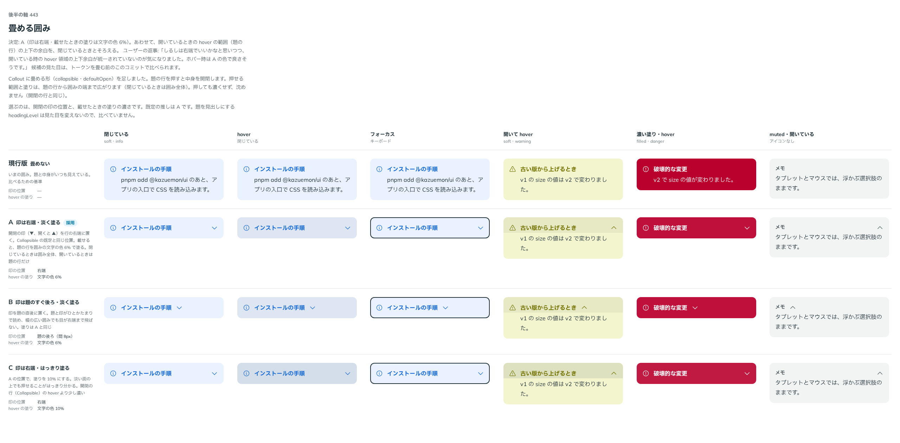

# 0410. Callout の畳める形は、山形は右端・載せたときの塗りは淡く。開いているときも上下の余白をそろえる

- ステータス: Accepted
- 日付: 2026-10-01
- ラウンド: 後半 軸 443

## 背景

Callout に畳める形（`collapsible`）を足すにあたり、開閉の印の位置と、題の行に載せたときの塗りの濃さを決めました。

## 候補

比較は、決めた時点のコミット `8cf8d0d` の比較のストーリー（`design/stories/axis-443-callout-collapsible.stories.tsx`）です。列は「閉じている」「hover」「フォーカス」「開いて hover」「濃い塗り・hover」「muted・開いている」です。

| 案        | 印の位置     | 載せたときの塗り |
| --------- | ------------ | ---------------- |
| 現行版    | 畳めない     | なし             |
| A（採用） | 右端         | 文字の色 6%      |
| B         | 題のすぐ後ろ | 文字の色 6%      |
| C         | 右端         | 文字の色 10%     |

## 決定

**A（印は右端、載せたときの塗りは 6%）にします。** あわせて、開いているときの載せたときの範囲を、題の上と同じだけ題の下へ広げ、上下の余白をそろえます。そのぶん、題と中身の間が広がります。

- 印（▼、開くと ▲）は行の右端に置きます。Collapsible の既定と同じ位置です
- 載せると、題の行が囲みの文字の色で淡く塗られます。押しても濃くなりません
- 開いているとき、塗りは題の行の下端で止まります。上下の余白が閉じているときとそろい、題と中身の間は少し広がります

## 理由

ユーザーの返事の原文です。

> 443 しるしは右端でいいかなと思いつつ、開いている時の hover 領域の上下余白が統一されていないのが気になりました。ホバー時は A の色で良さそうです。

## 却下した案と理由

B（印を題のすぐ後ろ）・C（塗りを 10%）は採りませんでした。右端は Collapsible と同じ位置で、6% の塗りで載せたことが分かるためです。

## 影響

- `src/components/callout/Callout.tsx`: 開いているときの塗りを題の下へ広げ、中身の上の余白（`--spacing-control-x`）をそのぶん置きます。余白は Panel の中に置き、閉じる動きの途中で行が跳ねません
- 比べるためだけに置いた `--callout-indicator-margin-start`・`--callout-trigger-hover-mix` は畳んで消しました
- 比較のストーリーは消しました

## 原則への反映

反映なし。畳める囲みの開閉の印と載せたときの塗りの決定で、原則が新しく扱う対象は増えていません。押しても濃くしない手応え（原則 3）の範囲内です。

## 比較画像

決めた時点のコミットは、比較が `8cf8d0d`、実装が `fee413b` です。`git checkout 8cf8d0d && pnpm storybook` で、比較のストーリー（`Design Review/443 畳める囲み`）を決めたときの部品のまま開けます。
