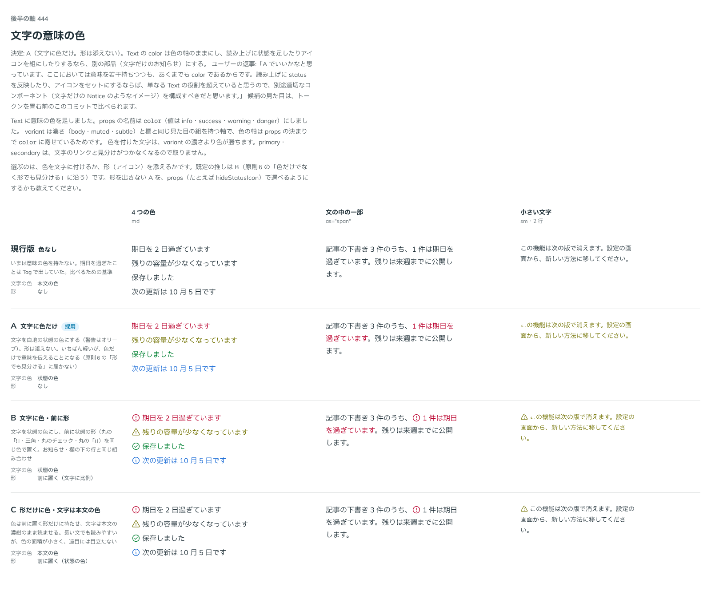

# 0411. Text の color は色だけを変える。アイコンも読み上げも付けない

- ステータス: Accepted
- 日付: 2026-10-01
- ラウンド: 後半 軸 444

## 背景

Text に意味の色（`color`: info・success・warning・danger）を足すにあたり、文字に色だけを付けるか、状態の形（アイコン）を添えるかを決めました。

## 候補

比較は、決めた時点のコミット `8cf8d0d` の比較のストーリー（`design/stories/axis-444-text-status-color.stories.tsx`）です。列は「4 つの色」「文の中の一部」「小さい文字」です。

| 案        | 文字の色 | 形                         |
| --------- | -------- | -------------------------- |
| 現行版    | 本文の色 | なし                       |
| A（採用） | 状態の色 | なし                       |
| B         | 状態の色 | 前に状態の形               |
| C         | 本文の色 | 前に状態の形（色は形だけ） |

## 決定

**A（文字に色だけ）にします。** Text の `color` は色だけを変え、アイコンも読み上げも付けません。状態を形や読み上げで伝えるなら、Text ではなく別の部品（文字だけの Notice のような部品）にします。

- 色の軸として、variant の濃さより色が勝ちます
- 文の中の一部（`as="span"`）にも使えます
- 状態を形で見分けたい文は、Text でなく状態を知らせる部品で書きます（backlog）

## 理由

ユーザーの返事の原文です。

> 444 A でいいかなと思っています。ここにおいては意味を若干持ちつつも、あくまでも color であるからです。読み上げに status を反映したり、アイコンをセットにするならば、単なる Text の役割を超えていると思うので、別途適切なコンポーネント（文字だけの Notice のようなイメージ）を構成すべきだと思います。

## 却下した案と理由

B・C（形を添える）は採りませんでした。形と読み上げを持つ表示は Text の役割を超え、別の部品の仕事だと考えたためです。

## 影響

- `src/components/text/Text.tsx`・`src/internal/reading/text.ts`: `color` は文字の色だけを変えます
- 比べるためだけに置いた `--text-status-text-follow`・`--text-status-icon-display` は消しました
- backlog に「文字だけの Notice のような部品」を足しました
- 比較のストーリーは消しました

## 原則への反映

原則 6 の文を書き換えました。「色だけでなく、形でも見分ける」を「状態を知らせる部品は」の決まりにし、「文章の文字に状態の色を付けるときは、色だけを変え、形も読み上げも足さない。形や読み上げでも状態を伝えたい文は、状態を知らせる部品で書く」を足しました（例外ではなく、原則の範囲の明示です）。

## 比較画像

決めた時点のコミットは、比較が `8cf8d0d`、実装が `fee413b` です。`git checkout 8cf8d0d && pnpm storybook` で、比較のストーリー（`Design Review/444 文字の意味の色`）を決めたときの部品のまま開けます。
