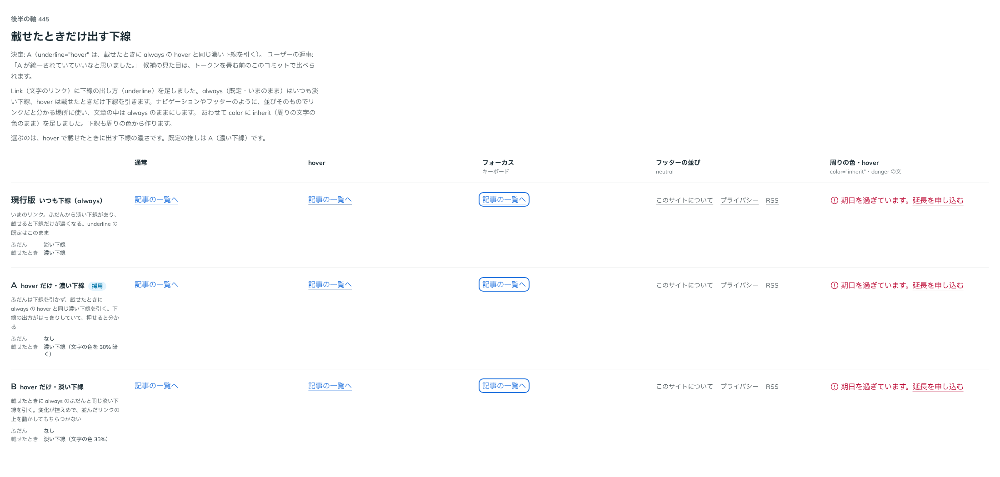

# 0412. Link の underline="hover" は、載せたときに always の hover と同じ濃い下線を引く

- ステータス: Accepted
- 日付: 2026-10-01
- ラウンド: 後半 軸 445

## 背景

文字のリンクに、載せたときだけ下線を出す形（`underline="hover"`）を足すにあたり、載せたときの下線の濃さを決めました。always（既定）はふだんから淡い下線があり、載せると濃くなります。

## 候補

比較は、決めた時点のコミット `8cf8d0d` の比較のストーリー（`design/stories/axis-445-link-underline-hover.stories.tsx`）です。列は「通常」「hover」「フォーカス」「フッターの並び」「周りの色・hover」です。

| 案                     | ふだん   | 載せたとき                         |
| ---------------------- | -------- | ---------------------------------- |
| 現行版（always・既定） | 淡い下線 | 濃い下線                           |
| A（採用）              | なし     | 濃い下線（always の hover と同じ） |
| B                      | なし     | 淡い下線（always のふだんと同じ）  |

## 決定

**A（載せたときに always の hover と同じ濃い下線）にします。**

- always と hover で、載せたときの下線が同じになり、そろって見えます
- ふだんは下線を引かないので、ナビゲーションやフッターのように、並びそのもので押せると分かる場所に向きます。文章の中は always のままにします

## 理由

ユーザーの返事の原文です。

> 445 A が統一されていいなと思いました。

## 却下した案と理由

B（淡い下線）は採りませんでした。always の hover と下線が揃わず、載せたときの変化も控えめすぎるためです。

## 影響

- `src/components/link/Link.tsx`: `underline="hover"` は、載せたときに既存の hover の下線の色にします
- 比べるためだけに置いた `--link-underline-hover-only` は消しました
- 比較のストーリーは消しました

## 原則への反映

反映なし。リンクの下線の出し方の決定で、原則が新しく扱う対象は増えていません。

## 比較画像

決めた時点のコミットは、比較が `8cf8d0d`、実装が `fee413b` です。`git checkout 8cf8d0d && pnpm storybook` で、比較のストーリー（`Design Review/445 載せたときだけ出す下線`）を決めたときの部品のまま開けます。
