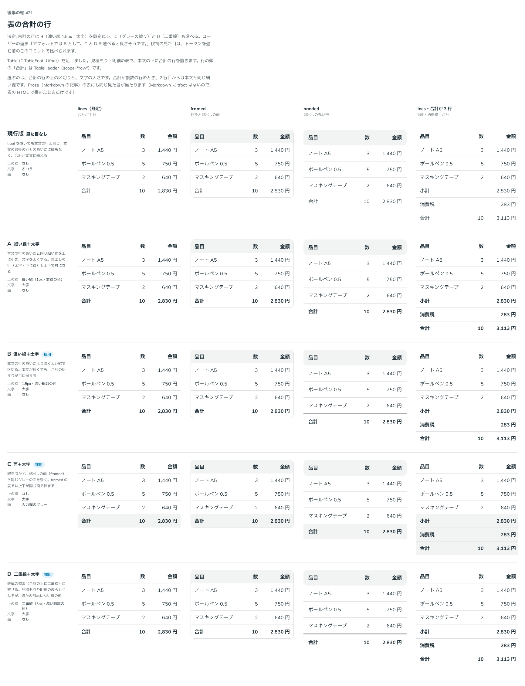

# 0413. Table の合計の行（TableFoot）は、上に濃い線と太字が既定。グレーの塗り・二重線も選べる

- ステータス: Accepted
- 日付: 2026-10-01
- ラウンド: 後半 軸 421

## 背景

Table に足した合計の行（TableFoot）に、本文の行と区別する見た目を付けるかを決めました。

## 候補

比較は、決めた時点のコミット `63a2455` の比較のストーリー（`design/stories/axis-421-table-foot.stories.tsx`）です。列は「lines（既定）・framed・banded・合計が 3 行」です。

| 案                | 見た目                              |
| ----------------- | ----------------------------------- |
| 現行版            | 見た目なし（本文と同じ）            |
| A                 | 細い線（1px）＋太字                 |
| B（採用・既定）   | 濃い線（1.5px・濃い輪郭の色）＋太字 |
| C（採用・選べる） | 線なし、グレーの塗り＋太字          |
| D（採用・選べる） | 二重線（3px・濃い輪郭の色）＋太字   |

## 決定

**B（上に濃い線と太字）を既定にします。** C（グレーの塗り）は `variant="filled"`、D（二重線）は `variant="double"` で選べます。

- 合計の始まりは、本文の行のあいだより濃く太い線で区切ります。本文が長くても合計が本文に紛れません
- 塗りの形は線を引かず、見出しの行と同じグレーで合計を示します。二重線は帳簿の慣習に寄せた形です

## 理由

ユーザーの返事の原文です。

> 421 デフォルトでは B として、C と D も選べると良さそうです。

## 却下した案と理由

A（細い線）と現行版（見た目なし）は、選ばれませんでした。

## 影響

- `src/components/table/Table.tsx`: `TableFoot` が `variant`（`line` 既定・`filled`・`double`）を持ちます
- `src/internal/reading/table.ts`: Prose の表にも同じ見た目が当たります
- `design/tokens.css`: 比べるための切り替えのトークンを畳みました
- 比較のストーリーは消しました

## 原則への反映

反映なし。合計の行の線と塗りの決定で、原則が新しく扱う対象は増えていません。既定と選べる形（原則 20）の範囲内です。

## 比較画像

決めた時点のコミットは `63a2455`（比較）・`d42626c`（実装）です。`git checkout 63a2455 && pnpm storybook` で、比較のストーリー（`Design Review/421 表の合計の行`）を決めたときの部品のまま開けます。
