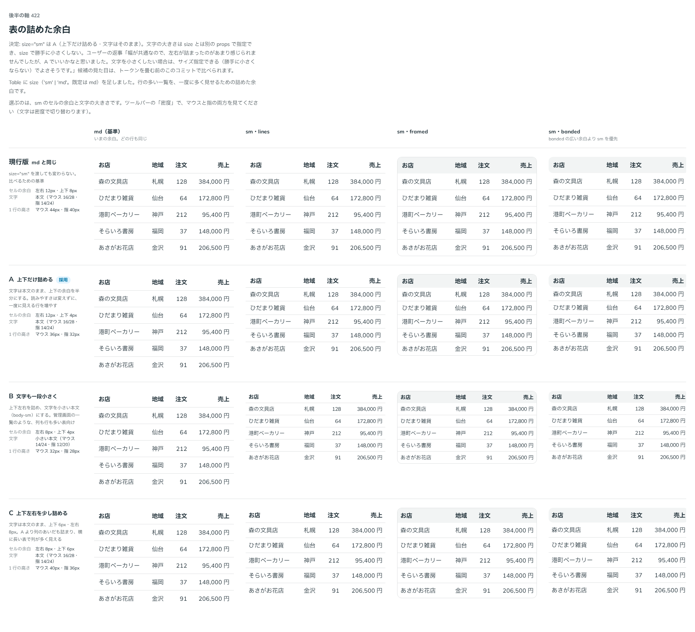

# 0414. Table の size="sm" は上下の余白だけを詰める。文字の大きさは textSize で別に選ぶ

- ステータス: Accepted
- 日付: 2026-10-01
- ラウンド: 後半 軸 422

## 背景

行の多い一覧を一度に多く見せるため、Table に詰めた余白（size="sm"）を足しました。何を詰めるかを決めました。

## 候補

比較は、決めた時点のコミット `e248992` の比較のストーリー（`design/stories/axis-422-table-size.stories.tsx`）です。列は「md（基準）・sm の lines・sm の framed」です。

| 案        | 見た目                                      |
| --------- | ------------------------------------------- |
| 現行版    | md と同じ（size="sm" を渡しても変わらない） |
| A（採用） | 上下の余白を半分にする。文字はそのまま      |
| B         | 左右・上下を詰め、文字も一段小さくする      |
| C         | 上下左右を少し詰める。文字はそのまま        |

## 決定

**A（上下だけ詰める。文字は小さくしない）を採用します。** 文字の大きさは `size` と別の `textSize` で選べます。`size` が勝手に文字を小さくすることはありません。

- `size="sm"` は行の高さだけを下げます。読みやすさは変えず、一度に見える行を増やします
- 文字を小さくしたいときは、使う側が `textSize` で指定します

## 理由

ユーザーの返事の原文です。

> 422 幅が共通なので、左右が詰まったのがあまり感じられませんでしたが、A でいいかなと思いました。文字を小さくしたい場合は、サイズ指定できる（勝手に小さくならない）でよさそうです。

## 却下した案と理由

B（文字も一段小さく）と C（上下左右を少し詰める）は、選ばれませんでした。文字を小さくする必要は、`textSize` で別に選べます。

## 影響

- `src/components/table/Table.tsx`: `size`（`md` 既定・`sm`）と `textSize` を持ちます
- `design/tokens.css`: 比べるための切り替えのトークンを畳みました
- 比較のストーリーは消しました

## 原則への反映

反映なし。size を余白の段として扱い文字を勝手に小さくしない決め方は、部品ごとの props の決めです。原則の文を書き換えるほどの変更ではないため、ほかの部品の size との関係は backlog に置きます。

## 比較画像

決めた時点のコミットは `e248992`（比較）・`88d46a8`（実装）です。`git checkout e248992 && pnpm storybook` で、比較のストーリー（`Design Review/422 表の詰めた余白`）を決めたときの部品のまま開けます。
