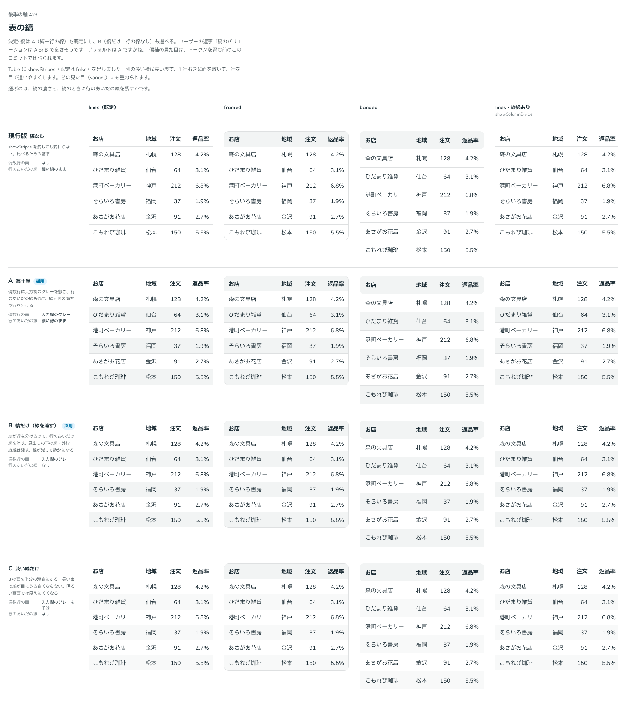

# 0415. Table の縞（showStripes）は、行のあいだの線を残すのが既定。hideRowDivider で線を消せる

- ステータス: Accepted
- 日付: 2026-10-01
- ラウンド: 後半 軸 423

## 背景

Table に足した縞（showStripes）で、縞のときに行のあいだの線を残すかを決めました。

## 候補

比較は、決めた時点のコミット `63a2455` の比較のストーリー（`design/stories/axis-423-table-stripes.stories.tsx`）です。列は「lines（既定）・framed・banded」です。

| 案                | 見た目                                             |
| ----------------- | -------------------------------------------------- |
| 現行版            | 縞なし（showStripes を渡しても変わらない）         |
| A（採用・既定）   | 偶数行に入力欄のグレーを敷き、行のあいだの線も残す |
| B（採用・選べる） | 縞だけ。行のあいだの線を消す                       |

## 決定

**A（縞と行の線）を既定にします。** B（縞だけ）は `hideRowDivider` で選べます。

- 縞は 1 行おきの面で行を追いやすくします。線も残すと、線と面の両方で行が分かれます
- 線を消した形は線が減って静かです。見出しの下の線・外枠・縦線は残ります

## 理由

ユーザーの返事の原文です。

> 423 縞のバリエーションは A or B で良さそうです。デフォルトは A ですかね。

## 却下した案と理由

現行版（縞なし）は、縞を足す機能の比較のための基準で、選べる形にはしません。

## 影響

- `src/components/table/Table.tsx`: `showStripes`（既定 `false`）と `hideRowDivider`（既定 `false`）を持ちます
- `design/tokens.css`: 比べるための切り替えのトークンを畳みました
- 比較のストーリーは消しました

## 原則への反映

反映なし。縞と行の線の決定で、原則が新しく扱う対象は増えていません。

## 比較画像

決めた時点のコミットは `63a2455`（比較）・`d42626c`（実装）です。`git checkout 63a2455 && pnpm storybook` で、比較のストーリー（`Design Review/423 表の縞`）を決めたときの部品のまま開けます。
