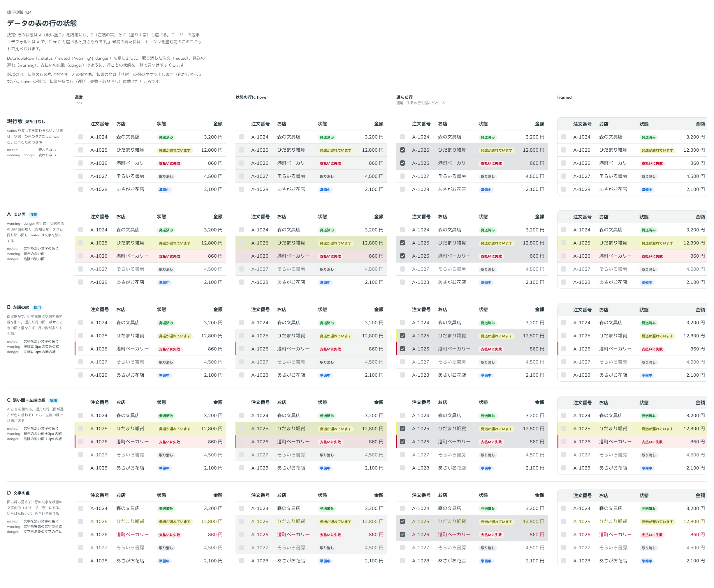

# 0416. DataTable の行の状態は、淡い塗りが既定。左端の帯・塗りと帯の両方も選べる

- ステータス: Accepted
- 日付: 2026-10-01
- ラウンド: 後半 軸 424

## 背景

DataTableRow の status（muted・warning・danger）を、行でどう見せるかを決めました。

## 候補

比較は、決めた時点のコミット `e248992` の比較のストーリー（`design/stories/axis-424-data-table-row-status.stories.tsx`）です。列は「通常・状態の行に hover・選んだ行・framed」です。

| 案                | 見た目                                           |
| ----------------- | ------------------------------------------------ |
| 現行版            | 見た目なし（状態の列のタグだけが伝える）         |
| A（採用・既定）   | 状態の色の淡い面を敷く（muted は文字を淡くする） |
| B（採用・選べる） | 行の左端に 3px の帯。面は敷かない                |
| C（採用・選べる） | 淡い面と左端の帯の両方                           |
| D                 | 文字の色だけ                                     |

## 決定

**A（淡い塗り）を既定にします。** B（左端の帯）は `statusIndicator="edge"`、C（塗りと帯の両方）は `statusIndicator="fill-edge"` で選べます。

- 状態の行は、塗りで一覧の中から見つけやすくします。状態の文は、どの案でも「状態」の列のタグで出し、色だけで伝えません
- 帯の形は面を足さないので行の数が多くても静かです。選んだ行の面に替わっても、帯が状態を残します

## 理由

ユーザーの返事の原文です。

> 424 デフォルトは A で、B or C も選べると良さそうです。

## 却下した案と理由

D（文字の色だけ）と現行版（見た目なし）は、選ばれませんでした。

## 影響

- `src/components/data-table/DataTableRow.tsx`・`DataTable.tsx`: `statusIndicator`（`fill` 既定・`edge`・`fill-edge`）を持ちます
- `design/tokens.css`: 比べるための切り替えのトークンを畳みました
- 比較のストーリーは消しました

## 原則への反映

反映なし。行の状態の見せ方の決定で、原則の文を書き換える変更はありません。

## 比較画像

決めた時点のコミットは `e248992`（比較）・`88d46a8`（実装）です。`git checkout e248992 && pnpm storybook` で、比較のストーリー（`Design Review/424 データの表の行の状態`）を決めたときの部品のまま開けます。
