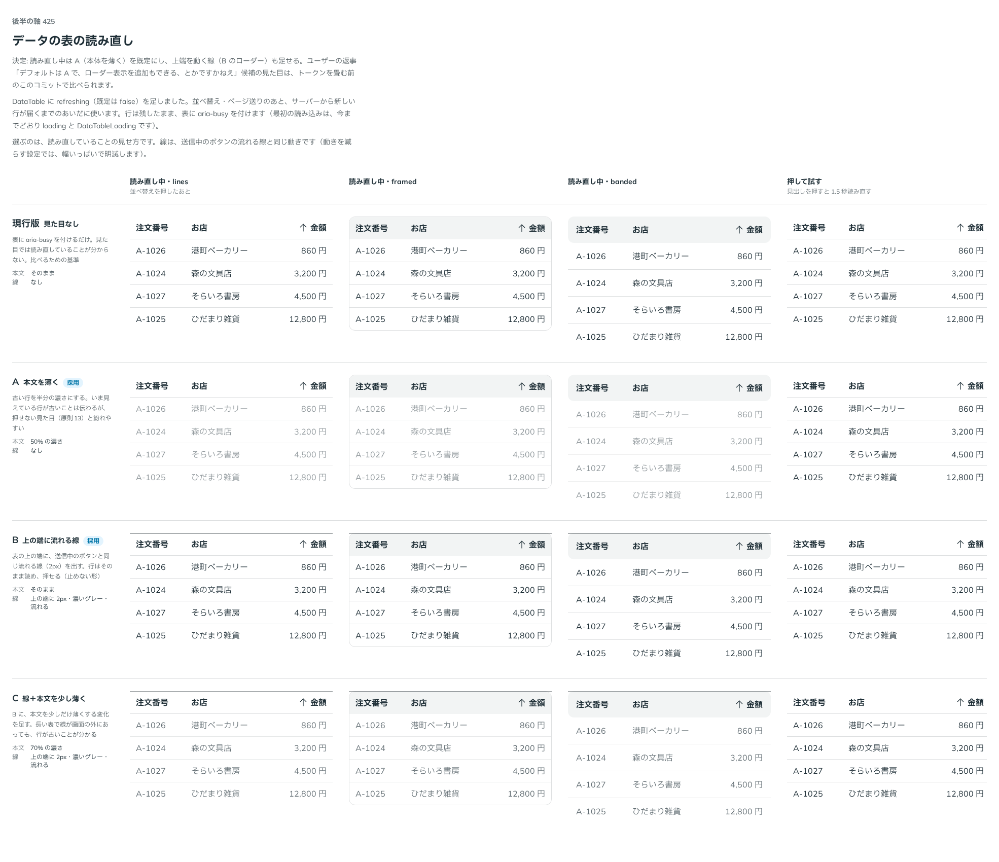

# 0417. DataTable の読み直し（refreshing）は、本体を薄くするのが既定。上の端を流れる線も足せる

- ステータス: Accepted
- 日付: 2026-10-01
- ラウンド: 後半 軸 425

## 背景

並べ替えやページ送りのあと、新しい行が届くまでの見せ方を決めました。行は残したまま、読み直していることを伝えます。

## 候補

比較は、決めた時点のコミット `0fc325e` の比較のストーリー（`design/stories/axis-425-data-table-refreshing.stories.tsx`）です。列は「読み直し中の lines・framed・banded・押して試す」です。

| 案                | 見た目                                    |
| ----------------- | ----------------------------------------- |
| 現行版            | 見た目なし（aria-busy だけ）              |
| A（採用・既定）   | 本文を半分の濃さにする                    |
| B（採用・足せる） | 表の上の端に 2px の流れる線。行はそのまま |
| C                 | 線に加えて、本文を少し薄く（70%）         |

## 決定

**A（本体を薄くする）を既定にします。** 上の端を動く線（B）は `showRefreshingBar` で足せます。

- 本体は薄くなりますが、行は残り、読めて、押せます
- 線は、送信中のボタンの流れる線と同じ動きです。動きを減らす設定では、幅いっぱいで明滅します

## 理由

ユーザーの返事の原文です。

> 425 デフォルトは A で、ローダー表示を追加もできる、とかですかねえ

## 却下した案と理由

C（線と本文の薄さの両方）は選ばれませんでした。線を足せる形（`showRefreshingBar`）と、本体を薄くする既定の組み合わせで同じ見た目になります。

## 影響

- `src/components/data-table/DataTable.tsx`: `refreshing` が本体を薄くします。`showRefreshingBar`（既定 `false`）で上の端の線を足せます
- `design/tokens.css`: 比べるための切り替えのトークンを畳みました
- 比較のストーリーは消しました

## 原則への反映

反映なし。読み直しの見せ方の決定で、原則が新しく扱う対象は増えていません。

## 比較画像

決めた時点のコミットは `0fc325e`（比較）・`781f2fe`（実装）です。`git checkout 0fc325e && pnpm storybook` で、比較のストーリー（`Design Review/425 データの表の読み直し`）を決めたときの部品のまま開けます。
