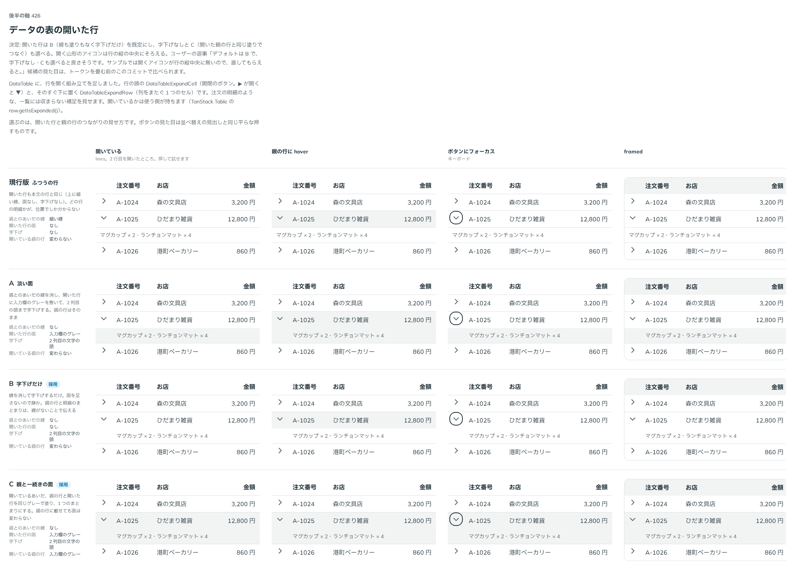

# 0418. DataTable の開いた行は、線も塗りもなく字下げだけが既定。字下げなし・親の行とつなぐ塗りも選べる

- ステータス: Accepted
- 日付: 2026-10-01
- ラウンド: 後半 軸 426

## 背景

DataTableExpandRow（行を開いたときに下に出る補足の行）と、親の行とのつなぎ方を決めました。

## 候補

比較は、決めた時点のコミット `63a2455` の比較のストーリー（`design/stories/axis-426-data-table-expand.stories.tsx`）です。列は「開いている・親の行に hover・ボタンにフォーカス・framed」です。

| 案                | 見た目                                           |
| ----------------- | ------------------------------------------------ |
| 現行版            | ふつうの行（上に細い線・面なし・字下げなし）     |
| A                 | 線を消し、入力欄のグレーの面を敷く。字下げする   |
| B（採用・既定）   | 線も面もなく、字下げだけ                         |
| C（採用・選べる） | 親の行と開いた行を同じグレーでつなぐ。字下げする |

## 決定

**B（線も塗りもなく字下げだけ）を既定にします。** `variant="flush"`（字下げなし）と `variant="filled"`（C。親の行とつなぐ塗り）も選べます。開く山形のボタンは、行の縦の中央にそろえます。

- 面を足さないので静かです。開いた行と親の行のつながりは、線がないことと字下げで伝えます
- 塗りの形は、開いているあいだ親の行にも同じ面を敷き、つながって見せます

## 理由

ユーザーの返事の原文です。

> 426 デフォルトは B で、字下げなし・Cも選べると良さそうです。サンプルでは開くアイコンが行の縦中央に無いので、直してもらえると。

## 却下した案と理由

A（開いた行だけに面）と現行版（線あり・字下げなし）は、選ばれませんでした。

## 影響

- `src/components/data-table/DataTableExpand.tsx`: `DataTableExpandRow` が `variant`（`indent` 既定・`flush`・`filled`）を持ちます。開閉のボタンを 1 行の高さの包みの縦の中央に置きます
- `design/tokens.css`: 比べるための切り替えのトークンを畳みました
- 比較のストーリーは消しました

## 原則への反映

反映なし。開いた行の見せ方の決定で、原則の文を書き換える変更はありません。

## 比較画像

決めた時点のコミットは `63a2455`（比較）・`d42626c`（実装）です。`git checkout 63a2455 && pnpm storybook` で、比較のストーリー（`Design Review/426 データの表の開いた行`）を決めたときの部品のまま開けます。
