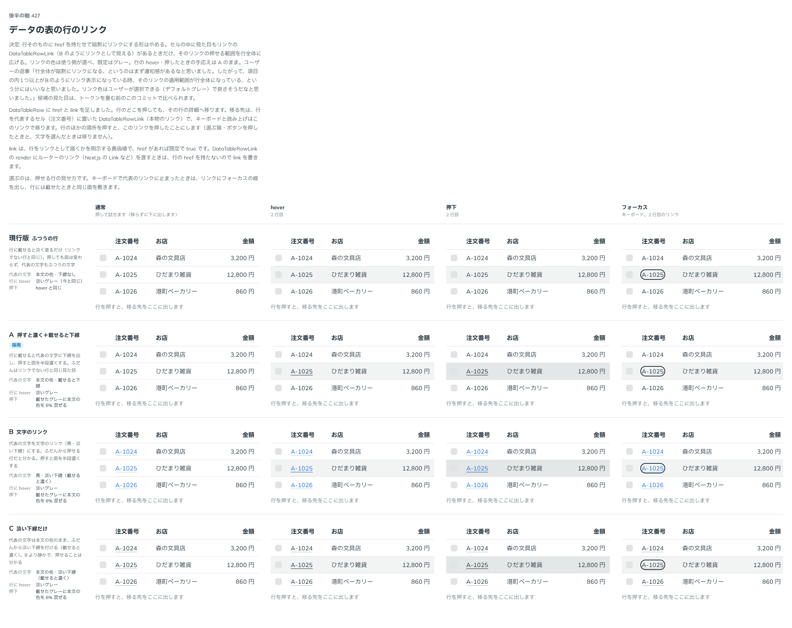

# 0419. DataTable の行は暗黙にリンクにしない。リンクの文字（DataTableRowLink）がある行だけ、押せる範囲を行全体に広げる

- ステータス: Accepted
- 日付: 2026-10-01
- ラウンド: 後半 軸 427

## 背景

行を押して詳細へ移る形（行のリンク）で、行全体をどう見せるかを決めました。

## 候補

比較は、決めた時点のコミット `e248992` の比較のストーリー（`design/stories/axis-427-data-table-row-link.stories.tsx`）です。列は「通常・hover・押下・フォーカス」です。

| 案                        | 見た目                                                              |
| ------------------------- | ------------------------------------------------------------------- |
| 現行版                    | ふつうの行（行を押せることが見た目に出ない）                        |
| A（採用・手応え）         | 行の hover は淡いグレー。載せると文字に下線、押すと面を半段濃くする |
| B（採用・リンクの見た目） | 代表の文字を文字のリンクにする。ふだんから押せると分かる            |
| C                         | 淡い下線だけ                                                        |

## 決定

**行を暗黙にリンクにしません。** 見た目にもリンクの `DataTableRowLink` が行の中にあるときだけ、押せる範囲を行全体に広げます。リンクの色は `color` で選べ、既定はグレーです。行の hover と押したときの手応えは A です。

- 行が押せることは、行の中のリンクの見た目（B）で伝えます。リンクを置かない行は、ふつうの行のままです
- 行の hover は淡いグレー、押すと半段濃くなります。キーボードでは代表のリンクにフォーカスの線が出ます

## 理由

ユーザーの返事の原文です。

> 427 行全体が暗黙にリンクになる、というのはまず違和感があるなと思いました。したがって、項目の内1つ以上がBのようにリンク表示になっている時、そのリンクの適用範囲が行全体になっている、という分にはいいなと思いました。リンク色はユーザーが選択できる（デフォルトグレー）で良さそうだなと思いました。

## 却下した案と理由

行そのものに `href` を持たせて暗黙にリンクにする形は、ユーザーが違和感を示したのでやめました。C（淡い下線だけ）と現行版は、選ばれませんでした。

## 影響

- `src/components/data-table/DataTableRowLink.tsx`: 文字のリンク。`color` の既定は `neutral`
- `src/components/data-table/DataTableRow.tsx`: `href`・`link` をやめ、`DataTableRowLink` を置いた行だけ、押せる範囲を行全体に広げます
- `design/tokens.css`: 比べるための切り替えのトークンを畳みました
- 比較のストーリーは消しました

## 原則への反映

原則 3 と原則 17 の文を書き換えました。

- 原則 3: 沈みがなくてもよい場合を 2 つから 3 つにし、罫線でつながった面の一部（表の行）は、沈めずに塗りを濃くして返す、を足しました。行の現れ方は 1 つにまとめ、トグルの行は押しても濃くせず、リンクの文字を持つ表の行は押すと塗りが半段濃くなる、と書き分けました
- 原則 17: 考えに「押せること自体も、見た目で分かるようにする」を足しました。文字のリンクの現れ方を、広い範囲が要るときは、ボタンの見た目のリンクにするか、区切り線で範囲の見える表の行にリンクの文字を置いて行全体を押せる範囲にする、に書き換えました。リンクの文字を置かない行は押せる範囲にしません

## 比較画像

決めた時点のコミットは `e248992`（比較）・`88d46a8`（実装）です。`git checkout e248992 && pnpm storybook` で、比較のストーリー（`Design Review/427 データの表の行のリンク`）を決めたときの部品のまま開けます。
