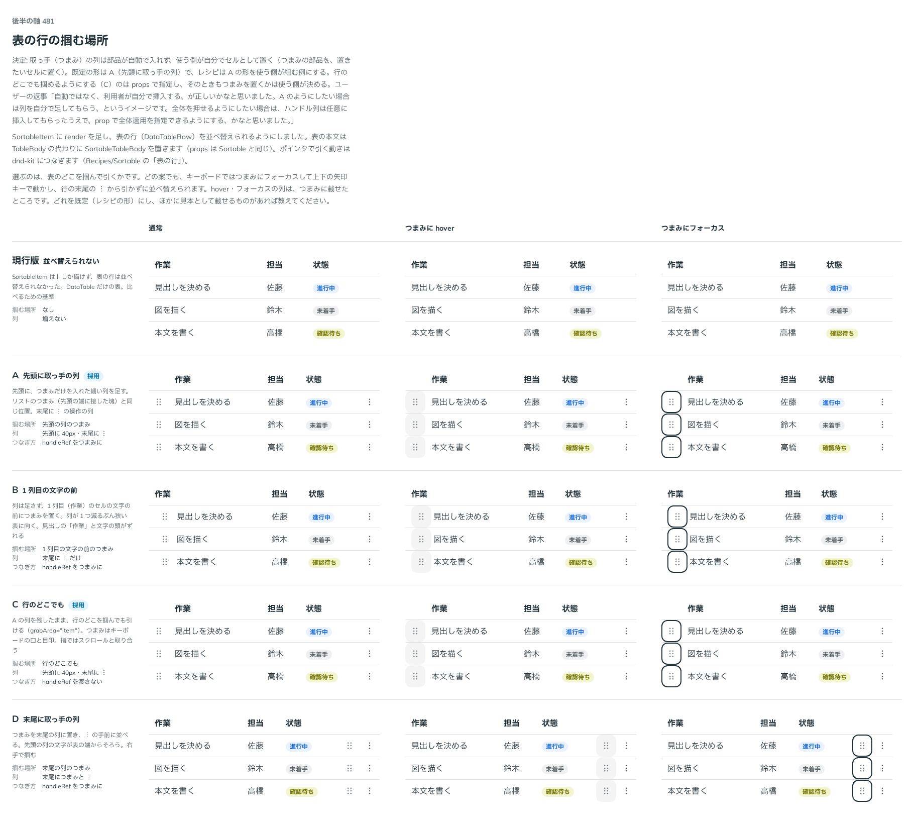

# 0420. 表の行のつまみの列は、部品が足さず使う側が置く。既定の見本は先頭の取っ手の列

- ステータス: Accepted
- 日付: 2026-10-01
- ラウンド: 後半 軸 481

## 背景

Sortable で表の行（DataTable の行）を並べ替えられるようにしました（`SortableItem` の `render` と `SortableTableBody`）。表の行では、どこを掴んで引くか、つまみの列を部品が足すかを決める必要がありました。出どころはトリアージの F114 です。

## 候補

比較は、決めた時点のコミット `292fd64` の比較のストーリー（`design/stories/axis-481-sortable-row-grab.stories.tsx`）です。列は「通常」「つまみに hover」「つまみにフォーカス」です。

| 案                    | 掴む場所                        | 列                          |
| --------------------- | ------------------------------- | --------------------------- |
| 現行版                | なし（表の行は並べ替えない）    | 増えない                    |
| A（採用・既定の見本） | 先頭の列のつまみ                | 先頭に取っ手の列、末尾に ︙ |
| B                     | 1 列目の文字の前のつまみ        | 末尾に ︙ だけ              |
| C（採用・選べる）     | 行のどこでも（grabArea="item"） | A と同じ                    |
| D                     | 末尾の列のつまみ                | 末尾につまみと ︙           |

## 決定

**つまみの列は部品が自動で入れません。使う側が、置きたいセルに `SortableHandle` を置きます。** 既定の見本（Docs の例とレシピ）は A（先頭に取っ手の列）です。行のどこを掴んでも引けるようにするときは、つまみの列を置いたうえで `grabArea="item"`（C）を付けます。

- つまみと移動の操作だけを入れたセルは、中身の幅に詰め、左右の余白を持ちません
- B・D の形も、使う側がつまみを置くセルを変えれば作れます。部品は列の位置を決めません

## 理由

ユーザーの返事の原文です。

> 自動ではなく、利用者が自分で挿入する、が正しいかなと思いました。A のようにしたい場合は列を自分で足してもらう、というイメージです。全体を押せるようにしたい場合は、ハンドル列は任意に挿入してもらったうえで、prop で全体適用を指定できるようにする、かなと思いました。

表の列の構成（見出し・幅・並び）は使う側の持ち物で、部品が列を差し込むと見出しの行と数が合わなくなります。

## 却下した案と理由

- **部品が取っ手の列を自動で足す形**: 採りませんでした。見出しの行（`TableHead`）は使う側が書くので、本文だけに列が増えると列の数がずれます
- **B・D**: 既定の見本にはしませんでしたが、つまみを置くセルを変えるだけで作れるので、禁じてはいません

## 影響

- `src/components/sortable/SortableTableBody.tsx`・`Sortable.tsx`: 表の行（`render` に `tr`・`DataTableRow`）では列を足しません。つまみだけ・移動の操作だけのセルを中身の幅に詰めます
- `src/recipes/sortable-data-table.tsx` と `Components/Sortable` の「表の行」: 先頭に取っ手の列、末尾に操作の列を置く形を見本にします
- 比較のストーリーは消しました

## 原則への反映

反映なし。部品が置かれる場所（表の列の構成）を知らないので決めず、使う側に渡すのは、原則 20 の範囲内です。

## 比較画像

決めた時点のコミットは `292fd64`（比較）・`5b3b0a1`（実装）です。`git checkout 292fd64 && pnpm storybook` で、比較のストーリー（`Design Review/481 表の行の掴む場所`）を決めたときの部品のまま開けます。
