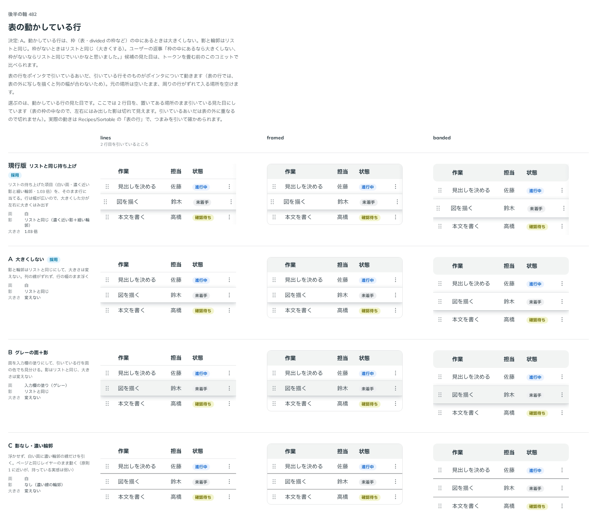

# 0421. 表の動かしている行は、外枠のある表（framed）の中では大きくしない

- ステータス: Accepted
- 日付: 2026-10-01
- ラウンド: 後半 軸 482

## 背景

表の行をポインタで引いているあいだ、引いている行そのものがポインタについて動きます（表の外に写しを描くと列の幅が合わないため）。リストの持ち上げた項目（[ADR-0338](./0338-sortable-lifted.md)、白い面・濃く近い影・少しだけ大きく）を、そのまま表の行に当てるかを決めました。出どころはトリアージの F114 です。

## 候補

比較は、決めた時点のコミット `79d885a` の比較のストーリー（`design/stories/axis-482-sortable-row-lifted.stories.tsx`）です。列は表の見た目（lines・framed・banded）で、どれも 2 行目を引いているところです。

| 案                                 | 面           | 影                   | 大きさ   |
| ---------------------------------- | ------------ | -------------------- | -------- |
| 現行版（採用・lines・banded の表） | 白           | リストと同じ         | 1.03 倍  |
| A（採用・framed の表）             | 白           | リストと同じ         | 変えない |
| B                                  | 入力欄の塗り | リストと同じ         | 変えない |
| C                                  | 白           | なし（濃い線の輪郭） | 変えない |

## 決定

**外枠のある表（Table・DataTable の `variant="framed"`）の中では、引いている行を大きくしません（A）。** 面と影はリストと同じです。**lines・banded の表の行と、枠のないリストは、リストと同じく 1.03 倍にします（現行版）。**

- 外枠のある表では、大きくした行が枠の線からはみ出し、列の線ともずれます。影だけで浮かせます
- 表の見た目は、Table・DataTable が context で中の部品に渡し、`SortableTableBody` が framed のときだけ大きさを 1 にします

## 理由

ユーザーの返事の原文です。

> 枠の中にあるなら大きくしない、枠がないならリストと同じでいいかなと思いました。

「枠」がどこまでを指すかを確かめた答えです。

> 外枠のある表、のイメージです。

はじめの実装（`24d9d48`）は「枠の中」をすべての表の行と読み、どの表でも大きくしない形にしていました。確かめの答えを受けて、外枠のある表だけに絞りました（`ed89a2f`）。

## 却下した案と理由

- **B（グレーの面）**: 採りませんでした。入力欄の塗りは「値を入れる場所」や選んでいる行の印と近く、持ち上げている面には見えません
- **C（影なし・濃い輪郭）**: 採りませんでした。ページと同じ高さのまま動き、持っている実感が弱くなります（[ADR-0338](./0338-sortable-lifted.md) の理由と同じ）

## 影響

- `src/internal/table-variant-context.ts`: 表の見た目を中の部品に渡す context（`TableVariantContext`）を足しました。Table・DataTable が `<table>` の中に置きます
- `src/components/sortable/SortableTableBody.tsx`: framed の表の中では `--sortable-lifted-scale` を 1 にします
- `src/components/sortable/Sortable.tsx`: 表の行（`data-dragging`）にも、リストと同じ大きさ・影の変化を、押す動きと同じ長さ・緩急で付けます
- 比べるためだけに置いた `--sortable-row-lifted-bg`・`--sortable-row-lifted-shadow`・`--sortable-row-lifted-scale` は、`24d9d48` で消し、リストの `--sortable-lifted-*` に畳みました
- `Components/Sortable` に「表の行を引いているとき」を足し、play で lines・banded は大きく、framed は大きくしないことを確かめます
- divided のリストの持ち上げた写しは、DragOverlay の中では既定の card で描かれます（未決として backlog に残しました）
- 比較のストーリーは消しました

## 原則への反映

**原則 1 の文を書き換えました。** つまんで持ち上げているものを少しだけ大きくする文に、外枠に囲まれた中を動くものは、大きくすると枠の線からはみ出すので影だけで浮かせる、という考えを入れました。これまでの文は大きくすることを無条件に書いており、外枠のある表の行を説明できませんでした。

## 比較画像

決めた時点のコミットは `79d885a`（比較）・`24d9d48`（実装）・`ed89a2f`（外枠のある表だけに絞った直し）です。`git checkout 79d885a && pnpm storybook` で、比較のストーリー（`Design Review/482 表の動かしている行`）を決めたときの部品のまま開けます。
