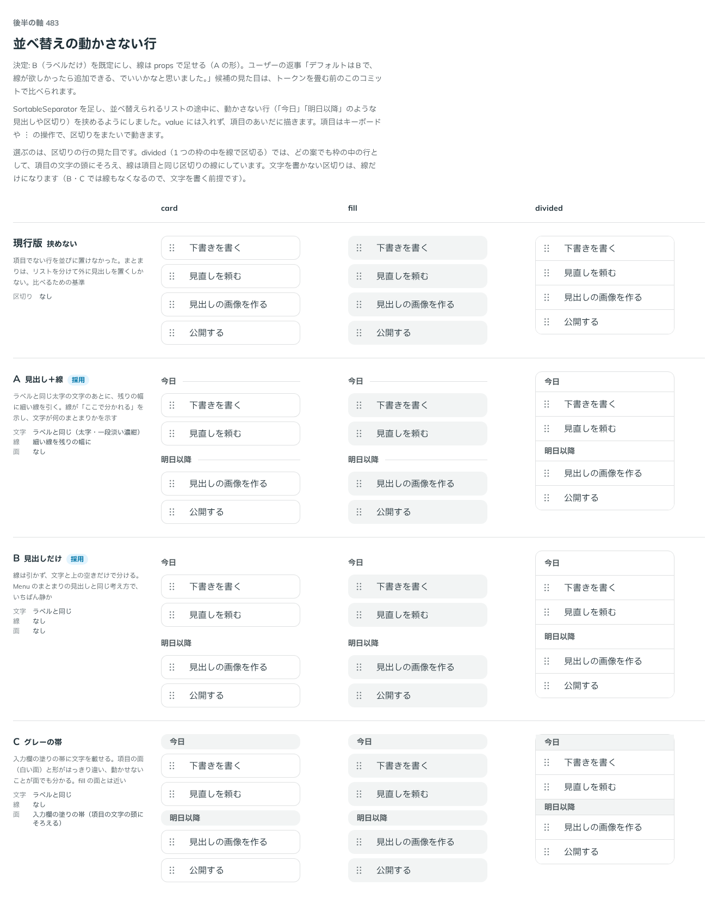

# 0422. Sortable の動かさない行（SortableSeparator）は見出しの文字だけが既定。showDivider で線を足せる

- ステータス: Accepted
- 日付: 2026-10-01
- ラウンド: 後半 軸 483

## 背景

`SortableSeparator` を足し、並べ替えられるリストの途中に、動かさない行（「今日」「明日以降」のような見出しや区切り）を挟めるようにしました。value には入れず、項目はキーボードや ︙ の操作で区切りをまたいで動きます。その行の見た目を決めました。出どころはトリアージの F115 です。

## 候補

比較は、決めた時点のコミット `292fd64` の比較のストーリー（`design/stories/axis-483-sortable-separator.stories.tsx`）です。列は項目の面（card・fill・divided）です。

| 案                | 文字             | 線               | 面               |
| ----------------- | ---------------- | ---------------- | ---------------- |
| 現行版            | 挟めない         | なし             | なし             |
| A（採用・選べる） | ラベルと同じ太字 | 残りの幅に細い線 | なし             |
| B（採用・既定）   | ラベルと同じ太字 | なし             | なし             |
| C                 | ラベルと同じ太字 | なし             | 入力欄の塗りの帯 |

## 決定

**B（見出しの文字だけ）を既定にします。** 線を引いた形（A）は `showDivider` で選べます。

- 文字と上の空きだけで分けます。Menu のまとまりの見出しと同じ考え方です
- 線を引くときは、線が分かれ目を示すぶん上の空きを詰めます
- 文字を書かない区切りは、`showDivider` を付けて線だけにします
- divided のリストでは、項目と同じ区切りの線で分けるので `showDivider` は使いません

## 理由

ユーザーの返事の原文です。

> デフォルトはBで、線が欲しかったら追加できる、でいいかなと思いました。

## 却下した案と理由

- **C（グレーの帯）**: 採りませんでした。入力欄の塗りの帯は、fill の項目の面と近く、項目と見分けにくくなります

## 影響

- `src/components/sortable/Sortable.tsx`: `SortableSeparator` に `showDivider`（既定 `false`）を持ちます
- `design/tokens.css`: 比べるためだけに置いた `--sortable-separator-fg`・`--sortable-separator-line-width`・`--sortable-separator-bg`・`--sortable-separator-px` は `5b3b0a1` で消し、`showDivider` の variant に畳みました。上の空きは `--sortable-separator-pt`（文字だけ）と `--sortable-separator-divider-pt`（線を引くとき）です
- 比較のストーリーは消しました

## 原則への反映

反映なし。見出しの文字と上の空きで一覧のまとまりを分ける形は、Menu のまとまりの見出しと同じで、原則が新しく扱う対象は増えていません。既定と選べる形は原則 20 の範囲内です。

## 比較画像

決めた時点のコミットは `292fd64`（比較）・`5b3b0a1`（実装）です。`git checkout 292fd64 && pnpm storybook` で、比較のストーリー（`Design Review/483 並べ替えの動かさない行`）を決めたときの部品のまま開けます。
