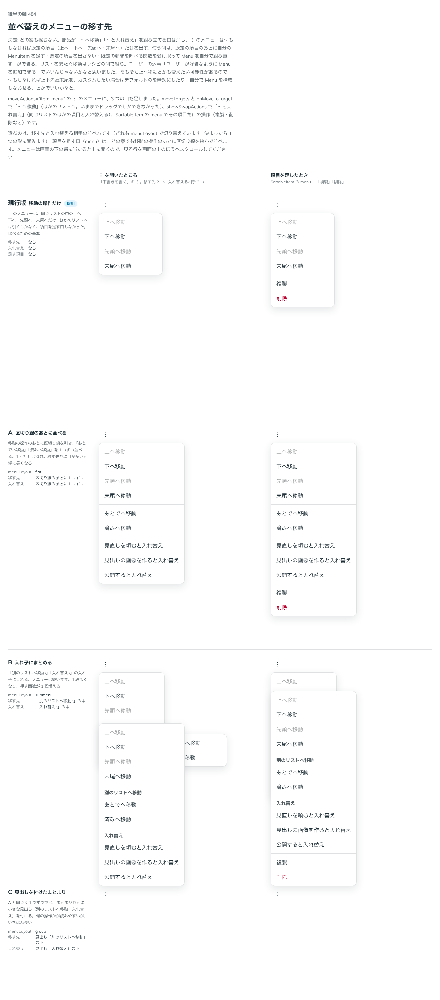

# 0423. Sortable の ︙ のメニューは「〜へ移動」「〜と入れ替え」を組み立てない。既定の項目は消せて、組み直せる

- ステータス: Accepted
- 日付: 2026-10-01
- ラウンド: 後半 軸 484

## 背景

`moveActions="item-menu"` の ︙ のメニュー（[ADR-0342](./0342-sortable-move-actions.md)）は、同じリストの中の上へ・下へ・先頭へ・末尾へだけを持ち、ほかのリストへはドラッグでしか移せませんでした。比較のために、`moveTargets`・`onMoveToTarget`（「〜へ移動」）、`showSwapActions`（「〜と入れ替え」）、`SortableItem` の `menu`（項目ごとの操作）を足し、移す先と入れ替える相手の並べ方を `menuLayout` で切り替えて比べました。出どころはトリアージの F116 です。

## 候補

比較は、決めた時点のコミット `79d885a` の比較のストーリー（`design/stories/axis-484-sortable-menu-layout.stories.tsx`）です。列は「︙ を開いたところ」「項目を足したとき」です。メニューは同時に開いているので、下の行の面が上の行に重なって写っています。

| 案             | 移す先・入れ替え                                       |
| -------------- | ------------------------------------------------------ |
| 現行版（採用） | なし（上へ・下へ・先頭へ・末尾へだけ）                 |
| A              | 区切り線のあとに 1 つずつ並べる                        |
| B              | 「別のリストへ移動 ›」「入れ替え ›」の入れ子にまとめる |
| C              | 1 つずつ並べ、まとまりごとに小さな見出しを付ける       |

## 決定

**どの案も採らず、部品は「〜へ移動」「〜と入れ替え」を組み立てません。** ︙ のメニューは、何もしなければ既定の項目（上へ・下へ・先頭へ・末尾へ）だけを出します。

- 項目を足すときは、`SortableItem` の `menu` に `MenuItem` を渡します。既定の項目のあとに区切り線を挟んで並びます
- 既定の項目を出さないときは `hideMoveItems` を付けます
- 既定の動きを自分のメニューから呼ぶときは、`useSortableItemActions` で動かす関数（上へ・下へ・先頭へ・末尾へと、動かせるかどうか）を受け取り、Menu を組み直します
- リストをまたぐ移動は、部品ではなくレシピ（`src/recipes/sortable-move-between-lists.tsx`）で、使う側が両方の並びを更新する形を見せます

## 理由

ユーザーの返事の原文です。

> ユーザーが好きなように Menu を追加できる、でいいんじゃないかなと思いました。そもそも上へ移動とかも変えたい可能性があるので、何もしなければ上下先頭末尾を、カスタムしたい場合はデフォルトのを無効にしたり、自分で Menu を構成しなおせる、とかでいいかなと。

移す先の名前や並べ方、入れ替える相手の選び方は、置かれる画面（タスクボード・設定の並び）によって変わり、部品には分かりません。

## 却下した案と理由

- **A・B・C**: どれも、部品が移す先や入れ替える相手から項目を組み立てる前提でした。並べ方を部品が 1 つに決める必要がなくなったので、どれも採りませんでした

## 影響

- `src/components/sortable/Sortable.tsx`・`SortableTableBody.tsx`: `hideMoveItems`（既定 `false`）を持ちます。`SortableItem` の `menu` はそのまま残します
- `src/components/sortable/SortableMoveActions.tsx`: `useSortableItemActions` と型 `SortableItemActionsValue` を公開します（`src/index.ts`）
- 比較のために足した `moveTargets`・`onMoveToTarget`・`moveToTargetLabel`・`moveTargetsTitle`・`showSwapActions`・`swapLabel`・`swapTitle`・`menuLayout` と、型 `SortableMoveTarget`・`SortableMenuLayout` は `24d9d48` で消しました。どれもこのブランチ（`4cf00c3`）で足して消したもので、main（`03af00f`）には一度も入っていないので、利用者への破壊的変更にはなりません
- `src/recipes/sortable-move-between-lists.tsx` と `Recipes/Sortable` に、︙ のメニューに「〜へ移動」を足して 2 つのリストのあいだで移す見本を置きました
- 比較のストーリーは消しました

## 原則への反映

反映なし。内容に関わる文（移す先の名前）を部品が組み立てず、既定を 1 つ持って使う側が差し替えられるようにするのは、原則 20 の範囲内です。

## 比較画像

決めた時点のコミットは `79d885a`（比較）・`24d9d48`（実装）です。`git checkout 79d885a && pnpm storybook` で、比較のストーリー（`Design Review/484 並べ替えのメニューの移す先`）を決めたときの部品のまま開けます。
