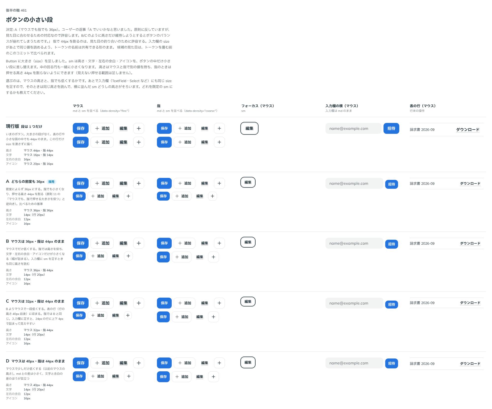

# 0424. Button の小さい段（size="sm"）は、マウスでも指でも 36px。指で押せる高さを割るのは許容する

- ステータス: Accepted
- 日付: 2026-10-01
- ラウンド: 後半 軸 461

## 背景

Button に大きさ（`size`）を足し、小さい段（`sm`）の高さを決めました。標準の段（`md`）は、マウスでも指でも 44px で、指で押せる高さを保っています（[原則 11](../principles.md#11-文字の大きさは入力方式で切り替える)）。小さい段は、表の行や小さな面の中、入力欄の横に置きます。同じ段の入力欄（TextField・Select など）にも、あとで同じ `size` を足すので、ここで決める高さはそのときも読まれます。

## 候補

比較は、決めた時点のコミット `70feeec` の比較のストーリー（`design/stories/axis-461-button-size.stories.tsx`）です。列は「マウス」「指」「フォーカス」「入力欄の横」「表の行」です。

| 案        | マウスの高さ | 指の高さ | 文字 | 左右の余白 |
| --------- | ------------ | -------- | ---- | ---------- |
| 現行版    | 44px         | 44px     | 16px | 16px       |
| A（採用） | 36px         | 36px     | 14px | 12px       |
| B         | 36px         | 44px     | 14px | 12px       |
| C         | 32px         | 44px     | 14px | 12px       |
| D         | 40px         | 44px     | 14px | 12px       |

現行版は、段を持たない md の見た目です。

## 決定

**`size="sm"` は、密度によらず 36px にします。** 文字は 14px（行 20px）、左右の余白は 12px、アイコンは 16px で、これも密度では変えません。

- 指でも 36px のままなので、指で押せる高さ（44px）を割ります。見た目の釣り合いを優先した許容です
- 指で押すことが多い画面の主な操作には、md を使います
- 高さは `--spacing-control-sm` の 1 つで持ち、入力欄の `size` があとで同じ名前を読みます。マウス用・指用に分けていた比較のための 2 つのトークンは、畳んで消しました

## 理由

ユーザーの返事の原文です。

> A でいいかなと思いました。原則に反していますが、見た目に合わせるための対応なので許容します。B/Cのように高さだけ維持しようとするとボタンのバランスが崩れてしまうためです。

出どころはトリアージの F92 です。B・C・D は、指のときだけ 44px の高さを保ち、文字と余白は小さいままにする形です。ボタンの中の文字と余白に対して高さだけが大きくなり、釣り合いが崩れて見えます。

## 却下した案と理由

- **B・C・D（指のときは高さを 44px に保つ）**: 採りませんでした。押せる大きさは保てますが、小さい段の見た目の釣り合いが崩れます。小さい段を選ぶのは、小さく見せたいときです
- **現行版（段を持たない）**: 表の行や小さな面の中で、44px のボタンが大きすぎます

## 影響

- `src/components/button/Button.tsx`: `size`（`md`・`sm`。既定 `md`）を持ちます
- `design/tokens.css`: `--spacing-control-sm-fine`・`--spacing-control-sm-coarse` を `--spacing-control-sm` に畳みました
- 比較のストーリーは消しました

## 原則への反映

[原則 11](../principles.md#11-文字の大きさは入力方式で切り替える)の「部品の高さと余白は、入力方式によらず同じです。マウスでも、指で押せる大きさを保ちます」を、標準の段は指で押せる大きさを保ち、小さい段は見た目の釣り合いを優先して割ってよい、と読める文に書き換えました。指で押すことが多い画面の主な操作に標準の段を使う、という勧めは、原則には書かず、Button の `size` の説明と Docs に書きました。[原則 17](../principles.md#17-押せる範囲は見た目の範囲)の「寸法を大きくしても…」の文は、小さい段が指の高さを割っても、見えない広がりで補わないと読める文に書き換えました。例外としては足していません。

## 比較画像

決めた時点のコミットは、比較が `70feeec`、実装が `92132e1` です。`git checkout 70feeec && pnpm storybook` で、比較のストーリー（`Design Review/461 Button の小さい段`）を決めたときの部品のまま開けます。
