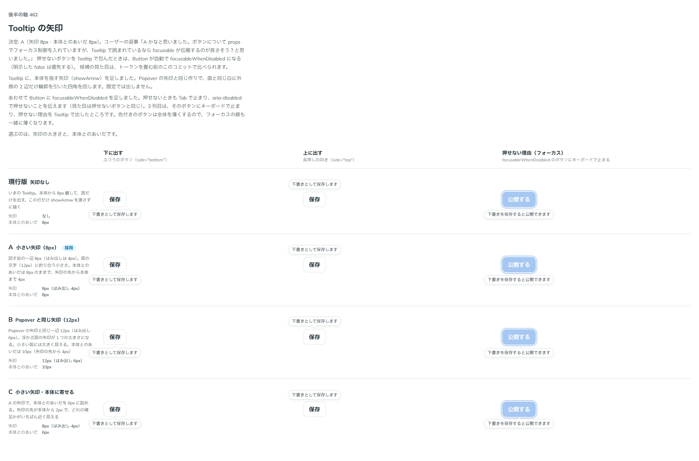

# 0426. 押せないボタンを Tooltip で包むと、Button が自動で focusableWhenDisabled になる

- ステータス: Accepted
- 日付: 2026-10-01
- ラウンド: 後半 軸 462

## 背景

押せないボタンは、既定では Tab で止まらず、押せない理由を Tooltip で出してもキーボードの人には届きません。Button には、押せなくてもフォーカスできる `focusableWhenDisabled`（`aria-disabled` で押せないことを伝える形）があります。Tooltip の本体にしたボタンでは、この props を毎回渡す必要があるかを決めました。

## 候補

比較は、決めた時点のコミット `60c0270` の比較のストーリー（[ADR-0425](./0425-tooltip-arrow.md) と同じ `axis-462-tooltip-arrow.stories.tsx`）の、3 列目「押せない理由（フォーカス）」です。

| 案        | Tooltip の本体の押せないボタン                            |
| --------- | --------------------------------------------------------- |
| 現行版    | 渡したときだけフォーカスできる（`focusableWhenDisabled`） |
| A（採用） | 渡さなくてもフォーカスできる。明示した `false` は優先する |

## 決定

**Tooltip の本体にしたボタンは、`focusableWhenDisabled` を渡さなくてもフォーカスできる形になります。** 明示した `false` はそちらを優先し、ふつうの押せないボタンに戻ります。

- 押せない理由を Tooltip で出すボタンには、キーボードで止まれます。理由が読めない人を作りません
- 見た目は押せないボタンのままです（[原則 13](../principles.md#13-押せないものは浮かせず薄くする)）

## 理由

ユーザーの返事の原文です（[ADR-0425](./0425-tooltip-arrow.md) と同じ返事です）。

> A かなと思いました。ボタンについて props でフォーカス制御を入れていますが、Tooltip で囲まれているなら focusable が伝搬するのが良さそう？と思いました。

出どころはトリアージの F91 です。

原則の文は、レビューでの返事に合わせて、見える文を基本にし、吹き出しをその次に置く順番にしました。

> 基本は常に見えるように、例外的に Tooltip を許容する、という感じですね

## 却下した案と理由

- **現行版（毎回渡す）**: 採りませんでした。Tooltip で包む場面では、ほぼ必ず渡すことになり、渡し忘れで理由が届かなくなります

## 影響

- `src/internal/tooltip-trigger.ts`: Tooltip の本体であることを Button に伝える印を足しました。Tooltip が本体の要素そのものにだけ足す props なので、入れ物や自作の部品を本体にしたときの中のボタンには届きません（はじめは React の文脈で配っていましたが、子を受け取らない自作の部品の中まで届いたため、印の props に替えました）
- `src/components/button/Button.tsx`: `focusableWhenDisabled` の既定は「Tooltip の本体なら true、それ以外は false」です
- 比較のストーリーは消しました

## 原則への反映

[原則 13](../principles.md#13-押せないものは浮かせず薄くする)の「押せない理由は、そのもののそばに、見える文で書きます」を、理由はいつも見える文でそのもののそばに書き、見える文を置く場所がないときに限ってボタンに添える小さな吹き出しで伝えてよく、そのときはそのボタンにキーボードでも止まれる、と読める文に書き換えました。見える文を基本にし、吹き出しはその次に置く順番です。別の項や例外としては足していません。

## 比較画像

[ADR-0425](./0425-tooltip-arrow.md) と同じ画像です。

決めた時点のコミットは、比較が `60c0270`、実装が `f2fb844` です。`git checkout 60c0270 && pnpm storybook` で、比較のストーリー（`Design Review/462 Tooltip の矢印`）を決めたときの部品のまま開けます。
