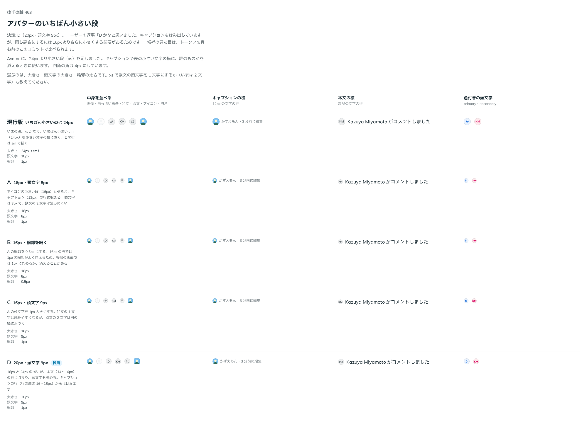

# 0427. Avatar の xs は 20px・頭文字 9px。キャプションの行からはみ出すのは許容する

- ステータス: Accepted
- 日付: 2026-10-01
- ラウンド: 後半 軸 463

## 背景

Avatar に、いちばん小さい段（`xs`）を足しました。これまでのいちばん小さい段（`sm`）は 24px で、キャプションや表の小さい文字の横に置くには大きすぎます。`xs` の大きさ・頭文字の大きさ・輪郭の太さを決めました。

## 候補

比較は、決めた時点のコミット `60c0270` の比較のストーリー（`design/stories/axis-463-avatar-xs.stories.tsx`）です。列は「中身を並べる」「キャプションの横」「本文の横」「色付きの頭文字」です。

| 案        | 大きさ     | 頭文字 | 輪郭  |
| --------- | ---------- | ------ | ----- |
| 現行版    | 24px（sm） | 10px   | 1px   |
| A         | 16px       | 8px    | 1px   |
| B         | 16px       | 8px    | 0.5px |
| C         | 16px       | 9px    | 1px   |
| D（採用） | 20px       | 9px    | 1px   |

現行版は `xs` がなく、`sm` を小さい文字の横に置いた形です。

## 決定

**`xs` は 20px、頭文字は 9px、輪郭は 1px にします。** 四角の角は 4px です。

- 16px と 24px のあいだの大きさで、本文（14〜16px）の行に収まります。頭文字も読めます
- キャプションの行（行の高さ 16〜18px）からは、少しはみ出します。許容します

## 理由

ユーザーの返事の原文です。

> D かなと思いました。キャプションをはみ出していますが、同じ高さにするには16pxよりさらに小さくする必要があるためです。

出どころはトリアージの F103 です。16px でも行の高さに収まるのは 16px 以下で、そこまで小さくすると頭文字が 8〜9px になり、欧文の 2 文字は読めません。

## 却下した案と理由

- **A・B・C（16px）**: 採りませんでした。キャプションの行には収まりますが、頭文字が読みにくく、欧文の 2 文字は円の縁に近づきます。B（輪郭 0.5px）は、等倍の画面で 1px に丸められるか消えることがあります

## 影響

- `src/components/avatar/Avatar.tsx`: `size` に `xs` を持ちます
- `design/tokens.css`: `--avatar-size-xs`（20px）、`--avatar-text-xs`（9px）。比べるためだけに足した `--avatar-outline-width-xs` は消しました
- 比較のストーリーは消しました

## 原則への反映

反映なし。大きさの段を 1 つ足した決定で、原則が新しく扱う対象は増えていません。

## 比較画像

決めた時点のコミットは、比較が `60c0270`、実装が `f2fb844` です。`git checkout 60c0270 && pnpm storybook` で、比較のストーリー（`Design Review/463 アバターのいちばん小さい段`）を決めたときの部品のまま開けます。
