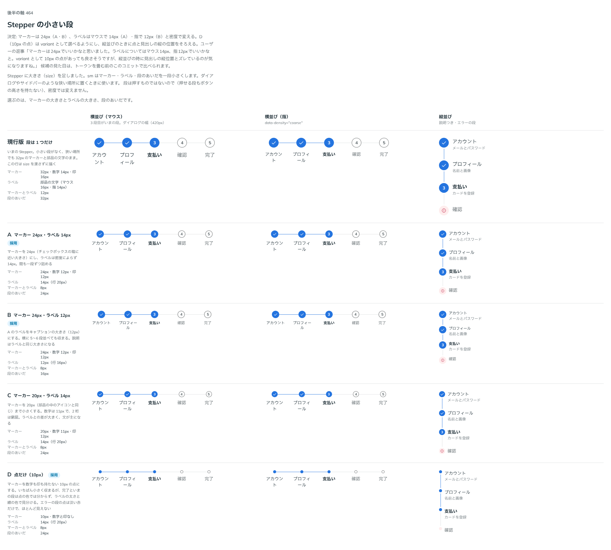

# 0428. Stepper の小さい段（size="sm"）は、マーカー 24px。ラベルはマウス 14px・指 12px

- ステータス: Accepted
- 日付: 2026-10-01
- ラウンド: 後半 軸 464

## 背景

Stepper に大きさ（`size`）を足しました。小さい段（`sm`）は、ダイアログやサイドバーのような狭い場所に置きます。マーカー・ラベル・段のあいだを一段小さくします。段は押すものではないので、高さを指で押せる大きさに合わせる必要はありません。

## 候補

比較は、決めた時点のコミット `70feeec` の比較のストーリー（`design/stories/axis-464-stepper-size.stories.tsx`）です。列は「横並び（マウス）」「横並び（指）」「縦並び」です。

| 案                | マーカー | ラベル                             |
| ----------------- | -------- | ---------------------------------- |
| 現行版            | 32px     | 部品の文字（マウス 16px・指 14px） |
| A（採用・マウス） | 24px     | 14px（行 20px）                    |
| B（採用・指）     | 24px     | 12px（行 16px）                    |
| C                 | 20px     | 14px（行 20px）                    |
| D                 | 点 10px  | 14px（行 20px）                    |

D は [ADR-0429](./0429-stepper-dot.md) で別に決めました。

## 決定

**`size="sm"` のマーカーは 24px にします。ラベルは、マウスで 14px（行 20px）、指で 12px（行 16px）と、密度で変えます。** 段のあいだも一段詰めます。

- マーカー 24px は、チェックボックスの箱に近い大きさです。数字と印は 12px です
- ラベルの密度による切り替えは、部品の中の文字が指で小さくなる決まり（[原則 11](../principles.md#11-文字の大きさは入力方式で切り替える)）と同じです。指では、横に 5〜6 段並べても収まります

## 理由

ユーザーの返事の原文です。

> マーカーは24pxでいいかなと思いました。ラベルについてはマウス14px、指12pxでいいかなと。variant として 10px の点があっても良さそうですが、縦並びの時に見出しの縦位置とズレているのが気になりますね。

出どころはトリアージの F104 です。点の話は [ADR-0429](./0429-stepper-dot.md) で決めました。

## 却下した案と理由

- **C（マーカー 20px）**: 採りませんでした。部品の中のアイコンと同じ大きさで、数字が 11px になり 2 桁が窮屈です。ラベルとの差が大きくなり、文が主になります
- **ラベルを密度で変えない（A だけ・B だけ）**: 採りませんでした。マウスでは 14px で読みやすく、指では 12px で狭い場所に多く収まるため、部品の中の文字の決まりに合わせました

## 影響

- `src/components/stepper/Stepper.tsx`: `size`（`md`・`sm`。既定 `md`）を持ちます。ラベルは `--density-coarse` で、マウス用と指用のトークンのあいだを選びます
- `design/tokens.css`: `--stepper-label-text-sm-fine`・`-coarse`、`--stepper-label-leading-sm-fine`・`-coarse`
- 比較のストーリーは消しました

## 原則への反映

反映なし。ラベルが指で小さくなるのは、原則 11 の「指で小さくするのは、部品の中の文字…」に当たり、原則の文を変える必要はありません。マーカー（押さない印）は大きさの段で持つだけです。

## 比較画像

決めた時点のコミットは、比較が `70feeec`、実装が `92132e1` です。`git checkout 70feeec && pnpm storybook` で、比較のストーリー（`Design Review/464 Stepper の小さい段`）を決めたときの部品のまま開けます。
