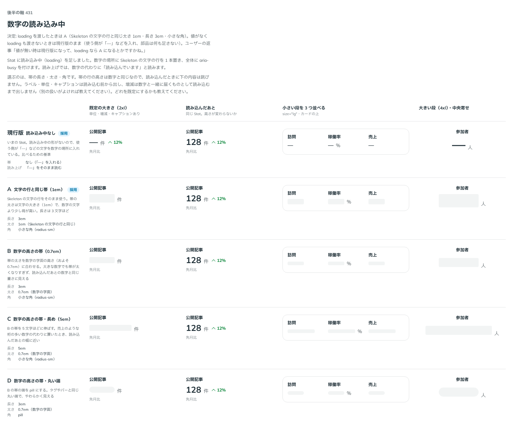

# 0430. Stat の読み込み中は、数字の場所に Skeleton の文字の行を置く。値も loading もないときは何も足さない

- ステータス: Accepted
- 日付: 2026-10-01
- ラウンド: 後半 軸 431

## 背景

Stat に読み込み中（`loading`）を足すにあたり、数字の場所に置く帯の長さ・太さ・角を決めました（出どころ: トリアージ F70）。

## 候補

比較は、決めた時点のコミット `42e7a75` の比較のストーリー（`design/stories/axis-431-stat-loading.stories.tsx`）です。

| 案             | 帯                                                        |
| -------------- | --------------------------------------------------------- |
| 現行版（採用） | 何も足さない。使う側が「—」などを入れる                   |
| A（採用）      | Skeleton の文字の行と同じ（太さ 1em・長さ 3em・小さな角） |
| B              | 数字の字面の高さ（0.7em）・長さ 3em                       |
| C              | 0.7em・長さ 5em                                           |
| D              | B の端を pill にしたもの                                  |

## 決定

**`loading` を渡したときは、数字の場所に Skeleton の文字の行（太さ 1em・長さ 3em）を置きます（A）。** 値がなく `loading` もないときは、部品は何も足しません（現行版）。使う側が「—」などを値に入れます。

- 帯の行の高さは数字と同じなので、読み込んだときに下の内容は跳びません
- ラベル・単位・キャプションは読み込む前から出し、増減は数字と一緒に届くものとして、読み込むまで出しません
- 読み上げでは、数字の代わりに「読み込んでいます」と読みます（`loadingText`）。全体に `aria-busy` を付けます

## 理由

ユーザーの返事の原文です。

> 値が無い時は現行版になって、loading なら A になるとかですかね。

## 却下した案と理由

B〜D は、見た目の差が小さいか、Skeleton の文字の行から外れるため採りませんでした。「値がないとき」に部品が「—」を足す案も採りませんでした（原則 20。何を出すかは使う側が決めます）。

## 影響

- `src/components/stat/Stat.tsx`: `loading`（既定 `false`）と `loadingText` を持ちます
- 帯の長さは `--stat-loading-width`。太さ・角は Skeleton の文字の行のままで、比べるためだけに置いた太さ・角のトークンは消しました（実装のコミット `d91d94d`）
- 比較のストーリーは消しました

## 原則への反映

反映なし。読み込み中の場所取りを Skeleton の淡い光で示すのは、原則 14 にすでにあります。

## 比較画像

決めた時点のコミットは、比較が `42e7a75`、実装が `d91d94d` です。`git checkout 42e7a75 && pnpm storybook` で、比較のストーリー（`Design Review/431 数字の読み込み中`）を決めたときの部品のまま開けます。
