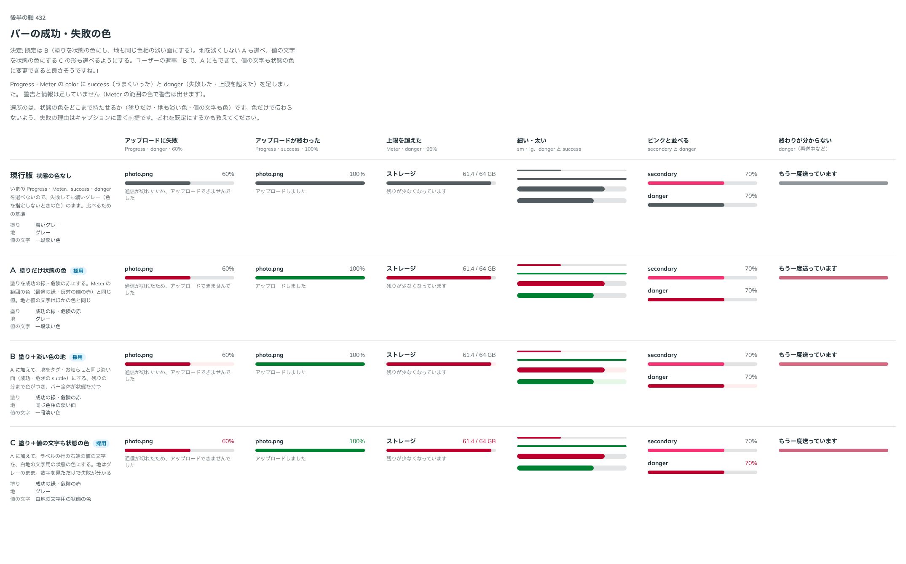

# 0431. Progress・Meter の状態の色（success・danger）は、塗りも地も状態の色にする。地を灰色に、値の文字を状態の色にも選べる

- ステータス: Accepted
- 日付: 2026-10-01
- ラウンド: 後半 軸 432

## 背景

Progress・Meter に成功（success）と失敗（danger）の色を足すにあたり、状態の色をバーのどこまで持たせるかを決めました（出どころ: トリアージ F74）。

## 候補

比較は、決めた時点のコミット `42e7a75` の比較のストーリー（`design/stories/axis-432-bar-status-color.stories.tsx`）です。

| 案                | 塗り           | 地               | 値の文字   |
| ----------------- | -------------- | ---------------- | ---------- |
| 現行版            | 色なし（灰色） | 灰色             | 一段淡い色 |
| A（採用・選べる） | 状態の色       | 灰色             | 一段淡い色 |
| B（採用・既定）   | 状態の色       | 同じ色相の淡い面 | 一段淡い色 |
| C（採用・選べる） | 状態の色       | 灰色             | 状態の色   |

## 決定

**B を既定にします。** 塗りを状態の色（成功の緑・危険の赤）にし、地も同じ色相の淡い面にします。`trackColor="neutral"` で地を灰色にでき（A）、`valueColor="color"` で値の文字も状態の色にできます（C）。

- 残りの分まで色がつくので、バー全体が状態を持ちます
- 色だけで伝わらないよう、失敗の理由はキャプションに書く前提です

## 理由

ユーザーの返事の原文です。

> B で、A にもできて、値の文字も状態の色に変更できると良さそうですね。

## 却下した案と理由

なし。3 案とも選べる形になりました。

## 影響

- `src/internal/bar/bar-styles.ts`: `BarTrackColor`（`color`・`neutral`）と `BarValueColor`（`muted`・`color`）。Progress・Meter が共有します
- `src/index.ts` から `BarColor`・`BarSize`・`BarTrackColor`・`BarValueColor` を出します
- 警告と情報は足していません（Meter の範囲の色で警告は出せます）
- 比べるためだけに置いた切り替えのトークンは、実装のコミット（`d91d94d`）で畳んで消しました
- 比較のストーリーは消しました

## 原則への反映

[原則 6](../principles.md#6-色は役割で持つ) に、状態の色のバーは地まで同じ色相の淡い面にして、バー全体で状態を示すことを書き足しました。

## 比較画像

決めた時点のコミットは、比較が `42e7a75`、実装が `d91d94d` です。`git checkout 42e7a75 && pnpm storybook` で、比較のストーリー（`Design Review/432 バーの成功・失敗の色`）を決めたときの部品のまま開けます。
