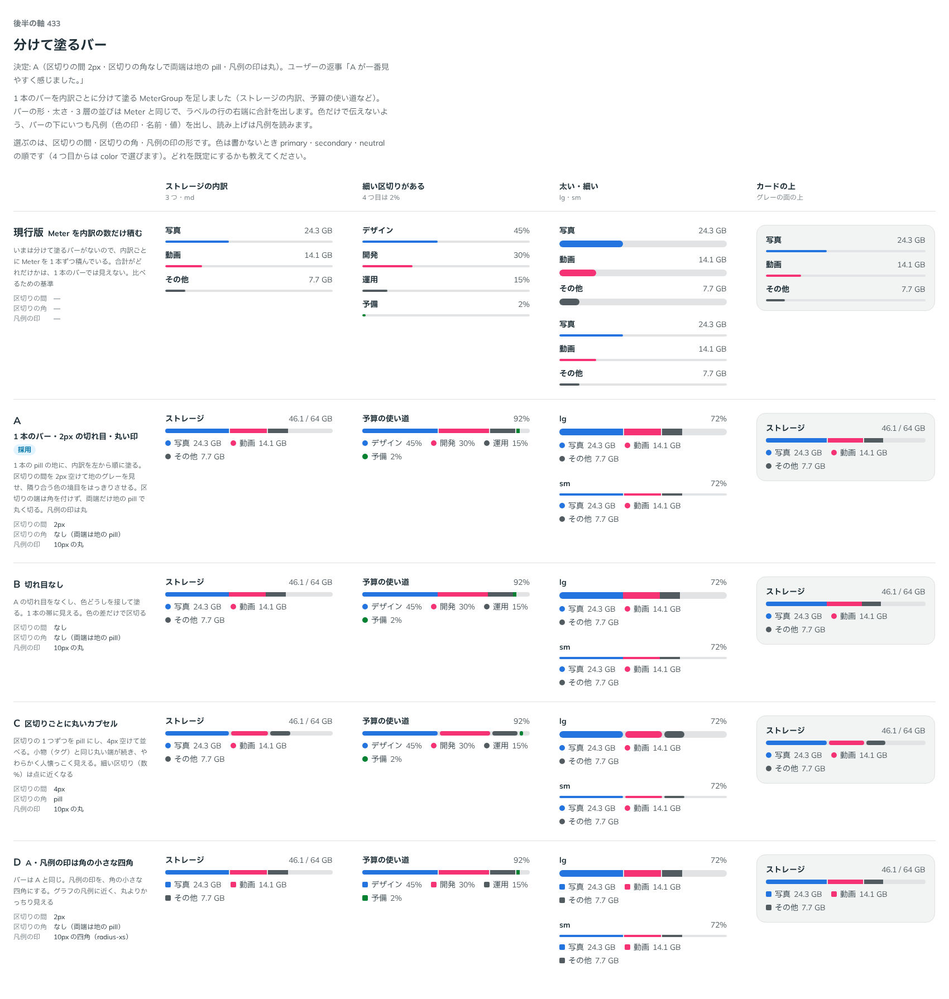

# 0432. MeterGroup は、区切りの間 2px・区切りに角なし・凡例の印は丸にする。等間隔の区切りは作らない

- ステータス: Accepted
- 日付: 2026-10-01
- ラウンド: 後半 軸 433

## 背景

1 本のバーを内訳ごとに分けて塗る MeterGroup の、区切りの間・区切りの角・凡例の印の形を決めました（出どころ: トリアージ F74）。

## 候補

比較は、決めた時点のコミット `42e7a75` の比較のストーリー（`design/stories/axis-433-meter-group.stories.tsx`）です。

| 案        | 区切りの間        | 区切りの角              | 凡例の印       |
| --------- | ----------------- | ----------------------- | -------------- |
| 現行版    | —（Meter を積む） | —                       | —              |
| A（採用） | 2px               | なし（両端は地の pill） | 丸             |
| B         | なし              | なし                    | 丸             |
| C         | 4px               | pill                    | 丸             |
| D         | 2px               | なし                    | 角の小さな四角 |

## 決定

**A を採用します。** 区切りの間は 2px、区切りの角はなし（両端だけ地の pill で丸く切る）、凡例の印は丸です。等間隔の区切り（`segments`）は作りません。

- 隣り合う色の境目が、切れ目ではっきり分かります
- 色だけで伝えないよう、バーの下にいつも凡例（色の印・名前・値）を出し、読み上げは凡例を読みます

## 理由

ユーザーの返事の原文です。

> A が一番見やすく感じました。

## 却下した案と理由

B は境目が色の差だけになります。C は小物のようで軽さを損ない、細い区切りが点に近くなります。D は凡例の印だけの差で、バーが同じです。等間隔の区切り（`segments`）は、内訳の値を持つ MeterGroup の用途から外れるので作りません。

## 影響

- `src/components/meter/MeterGroup.tsx`: 区切りの間・角・凡例の印を畳みました。比べるためだけに置いたトークンは、実装のコミット（`d91d94d`）で消しました
- 色は書かないとき primary・secondary・neutral の順で、4 つ目からは `color` で選びます
- 比較のストーリーは消しました

## 原則への反映

反映なし。内訳を 1 本のバーで見せる部品の細部の決定で、原則が新しく扱う対象は増えていません。

## 比較画像

決めた時点のコミットは、比較が `42e7a75`、実装が `d91d94d` です。`git checkout 42e7a75 && pnpm storybook` で、比較のストーリー（`Design Review/433 分けて塗るバー`）を決めたときの部品のまま開けます。
