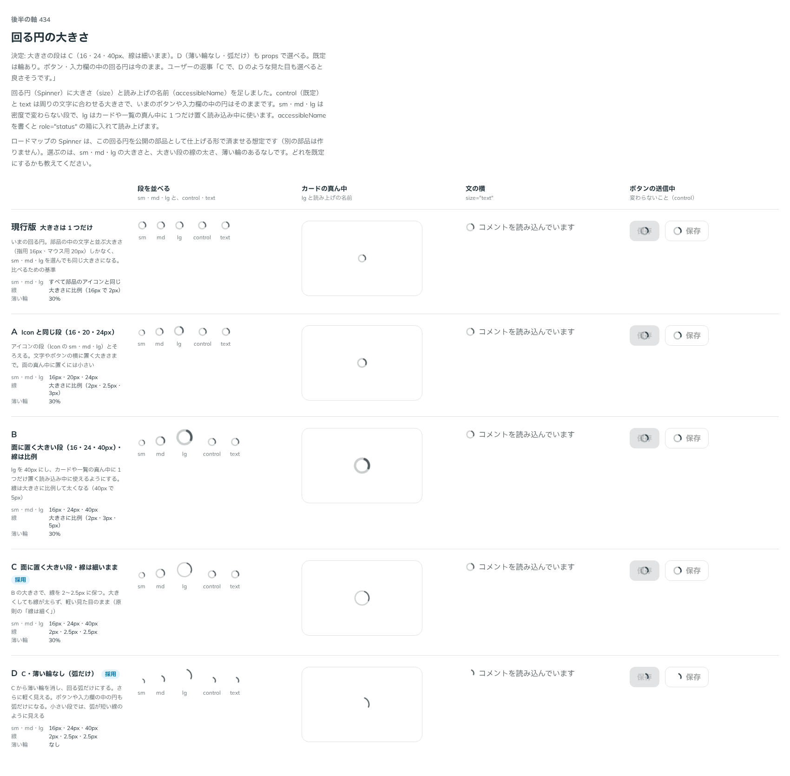

# 0433. Spinner の大きさは 16・24・40px で、線は細いまま。下地の輪を出さない形も選べる

- ステータス: Accepted
- 日付: 2026-10-01
- ラウンド: 後半 軸 434

## 背景

回る円（Spinner）に大きさ（`size`）を足すにあたり、段の大きさ・大きい段の線の太さ・下地の輪の有無を決めました（出どころ: トリアージ F83）。

## 候補

比較は、決めた時点のコミット `42e7a75` の比較のストーリー（`design/stories/axis-434-spinner-size.stories.tsx`）です。

| 案                | 段 sm・md・lg     | 線                   | 下地の輪 |
| ----------------- | ----------------- | -------------------- | -------- |
| 現行版            | 大きさは 1 つだけ | 大きさに比例         | あり     |
| A                 | 16・20・24px      | 比例                 | あり     |
| B                 | 16・24・40px      | 比例（40px で 5px）  | あり     |
| C（採用・既定）   | 16・24・40px      | 細いまま（2〜2.5px） | あり     |
| D（採用・選べる） | 16・24・40px      | 細いまま             | なし     |

## 決定

**C を既定にします。** 段は sm・md・lg で 16・24・40px、線は大きくしても 2〜2.5px の細いままです。`hideTrack` で下地の薄い輪を出さず、弧だけにできます（D）。ボタン・入力欄の中の回る円は変えません（`control`・`text` は周りの文字に合わせる大きさのまま、輪あり）。

- lg は、カードや一覧の真ん中に 1 つだけ置く読み込み中に使います
- 大きくしても線が太らないので、軽い見た目のままです

## 理由

ユーザーの返事の原文です。

> C で、D のような見た目も選べると良さそうです。

## 却下した案と理由

A は面の真ん中に置くには小さいため、B は大きい段で線が太くなり、軽さを損なうため採りませんでした。

## 影響

- `src/components/loading/Loading.tsx`: `size`（`sm`・`md`・`lg`・`control`・`text`）、`accessibleName`、`hideTrack`（既定 `false`）
- 比べるためだけに置いた切り替えのトークンは、実装のコミット（`d91d94d`）で畳みました
- 比較のストーリーは消しました

## 原則への反映

[原則 14](../principles.md#14-動きは手応えと待ちを伝える) に、大きな回る円でも線は細いままにして、軽く見せることを書き足しました。

## 比較画像

決めた時点のコミットは、比較が `42e7a75`、実装が `d91d94d` です。`git checkout 42e7a75 && pnpm storybook` で、比較のストーリー（`Design Review/434 回る円の大きさ`）を決めたときの部品のまま開けます。
