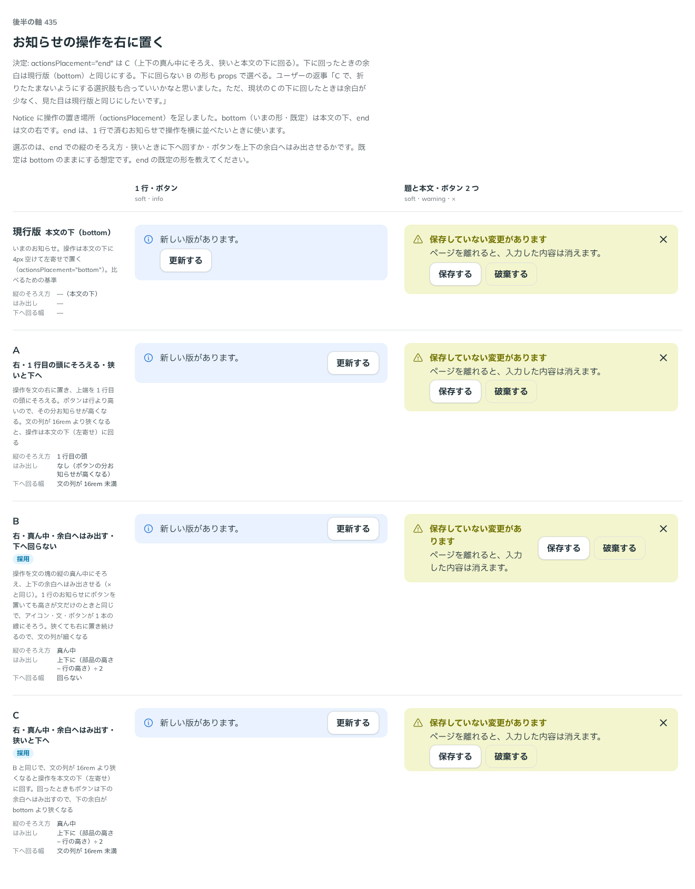

# 0434. Notice の操作を右に置く形（end）は、文の縦の真ん中にそろえ、文の列が狭いと本文の下に回る

- ステータス: Accepted
- 日付: 2026-10-01
- ラウンド: 後半 軸 435

## 背景

Notice の操作を文の右に置く `actionsPlacement="end"` の、縦のそろえ方・狭いときの扱いを決めました（出どころ: トリアージ F78）。

## 候補

比較は、決めた時点のコミット `42e7a75` の比較のストーリー（`design/stories/axis-435-notice-actions-end.stories.tsx`）です。

| 案                | 縦のそろえ方       | はみ出し                   | 狭いとき   |
| ----------------- | ------------------ | -------------------------- | ---------- |
| 現行版（既定）    | 本文の下（bottom） | —                          | —          |
| A                 | 1 行目の頭         | なし（お知らせが高くなる） | 本文の下へ |
| B（採用・選べる） | 真ん中             | 上下の余白へはみ出す       | 回らない   |
| C（採用）         | 真ん中             | 上下の余白へはみ出す       | 本文の下へ |

## 決定

**`actionsPlacement="end"` は C にします。** 操作を文の縦の真ん中にそろえ、ボタンは上下の余白へはみ出させて行の高さを文に合わせます。文の列が 16rem 未満に狭くなると、操作は本文の下に回ります。下に回ったときの見た目は `bottom`（現行版）と同じです。`narrowActionsPlacement="end"` で、狭くても回さず右に置く形（B）も選べます。既定は `bottom` のままです。

- 1 行のお知らせにボタンを置いても、高さが文だけのときと同じです
- アイコン・文・ボタンが 1 本の線にそろいます

## 理由

ユーザーの返事の原文です。

> C で、折りたたまないようにする選択肢も合っていいかなと思いました。ただ、現状のCの下に回したときは余白が少なく、見た目は現行版と同じにしたいです。

## 却下した案と理由

A は、ボタンの分だけお知らせが高くなるため採りませんでした。C の下に回したときの余白が bottom より狭い案（比較の C）は、返事のとおり bottom と同じ余白に直しました。

## 影響

- `src/components/notice/Notice.tsx`: `actionsPlacement`（`bottom`・`end`。既定 `bottom`）、`narrowActionsPlacement`（`bottom`・`end`）
- `src/components/notice/use-actions-wrapped.ts`: 文の列の幅から、操作が下に回るかを測ります
- 比べるためだけに置いた縦のそろえ方とはみ出しのトークン（`--notice-actions-align`・`--notice-actions-margin-y`）は、実装のコミット（`d91d94d`）で部品に畳んで消しました。残したのは `--notice-actions-gap` と `--notice-actions-text-min` です
- 比較のストーリーは消しました

## 原則への反映

反映なし。操作の置き場所の決定で、原則が新しく扱う対象は増えていません。

## 比較画像

決めた時点のコミットは、比較が `42e7a75`、実装が `d91d94d` です。`git checkout 42e7a75 && pnpm storybook` で、比較のストーリー（`Design Review/435 お知らせの操作を右に置く`）を決めたときの部品のまま開けます。
