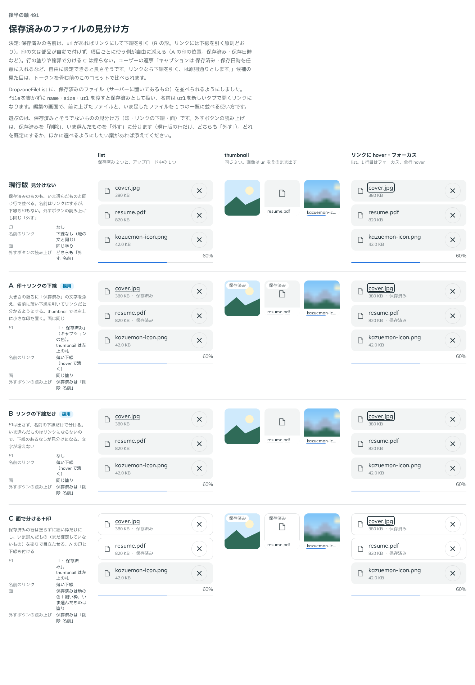

# 0436. DropzoneFileList は「保存済み」などの文を付けず、項目ごとの caption を使う側が添える

- ステータス: Accepted
- 日付: 2026-10-01
- ラウンド: 後半 軸 491

## 背景

保存済みのファイルに「保存済み」の印を付けるかを比べました（[ADR-0435](./0435-dropzone-saved-file-link.md)）。印の文を部品が決めるのか、使う側に任せるのかを決めました。

## 候補

比較は [ADR-0435](./0435-dropzone-saved-file-link.md) と同じ、決めた時点のコミット `dd4fe39` の比較のストーリーです。案 A は部品が「保存済み」の文を添える形、B は印を出さない形でした。

## 決定

**部品は「保存済み」などの文を自分で付けません。** 使う側が、項目ごとの caption（保存済み・保存日時など）を自由に添えます。

- caption は、list では大きさの後ろ、thumbnail では左上の札に出ます
- 消すボタンの読み上げの名前は、保存済みは「削除」、いま選んだものは「外す」です
- 部品に `savedLabel` は持たせません

## 理由

ユーザーの返事の原文です。

> 491 キャプションは 保存済み・保存日時を任意に入れるなど、自由に設定できると良さそうです。リンクなら下線を引く、は原則通りとします。

どんな文を添えるかは、使う側の画面で決まります。「保存済み」だけでなく保存日時なども入るので、部品は文を決めません（原則 20）。

## 却下した案と理由

- 部品が「保存済み」の文を付ける形（`savedLabel`）: 言葉や、添えたい内容（日時など）を使う側が変えられず、毎回差し替えが要ります。

## 影響

- `src/components/dropzone/DropzoneFileList.tsx`: `DropzoneFileEntry` に caption を持たせ、`savedLabel` を消しました
- 破壊的変更: `onRemove`・`removeName` が `File` ではなく `DropzoneFileEntry` を受けるようになりました

## 原則への反映

反映なし。内容に関わる文は使う側が決めるという原則 20 のとおりです。経緯の ADR に足しました。

## 比較画像

[ADR-0435](./0435-dropzone-saved-file-link.md) と同じ画像です。決めた時点のコミットは `dd4fe39`（比較）・`7bb5dd9`（実装）です。
