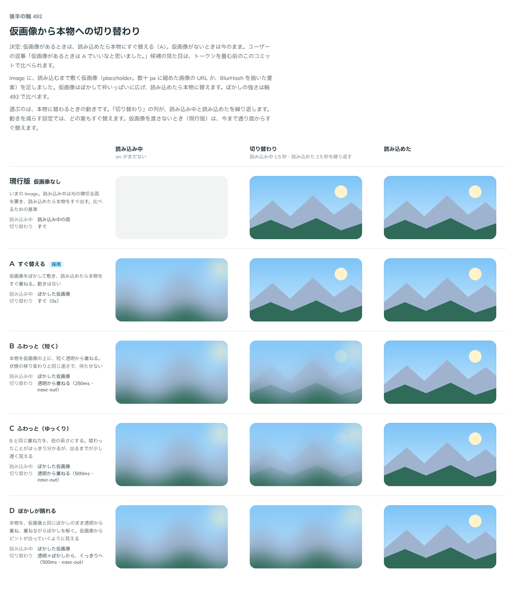

# 0437. Image の仮画像は、読み込めたら本物にすぐ替える

- ステータス: Accepted
- 日付: 2026-10-01
- ラウンド: 後半 軸 492

## 背景

Image に、読み込むまで敷く仮画像（placeholder）を足しました。読み込めたとき、仮画像から本物へどう替えるかを決めました。

## 候補

比較は、決めた時点のコミット `3f59d4a` の比較のストーリー（`design/stories/axis-492-image-reveal.stories.tsx`）です。列は「読み込み中」「切り替わり」「読み込めた」で、切り替わりの列は動きを繰り返します。動きは止めた画像では見えないので、案を言葉で書きます。

| 案        | 切り替わり                                                      |
| --------- | --------------------------------------------------------------- |
| 現行版    | 仮画像なし。読み込み中の面からすぐ替える                        |
| A（採用） | すぐ替える。動きなし                                            |
| B         | 本物を透明から重ねる（250ms）                                   |
| C         | B と同じ重ね方を倍の長さにする（500ms）                         |
| D         | 本物を仮画像と同じぼかしで重ね、重ねながらぼかしを解く（500ms） |

## 決定

**仮画像があるときは、読み込めたら本物にすぐ替えます（A）。** 仮画像がないときは、今までどおりです。

## 理由

ユーザーの返事の原文です。

> 492 仮画像があるときは A でいいなと思いました。

## 却下した案と理由

- B・C・D: 重ねる動きは、仮画像が本物と同じ絵なので、替わったことを知らせる役に立ちません。待たせる長さだけが増えます（原則 14）。

## 影響

- `src/components/image/Image.tsx`: 仮画像を敷いても、読み込めたら本物をすぐ出します
- 重ねて出す動きのトークン（`--image-reveal-duration`・`--image-reveal-from-blur`）は、実装のコミット `e46af66` で消しました
- 比較のストーリーは消しました

## 原則への反映

原則 14 に、仮画像を敷いた画像は読み込めたら本物にすぐ替える、という文を足しました。

## 比較画像

決めた時点のコミットは `3f59d4a`（比較）・`e46af66`（実装）です。`git checkout 3f59d4a && pnpm storybook` で、比較のストーリー（`Design Review/492 仮画像から本物への切り替わり`）を決めたときの部品のまま開けます。
