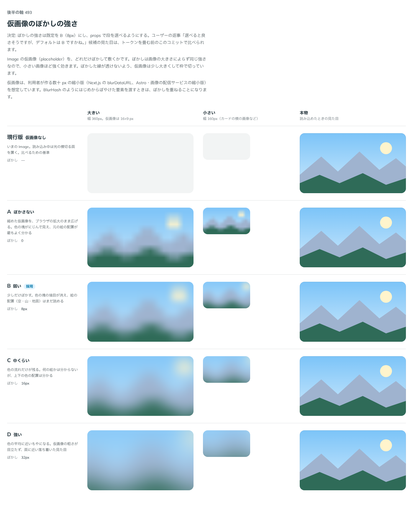

# 0438. Image の仮画像のぼかしは 8px が既定。段を選べる

- ステータス: Accepted
- 日付: 2026-10-01
- ラウンド: 後半 軸 493

## 背景

Image の仮画像（placeholder）を、どれだけぼかして敷くかを決めました。ぼかしは画像の大きさによらず同じ強さなので、小さい画像ほど強く効きます。

## 候補

比較は、決めた時点のコミット `dd4fe39` の比較のストーリー（`design/stories/axis-493-image-placeholder-blur.stories.tsx`）です。列は「大きい」「小さい」「本物」です。

| 案              | ぼかし | 見た目                                       |
| --------------- | ------ | -------------------------------------------- |
| 現行版          | —      | 仮画像なし。光の横切る面                     |
| A               | 0      | 色の塊がにじむ。絵の配置がもっともよく分かる |
| B（採用・既定） | 8px    | 塊の境目が消え、空・山・地面の配置は読める   |
| C               | 16px   | 色の流れだけが残る                           |
| D               | 32px   | 色の平均に近いもやになる                     |

## 決定

**ぼかしは 8px を既定にします（B）。** `placeholderBlur` で `none`・`sm`・`md`・`lg`（0・8・12・16px）から選べます。既定は `sm` です。

段の値は、はじめ比較の C・D にならって 0・8・16・32px にしましたが、レビューで Tailwind の `blur-sm`・`blur-md`・`blur-lg` の値（8・12・16px）にそろえました。既定の `sm`（8px）は変わりません。

## 理由

ユーザーの返事の原文です。

> 493 選べると良さそうですが、デフォルトは B ですかね。

段の値を Tailwind にそろえたときの、レビューでの返事の原文です。

> 4984-4 は B で揃えてしまって OK。他はお勧めの通り

## 却下した案と理由

なし。どの段も選べる形になりました。

## 影響

- `src/components/image/Image.tsx`: `placeholderBlur`（既定 `sm`）を持ちます
- 比べるために置いた 1 つのトークンは、実装のコミット `7bb5dd9` で段ごとのトークン（`--image-placeholder-blur-sm`・`-md`・`-lg`）に畳みました
- レビューで、段のトークンの値を Tailwind の blur の段（8・12・16px）にそろえました。`md`・`lg` は、比較の C・D より弱くなります
- 比較のストーリーと、その見本の画像（`axis-image-samples.ts`）は消しました

## 原則への反映

反映なし。既定を 1 つ決め、ほかの形は選べるようにするという原則 20 の範囲内です。

## 比較画像

決めた時点のコミットは `dd4fe39`（比較）・`7bb5dd9`（実装）です。`git checkout dd4fe39 && pnpm storybook` で、比較のストーリー（`Design Review/493 仮画像のぼかしの強さ`）を決めたときの部品のまま開けます。
