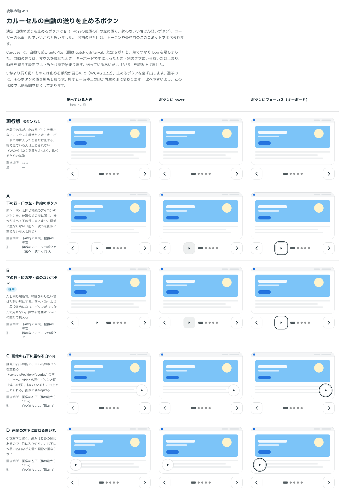

# 0439. Carousel の自動再生を止めるボタンは、下の行の位置の印の左に置く、線のないいちばん軽いボタン

- ステータス: Accepted
- 日付: 2026-10-01
- ラウンド: 後半 軸 451

## 背景

Carousel に自動で送る `autoPlay` を足しました。5 秒より長く動くものには止める手段が要る（WCAG 2.2.2）ので、止めるボタンを必ず出します。その置き場所と形を決めました。

## 候補

比較は、決めた時点のコミット `7d6c75e` の比較のストーリー（`design/stories/axis-451-carousel-autoplay.stories.tsx`）です。列は「送っているとき」「ボタンに hover」「ボタンにフォーカス（キーボード）」の 3 つです。

| 案              | 内容                                                                                                             |
| --------------- | ---------------------------------------------------------------------------------------------------------------- |
| 現行版          | ボタンなし（マウスを載せたとき・キーボードで中に入ったときだけ止まる。指では止められないので、比べるための基準） |
| A               | 下の行・位置の印の左・枠線のボタン（前へ・次へと同じ）                                                           |
| B（採用・既定） | 下の行・位置の印の左・線のないボタン（前へ・次へより一段控えめ）                                                 |
| C               | 画像の右下に重ねる白い丸（影あり）                                                                               |
| D               | 画像の左下に重ねる白い丸（影あり）                                                                               |

## 決定

**B（下の行の位置の印の左に置く、線のないボタン）にします。**

- 操作が前へ・次へ・位置の印と同じ下の行にまとまり、画像に重なりません
- 線をなくして、前へ・次へより一段控えめにします。ボタンが 3 つ並んで見えず、押せる範囲は hover の塗りで分かります
- 押すと一時停止の印が再生の印に変わります

## 理由

ユーザーの返事の原文です。

> 451 B でいいかなと思いました。

## 却下した案と理由

A（枠線のボタン）と、C・D（画像に重ねる白い丸）は選ばれませんでした。ユーザーは B を選び、理由は添えていません。C・D は画像の隅が隠れる形です。

## 影響

- `src/components/carousel/CarouselBase.tsx`・`use-auto-play.ts`: 止めるボタンを下の行の位置の印の左に置きます
- 比べるためだけに置いた切り替えのトークン（`--carousel-autoplay-*-display`・`overlay-justify`）は、実装のコミットで畳んで消しました
- 比較のストーリーは消しました

## 原則への反映

反映なし。前へ・次へを画像に重ねず下の行に置く既存の考え（原則 17 の押せる範囲、ADR-0283）の範囲内で、原則の文は変わりません。

## 比較画像

決めた時点のコミットは、比較が `7d6c75e`、実装が `ac690ae` です。`git checkout 7d6c75e && pnpm storybook` で、比較のストーリー（`Design Review/451 カルーセルの自動の送りを止めるボタン`）を決めたときの部品のまま開けます。
