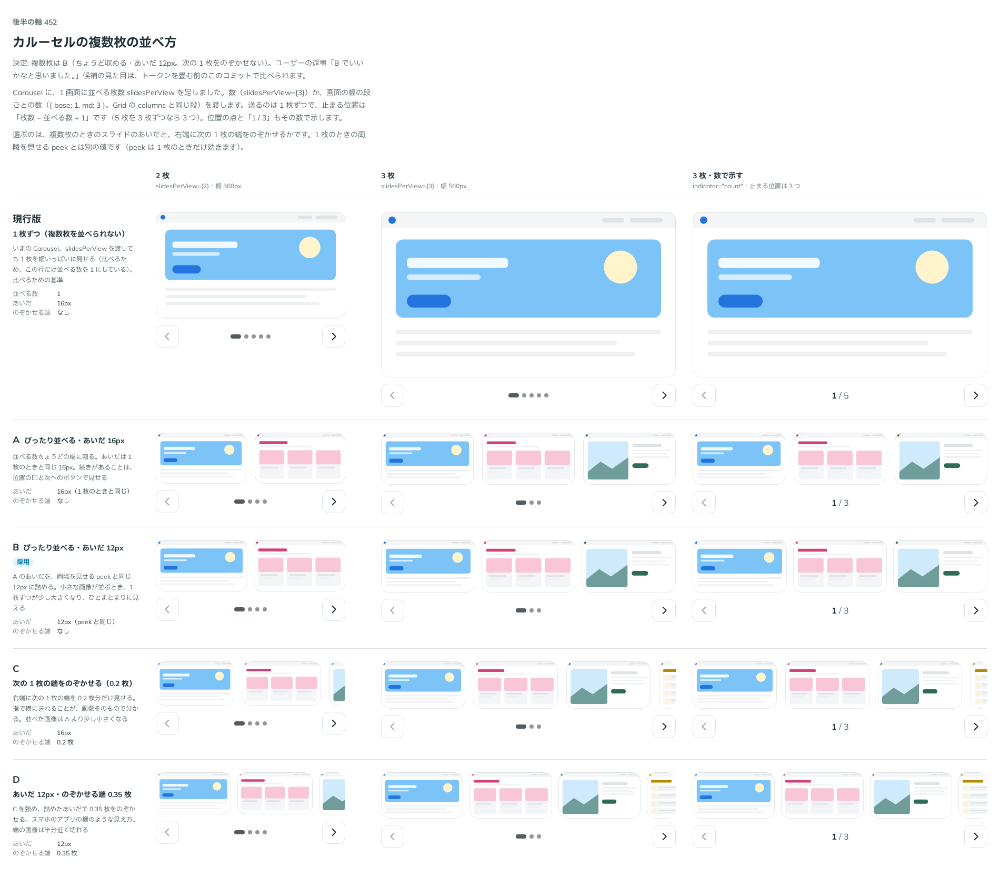

# 0440. Carousel の 1 画面に複数枚は、ちょうど収めてあいだを 12px にする。次の 1 枚の端はのぞかせない

- ステータス: Accepted
- 日付: 2026-10-01
- ラウンド: 後半 軸 452

## 背景

Carousel に、1 画面に複数枚を並べる `slidesPerView` を足しました。スライドのあいだと、右端に次の 1 枚の端をのぞかせるかを決めました。

## 候補

比較は、決めた時点のコミット `f421ab2` の比較のストーリー（`design/stories/axis-452-carousel-per-view.stories.tsx`）です。列は「2 枚」「3 枚」「3 枚・数で示す」の 3 つです。

| 案              | 内容                                                    |
| --------------- | ------------------------------------------------------- |
| 現行版          | 1 枚ずつ（複数枚を並べられない。比べるための基準）      |
| A               | ぴったり並べる・あいだ 16px（1 枚のときと同じ）         |
| B（採用・既定） | ぴったり並べる・あいだ 12px（両隣を見せる peek と同じ） |
| C               | 次の 1 枚の端を 0.2 枚のぞかせる・あいだ 16px           |
| D               | あいだ 12px・のぞかせる端 0.35 枚                       |

## 決定

**B（ちょうど収め、あいだは 12px）にします。** 次の 1 枚の端はのぞかせません。

- 小さな画像が並ぶとき、1 枚ずつが少し大きくなり、ひとまとまりに見えます
- 続きがあることは、位置の印と次へのボタンで見せます
- 1 枚のときの両隣を見せる `peek` は、1 枚のときだけ効きます

## 理由

ユーザーの返事の原文です。

> 452 B でいいかなと思いました。

## 却下した案と理由

A（あいだ 16px）と、C・D（次の 1 枚の端をのぞかせる形）は選ばれませんでした。ユーザーは B を選び、理由は添えていません。C・D は並んだ画像が A・B より小さくなる形です。

## 影響

- `src/components/carousel/CarouselBase.tsx`・`design/tokens.css`: 複数枚のあいだ（`--carousel-per-view-gap`）を 12px にしました。比べるためだけに置いたのぞかせる端のトークン（`--carousel-per-view-peek`）は、実装のコミットで畳んで消しました
- 比較のストーリーは消しました

## 原則への反映

反映なし。スライドの並べ方の決定で、原則が新しく扱う対象は増えていません。

## 比較画像

決めた時点のコミットは、比較が `f421ab2`、実装が `e822295` です。`git checkout f421ab2 && pnpm storybook` で、比較のストーリー（`Design Review/452 カルーセルの複数枚の並べ方`）を決めたときの部品のまま開けます。
