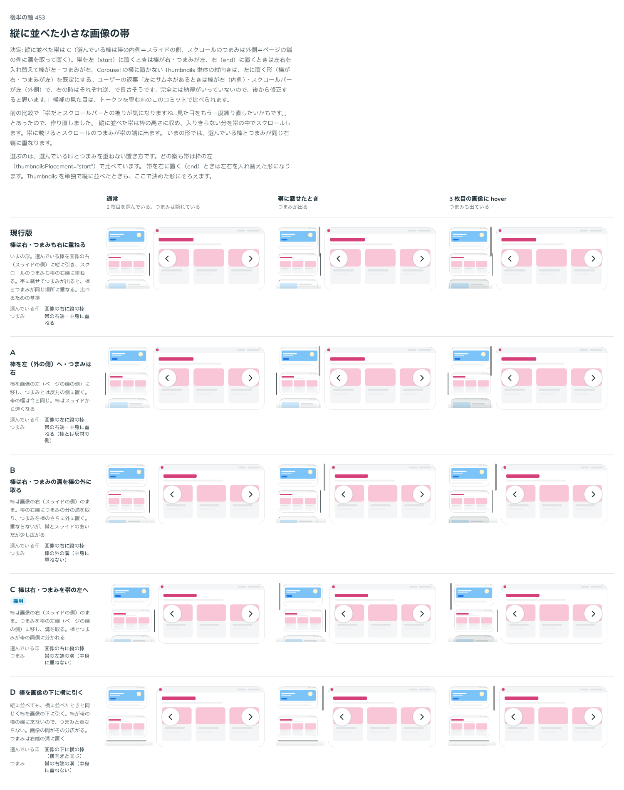

# 0441. 縦に並べた Thumbnails は、選んでいる棒を帯の内側に、スクロールのつまみを外側に溝を取って置く

- ステータス: Accepted
- 日付: 2026-10-01
- ラウンド: 後半 軸 453

## 背景

Carousel の横に Thumbnails を縦に並べると、選んでいる棒と、帯に載せたときに出るスクロールのつまみが帯の同じ右端に重なりました。重ならない置き方を決めました。最初の比較では、ユーザーが帯とスクロールバーの被りを気にしたので、候補を作り直して比べ直しました（作り直しは `b8b75c2`）。

## 候補

比較は、決めた時点のコミット `b3c87d9` の比較のストーリー（`design/stories/axis-453-thumbnails-vertical.stories.tsx`）です。列は「通常」「帯に載せたとき」「3 枚目の画像に hover」の 3 つ。帯は枠の左（`thumbnailsPlacement="start"`）で比べています。

| 案              | 内容                                                                                           |
| --------------- | ---------------------------------------------------------------------------------------------- |
| 現行版          | 棒は右・つまみも右に重ねる（比べるための基準）                                                 |
| A               | 棒を左（外側）へ。つまみは右                                                                   |
| B               | 棒は右。つまみの溝を棒の外に取る                                                               |
| C（採用・既定） | 棒は右（スライドの側）。つまみを帯の左端の外側に溝を取って置く。棒とつまみが帯の両側に分かれる |
| D               | 棒を画像の下に横に引く（横向きと同じ）。つまみは右端の溝                                       |

## 決定

**C を採用します。** 選んでいる棒は帯の内側（スライドの側）に、スクロールのつまみは外側（ページの端の側）に、溝を取って置きます。

- 帯を左に置くときは、棒が右・つまみが左です。右に置く（`end`）ときは左右を入れ替え、棒が左・つまみが右です
- Carousel の横に置かない Thumbnails 単体の縦向きは、左に置く形（棒が右・つまみが左）が既定です
- 棒とつまみが同じ場所に重なりません

## 理由

ユーザーの返事の原文です。

> 453（最初）帯だとスクロールバーとの被りが気になりますね…見た目をもう一度練り直したいかもです。
>
> 453（作り直したあと）左にサムネがあるときは棒が右（内側）・スクロールバーが左（外側）で、右の時はそれぞれ逆、で良さそうです。完全には納得がいっていないので、後から修正すると思います。

## 却下した案と理由

現行版は棒とつまみが重なるため、最初の比較で見直しになりました。A・B・D は選ばれませんでした。ユーザーの返事は C の置き方を述べたもので、ほかの案への理由は添えていません。

## 影響

- `src/components/thumbnails/Thumbnails.tsx`・`src/components/carousel/CarouselBase.tsx`・`src/internal/carousel-context.ts`: 棒を内側、つまみを外側の溝に置きます
- 比べるためだけのトークン（`--thumbnails-vertical-*`・`--carousel-thumbnails-bar-toward-slide`）は、実装のコミットで畳んで消しました
- ユーザーは「完全には納得がいっていない」と言っており、あとで見直します（backlog に残しています）

## 原則への反映

原則 1 の、スクロールできる面のつまみに関する文を足しました。つまみは、選んでいる印と同じ場所に重ねず、選んでいる印は中身の側に、つまみは外側に溝を取って置きます。

## 比較画像

決めた時点のコミットは、比較が `b3c87d9`、実装が `9ea39c9` です。`git checkout b3c87d9 && pnpm storybook` で、比較のストーリー（`Design Review/453 縦に並べた小さな画像の帯`）を決めたときの部品のまま開けます。
