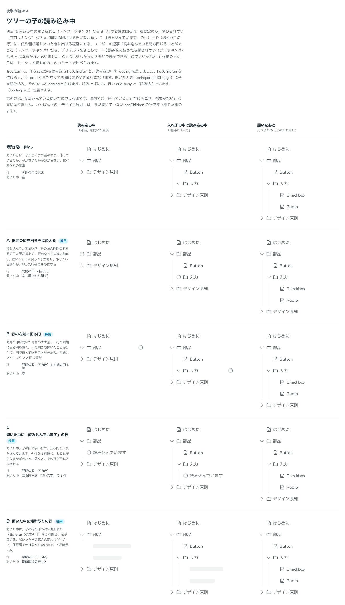

# 0442. Tree の読み込み中は、閉じられるなら行の右端に回る円、閉じられないなら開閉の印が回る円

- ステータス: Accepted
- 日付: 2026-10-01
- ラウンド: 後半 軸 454

## 背景

Tree の子をあとから読み込む行（`hasChildren`・`loading`）で、読み込んでいるあいだの見せ方を決めました。原則では、待っていることだけを見せ、結果がないとは言い切りません。

## 候補

比較は、決めた時点のコミット `7d6c75e` の比較のストーリー（`design/stories/axis-454-tree-loading.stories.tsx`）です。列は「読み込み中」「入れ子の中で読み込み中」「届いたあと」の 3 つです。

| 案                | 内容                                                         |
| ----------------- | ------------------------------------------------------------ |
| 現行版            | 印なし（開いた行は、子が届くまで空のまま。比べるための基準） |
| A（採用）         | 開閉の印を回る円に替える                                     |
| B（採用・既定）   | 開閉の印は開いた向きのまま、行の右端に回る円                 |
| C（採用・選べる） | 開いた中に「読み込んでいます」の行                           |
| D（採用・選べる） | 開いた中に、子の行の形の淡い場所取り（Skeleton）を 2 行      |

## 決定

**閉じられるかどうかで見せ方を変えます。** 読み込んでいるあいだも閉じられる（`loadingBehavior="non-blocking"`、既定）なら B（行の右端に回る円）、読み込み始めたら閉じられない（`"blocking"`）なら A（開閉の印が回る円）です。

- C（「読み込んでいます」の行）と D（場所取りの行）は、使う側が選んだときだけ出します（`loadingPlaceholder="text"`・`"skeleton"`。既定は出さない）
- B は開閉の印を残すので、印の向きで開いていることが分かり、円で待っていることが分かります
- A は閉じられない行の印が回る円になり、押せない理由がその場で分かります

## 理由

ユーザーの返事の原文です。

> 454 読み込んでいる間も閉じることができる（ノンブロッキング）なら、デフォルトをBとして、一度読み込み始めたら閉じれない（ブロッキング）なら A になるかなと思いました。CとDは欲しかったら追加で表示できる、位でいいかなと。

## 却下した案と理由

却下した案はありません。現行版（印なし）は、待っているのか子がないのか分からないため採りません。

## 影響

- `src/components/tree/Tree.tsx`: `loadingBehavior`・`loadingPlaceholder` を持ちます
- 比べるためだけの切り替えのトークン（`--tree-loading-*`）は、実装のコミットで畳んで消しました
- 比較のストーリーは消しました

## 原則への反映

原則 14 に、待っている印の置き場所を閉じられるかどうかで変える文を足しました。

## 比較画像

決めた時点のコミットは、比較が `7d6c75e`、実装が `ac690ae` です。`git checkout 7d6c75e && pnpm storybook` で、比較のストーリー（`Design Review/454 ツリーの子の読み込み中`）を決めたときの部品のまま開けます。
