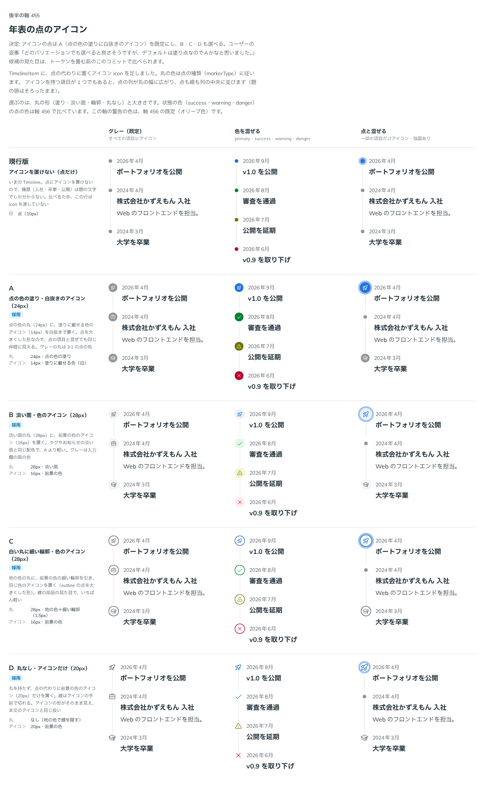

# 0443. Timeline のアイコンの点は、点の色の塗りに白抜きのアイコンが既定。ほかの形も選べる

- ステータス: Accepted
- 日付: 2026-10-01
- ラウンド: 後半 軸 455

## 背景

Timeline の点にアイコンを置くとき（`icon`）の、丸の形と色を決めました。

## 候補

比較は、決めた時点のコミット `7d6c75e` の比較のストーリー（`design/stories/axis-455-timeline-icon.stories.tsx`）です。列は「グレー（既定）」「色を混ぜる」「点と混ぜる」の 3 つです。

| 案                | 内容                                           |
| ----------------- | ---------------------------------------------- |
| 現行版            | アイコンを置けない（点だけ。比べるための基準） |
| A（採用・既定）   | 点の色の塗り（24px）に白抜きのアイコン         |
| B（採用・選べる） | 淡い面（28px）に前景の色のアイコン             |
| C（採用・選べる） | 白い丸に細い輪郭、前景の色のアイコン（28px）   |
| D（採用・選べる） | 丸なしで、前景の色のアイコンだけ（20px）       |

## 決定

**A（点の色の塗りに白抜きのアイコン、`iconVariant="filled"`）を既定にします。** B（`soft`）・C（`outline`）・D（`plain`）も選べます。

- A は点を大きくした形なので、点の項目と混ぜても同じ仲間に見えます
- 丸の色は点の種類（`markerType`）に従います

## 理由

ユーザーの返事の原文です。

> 455 どのバリエーションでも選べると良さそうですが、デフォルトは塗り点なのでAかなと思いました。

## 却下した案と理由

なし。全案が選べる形になりました。

## 影響

- `src/components/timeline/Timeline.tsx`: `Timeline`・`TimelineItem` が `iconVariant`（`filled`・`soft`・`outline`・`plain`。既定 `filled`）を持ちます
- 比べるためだけのトークン（`--timeline-icon-fill`・`surface`・`ring`）は、実装のコミットで畳んで消しました
- `plain` は props の語彙にありません（backlog に書きました）

## 原則への反映

反映なし。アイコンの丸の形の決定で、原則が新しく扱う対象は増えていません。既定と選べる形（原則 20）の範囲内です。

## 比較画像

決めた時点のコミットは、比較が `7d6c75e`、実装が `ac690ae` です。`git checkout 7d6c75e && pnpm storybook` で、比較のストーリー（`Design Review/455 年表の点のアイコン`）を決めたときの部品のまま開けます。
