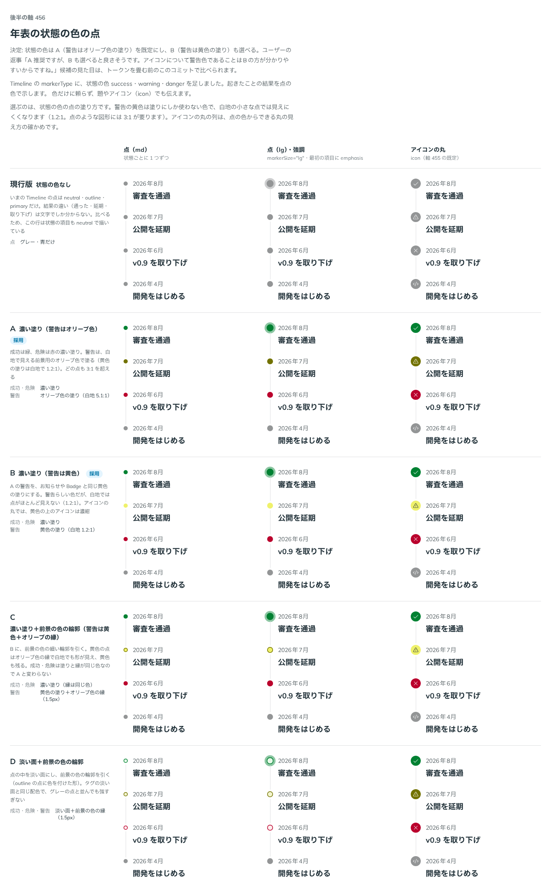

# 0444. Timeline の状態の色の点は濃い塗り。警告の色はオリーブが既定で、黄色も選べる

- ステータス: Accepted
- 日付: 2026-10-01
- ラウンド: 後半 軸 456

## 背景

Timeline の `markerType` に足した状態の色（success・warning・danger）の点の塗り方、とくに警告の黄色を決めました。黄色の塗りは白地で 1.2:1 しかなく、小さな点では見えにくくなります。

## 候補

比較は、決めた時点のコミット `f421ab2` の比較のストーリー（`design/stories/axis-456-timeline-status.stories.tsx`）です。列は「点（md）」「点（lg）・強調」「アイコンの丸」の 3 つです。

| 案                | 内容                                                 |
| ----------------- | ---------------------------------------------------- |
| 現行版            | 状態の色なし（比べるための基準）                     |
| A（採用・既定）   | 濃い塗り。警告はオリーブ色（白地 5.1:1）             |
| B（採用・選べる） | 濃い塗り。警告は黄色（白地 1.2:1）                   |
| C                 | 濃い塗り＋前景の色の輪郭（警告は黄色＋オリーブの縁） |
| D                 | 淡い面＋前景の色の輪郭                               |

## 決定

**A（警告はオリーブ、`warningColor="olive"`）を既定にします。** B（`"yellow"`）も選べます。

- 成功は緑、危険は赤の濃い塗りです
- 既定（A）では、どの点も白地で 3:1 を超えます。黄色（B）は 1.2:1 なので、題やアイコンでも警告を伝えます
- 警告を黄色にすると、アイコンの丸では黄色の上のアイコンが濃紺になります

## 理由

ユーザーの返事の原文です。

> 456 A 推奨ですが、B も選べると良さそうです。アイコンについて警告色であることはBの方が分かりやすいからですね。

## 却下した案と理由

C（輪郭を足す形）と D（淡い面と輪郭）は選ばれませんでした。ユーザーの返事は A と B だけに触れています。

## 影響

- `src/components/timeline/Timeline.tsx`: `Timeline` が `warningColor`（`olive`・`yellow`。既定 `olive`）を持ちます
- 比べるためだけのトークン（`--timeline-status-fill`・`--timeline-status-ring`）は、実装のコミットで畳んで消しました

## 原則への反映

原則 6 の警告の文を書き換えました。黄色を残すのはお知らせやタグの面の塗りで、白地に置く小さな印（点・アイコンの丸）の塗りは、文字や枠線と同じオリーブ色にします。警告だと一目で分かることを優先するときは、小さな印も黄色にできます。

## 比較画像

決めた時点のコミットは、比較が `f421ab2`、実装が `e822295` です。`git checkout f421ab2 && pnpm storybook` で、比較のストーリー（`Design Review/456 年表の状態の色の点`）を決めたときの部品のまま開けます。
