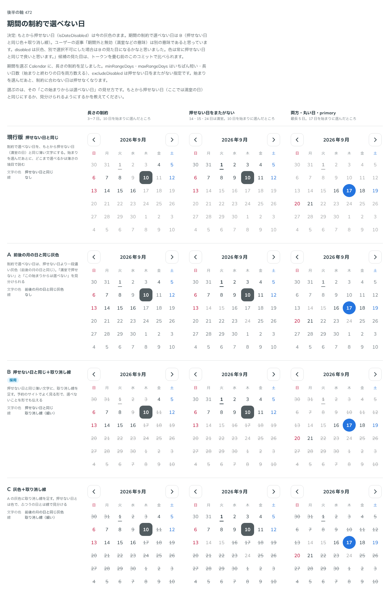

# 0448. Calendar の期間の制約で選べない日は、押せない日と同じ色に取り消し線

- ステータス: Accepted
- 日付: 2026-10-01
- ラウンド: 後半 軸 472

## 背景

期間を選ぶ Calendar に足した長さの制約（`minRangeDays`・`maxRangeDays`・`excludeDisabled`）で、始まりを選んだあとに選べなくなる日の見え方を決めました。

## 候補

比較は、決めた時点のコミット `28921b4` の比較のストーリー（`design/stories/axis-472-calendar-range-constraint.stories.tsx`）です。列は「長さの制約」「押せない日をまたがない」「両方・丸い日・primary」です。

| 案        | 制約で選べない日                         |
| --------- | ---------------------------------------- |
| 現行版    | もとから押せない日と同じ薄い文字         |
| A         | 前後の月の日と同じ灰色                   |
| B（採用） | 押せない日と同じ色に、取り消し線（細い） |

## 決定

**B を採用します。** 期間の制約で選べない日は、押せない日と同じ色に取り消し線を引きます。もとから押せない日（`disabled`。満室など）は、灰色のままで取り消し線を引きません。2 つは意味が違うので、色は同じにして形で見分けます。

## 理由

ユーザーの返事の原文です。

> 期間外と無効（満室などの意味）は別の意味であると思っています。disabled は灰色、別で選択不可にした場合はBの見た目になるかなと思いました。色は常に押せない日と同じで良いと思います。

## 却下した案と理由

現行版は、制約で選べない日ともとから押せない日が見分けられません。A は色の差だけで、押せない日の色と近く、意味の違いが読めません。

## 影響

- `src/components/calendar/Calendar.tsx`: 制約で選べない日に取り消し線の見た目（`data-look="constrained"`）
- `minRangeDays`・`maxRangeDays` は始まりと終わりの日を両方数えます。`excludeDisabled` は押せない日をまたぐ範囲を選べなくします（軸にせず props だけ決めました）

## 原則への反映

[原則 13](../principles.md#13-押せないものは浮かせず薄くする)に、条件で選べないものはもとから押せないものと色を同じにし、形で見分ける、を足しました。

## 比較画像

決めた時点のコミットは、比較が `28921b4`、実装が `1a1df19` です。`git checkout 28921b4 && pnpm storybook` で、比較のストーリー（`None`）を決めたときの部品のまま開けます。
