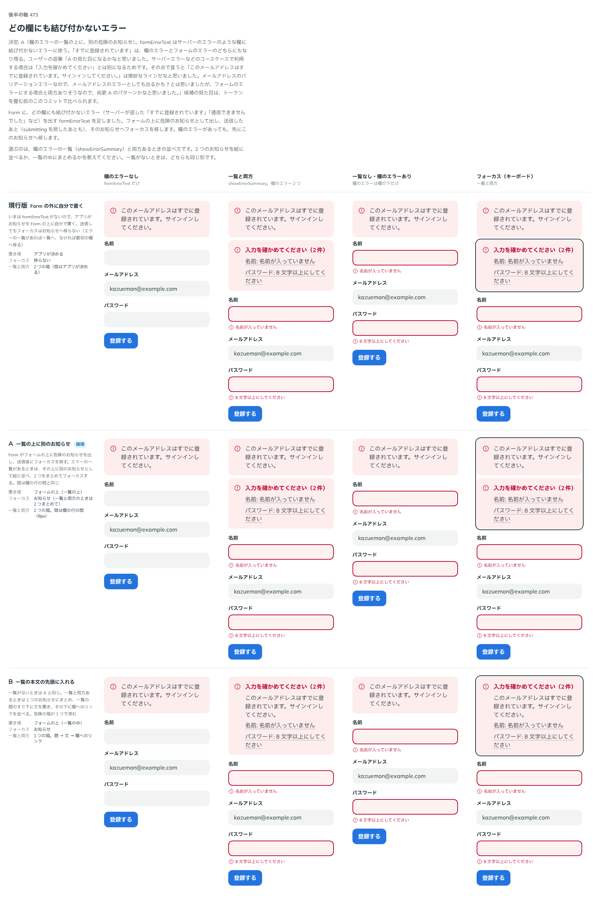

# 0449. Form の formErrorText は、欄のエラーの一覧の上に、別の危険のお知らせとして出す

- ステータス: Accepted
- 日付: 2026-10-01
- ラウンド: 後半 軸 473

## 背景

どの欄にも結び付かないエラー（サーバーが返した「すでに登録されています」「通信できませんでした」など）を Form が出す `formErrorText` を足しました。欄のエラーの一覧（`showErrorSummary`）と両方あるときの並べ方を決めました。

## 候補

比較は、決めた時点のコミット `28921b4` の比較のストーリー（`design/stories/axis-473-form-error-text.stories.tsx`）です。列は「欄のエラーなし」「一覧と両方」「一覧なし・欄のエラーあり」「フォーカス（キーボード）」です。

| 案        | 並べ方                                                                |
| --------- | --------------------------------------------------------------------- |
| 現行版    | Form の外に自分で置く。送信してもフォーカスはお知らせへ移らない       |
| A（採用） | 一覧の上に別の危険のお知らせとして出す。フォーカスは 2 つまとめて移す |
| B         | 一覧の本文の先頭に入れる。2 つのお知らせは 1 つの箱にまとまる         |

## 決定

**A を採用します。** `formErrorText` は、欄のエラーの一覧の上に、別の危険のお知らせとして出します。一覧がないときは、このお知らせだけが出ます。送信したあとのフォーカスは、お知らせ（一覧と 2 つあるときはまとめて）へ移します。

## 理由

ユーザーの返事の原文です。

> A の見た目になるかなと思いました。サーバーエラーなどのユースケースで利用する場合は「入力を確かめてください」とは別になるためです。その点で言うと「このメールアドレスはすでに登録されています。サインインしてください。」は微妙なラインだなと思いました。メールアドレスのバリデーションエラーなので、メールアドレスのエラーとしても出るかも？とは思いましたが、フォームのエラーにする場合と両方ありそうなので、尚更 A のパターンかなと思いました。

## 却下した案と理由

B は「入力を確かめてください」と別の文が 1 つの箱に入り、サーバーのエラーが欄の入力の誤りに見えます。現行版は、使う側が毎回組み、フォーカスも移りません。

## 影響

- `src/components/form/Form.tsx`: `formErrorText`。フォームの上のお知らせとしてフォーカスを移します（送信のたびに移し、中身が変わっただけでは移しません）
- 「すでに登録されています」のように、欄のエラーにもフォームのエラーにもなり得る文は、使う側がどちらかを選びます

## 原則への反映

反映なし。Form の新しい props の並べ方の決定で、原則の文は変わりません。エラーはステータスメッセージで伝える（原則 2）の範囲です。

## 比較画像

決めた時点のコミットは、比較が `28921b4`、実装が `1a1df19` です。`git checkout 28921b4 && pnpm storybook` で、比較のストーリー（`None`）を決めたときの部品のまま開けます。
