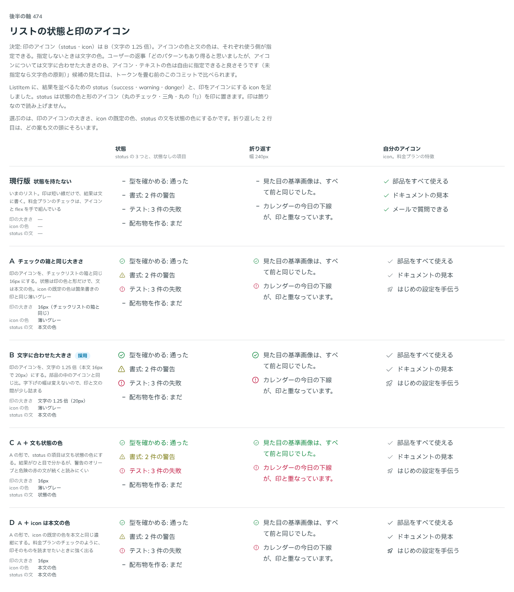

# 0450. List の status・icon の印のアイコンは、文字の 1.25 倍

- ステータス: Accepted
- 日付: 2026-10-01
- ラウンド: 後半 軸 474

## 背景

ListItem に足した、印をアイコンにする `icon` と、結果を並べる `status`（success・warning・danger）の、印のアイコンの大きさを決めました。

## 候補

比較は、決めた時点のコミット `7a0fdde` の比較のストーリー（`design/stories/axis-474-list-status-icon.stories.tsx`）です。列は「状態」「折り返す」「自分のアイコン」です。

| 案        | 印の大きさ・色                             |
| --------- | ------------------------------------------ |
| 現行版    | 状態を持たない                             |
| A         | チェックの箱と同じ 16px。icon は薄いグレー |
| B（採用） | 文字の 1.25 倍                             |
| C         | A に加えて、status の文も状態の色          |
| D         | A に加えて、icon を本文の色                |

## 決定

**B を採用します。** 印のアイコンは文字の 1.25 倍です。折り返した 2 行目は、どの案も文の頭にそろいます。

## 理由

ユーザーの返事の原文です。

> どのパターンもあり得ると思いましたが、アイコンについては文字に合わせた大きさのB、アイコン・テキストの色は自由に指定できると良さそうです（未指定なら文字色の原則）

## 却下した案と理由

A・C・D の 16px は、文字を大きくしたときにアイコンが追従しません。色の決め方は、返事のとおり次の ADR（0451）で props にしました。

## 影響

- `src/components/list/List.tsx`: 印のアイコンの大きさは `1.25em`。折り返しても 1 行目の中央にそろえます

## 原則への反映

[原則 21](../principles.md#21-アイコンは文字に合わせる)の「大きさは周りの文字に比例させる」の範囲です。文の変更はありません。

## 比較画像

決めた時点のコミットは、比較が `7a0fdde`、実装が `9e69bfa` です。`git checkout 7a0fdde && pnpm storybook` で、比較のストーリー（`None`）を決めたときの部品のまま開けます。
