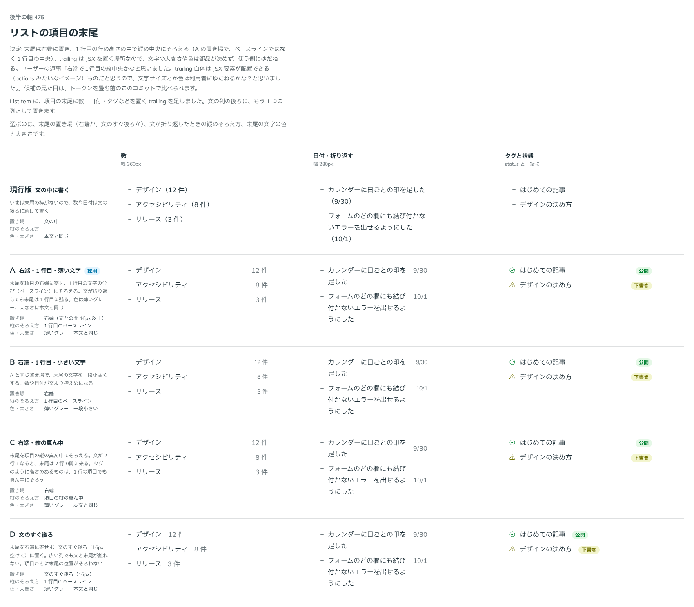

# 0452. ListItem の trailing は右端に置き、1 行目の高さの中で縦の中央にそろえる。中身の見た目は付けない

- ステータス: Accepted
- 日付: 2026-10-01
- ラウンド: 後半 軸 475

## 背景

ListItem に足した、項目の末尾に数・日付・タグなどを置く `trailing` の、置き場・折り返したときの縦のそろえ方・文字の色と大きさを決めました。

## 候補

比較は、決めた時点のコミット `7a0fdde` の比較のストーリー（`design/stories/axis-475-list-trailing.stories.tsx`）です。列は「数」「日付・折り返す」「タグと状態」です。

| 案     | 置き場・縦のそろえ          | 色・大きさ             |
| ------ | --------------------------- | ---------------------- |
| 現行版 | 文の中に書く                | 本文と同じ             |
| A      | 右端・1 行目のベースライン  | 薄いグレー・本文と同じ |
| B      | 右端・1 行目のベースライン  | 薄いグレー・一段小さい |
| C      | 右端・項目の縦の真ん中      | 薄いグレー・本文と同じ |
| D      | 文のすぐ後ろ（16px 空ける） | 薄いグレー・本文と同じ |

## 決定

**右端に置き、1 行目の行の高さの中で縦の中央にそろえます。** 文が折り返しても、末尾は 1 行目に残ります。比較画像では A の行に採用の印が付いていますが、A から採ったのは置き場（右端）だけです。縦は A のベースラインではなく 1 行目の行の高さの中央にそろえ、A の薄いグレーの文字も採りません。この組み合わせの案は比較の中にありません。

`trailing` は JSX を置く場所です。中身の文字の大きさや色は部品が付けず、使う側に任せます（A・B・C の薄いグレーや一段小さい文字は採りません）。

## 理由

ユーザーの返事の原文です。

> 右端で1行目の縦中央かなと思いました。trailing 自体は JSX 要素が配置できる（actions みたいなイメージ）ものだと思うので、文字サイズとか色は利用者にゆだねるかな？と思いました。

## 却下した案と理由

D は項目ごとに末尾の位置がそろいません。C は文が 2 行になると末尾が 2 行の間に来て、1 行目と結び付かなくなります。A・B は、中身がタグのように高さのあるものだと、ベースラインではそろいません。末尾の色と大きさは、中身が決めます。

## 影響

- `src/components/list/List.tsx`: `trailing`。高さは 1 行目の行の高さで、縦の中央にそろえます
- `trailing` の名前を props.md の語彙に足すかは backlog に残しました

## 原則への反映

[原則 20](../principles.md#20-部品は知らないことを決めない)に、使う側が中身を置く枠では、部品は位置だけを決める、を足しました。

## 比較画像

決めた時点のコミットは、比較が `7a0fdde`、実装が `9e69bfa` です。`git checkout 7a0fdde && pnpm storybook` で、比較のストーリー（`None`）を決めたときの部品のまま開けます。
