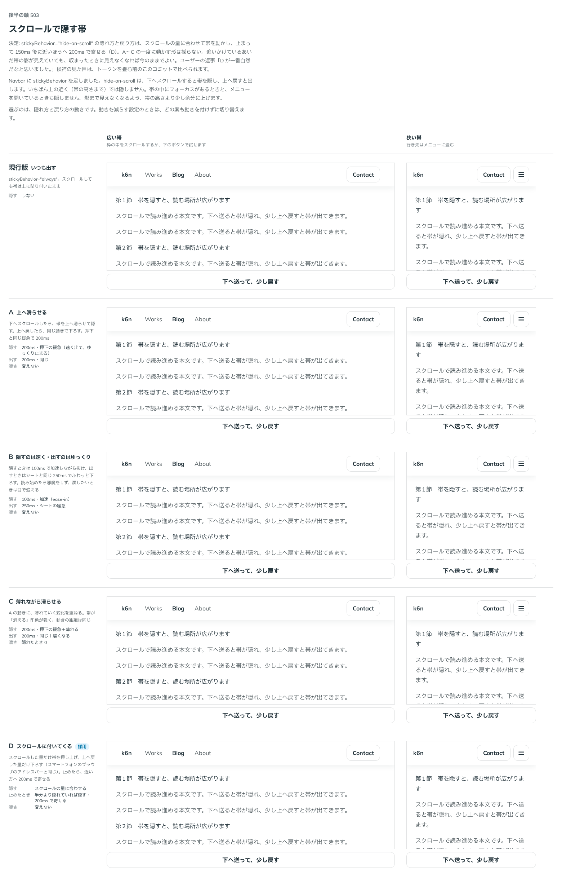

# 0454. スクロールで隠す Navbar の帯は、スクロールした分だけ動き、止まったら近いほうへ収まる

- ステータス: Accepted
- 日付: 2026-10-01
- ラウンド: 後半 軸 503

## 背景

Navbar を貼り付けた（`sticky`）とき、読み進めるあいだは帯を隠して本文の場所を広げたい場面があります（`stickyBehavior="hide-on-scroll"`）。隠れ方と戻り方の動きを決めます。出どころは、トリアージの F35 です。

## 候補

比較は、決めた時点のコミット `6e91044` の比較のストーリー（`design/stories/axis-503-navbar-hide-on-scroll.stories.tsx`）です。列は「広い帯」「狭い帯」で、枠の中をスクロールするか、ボタンで「下へ送って、少し戻す」を試せます。止めた画像では動きが見えないので、各案の動きを表にします。

| 案                               | 隠れるとき                                                                                                            | 戻るとき                                           | 濃さ         |
| -------------------------------- | --------------------------------------------------------------------------------------------------------------------- | -------------------------------------------------- | ------------ |
| 現行版                           | 隠さない（`always`）                                                                                                  | -                                                  | -            |
| A 上へ滑らせる                   | 下へ動いたら一度に滑らせる。200ms・押下の緩急                                                                         | 上へ動いたら同じ動きで下ろす。200ms                | 変えない     |
| B 隠すのは速く・出すのはゆっくり | 100ms・加速（ease-in）で抜ける                                                                                        | 250ms・シートの緩急で下ろす                        | 変えない     |
| C 薄れながら滑らせる             | A の動きに、薄れる変化を重ねる                                                                                        | 200ms・同じ動きで濃くなる                          | 隠れたとき 0 |
| D スクロールに付いてくる（採用） | スクロールした量だけ帯を押し上げる。止まって 150ms 後に、半分より隠れていれば隠し、そうでなければ出す。200ms で寄せる | 上へ戻した量だけ下ろす。止まったら同じく近いほうへ | 変えない     |

## 決定

**D を採用します。** `stickyBehavior="hide-on-scroll"` の帯は、スクロールした分だけ動き、止まって 150ms 後に近いほうへ収まります。A〜C のように、向きが変わったところで一気に動かす形は採りません。

- 追いかけているあいだは、帯の影が少し見えます。隠れて収まると影も消えるので、今のままにします
- いちばん上の近く（帯の高さまで）、帯の中にフォーカスがあるとき、メニューを開いているときは隠しません
- 動きを減らす設定のときは、動きを付けずに切り替えます

## 理由

ユーザーの返事の原文です。

> D が一番自然だなと思いました。

## 却下した案と理由

- A〜C: 向きが変わるたびに、決まった長さの動きで帯が動きます。指やホイールの動きとは別に帯が動くので、不自然です

## 影響

- `src/components/navbar/Navbar.tsx`: `stickyBehavior`（`always` が既定・`hide-on-scroll`）を持ちます
- `src/components/navbar/use-navbar-scroll.ts`: スクロールの量を帯の押し上げに写し、止まったら近いほうへ寄せます
- `design/tokens.css`: 影まで見えなくなるよう余分に押し上げる幅 `--navbar-hide-shadow-room` だけを残します。比べるためだけの動きのトークン（`--navbar-hide-*`・`--navbar-show-*`・`--navbar-hide-opacity`・`--navbar-hide-follow`）は、実装のコミット `57b7885` で畳んで消しました
- 比較のストーリーは消しました

## 原則への反映

原則 14 に、貼り付けた帯をスクロールで隠すときの動き（決まった長さの動きではなく、使う人の操作にそのまま付いていく）を足しました。

## 比較画像

決めた時点のコミットは、比較が `6e91044`、実装が `57b7885` です。`git checkout 6e91044 && pnpm storybook` で、比較のストーリー（`Design Review/503 スクロールで隠す帯`）を決めたときの部品のまま開けます。
