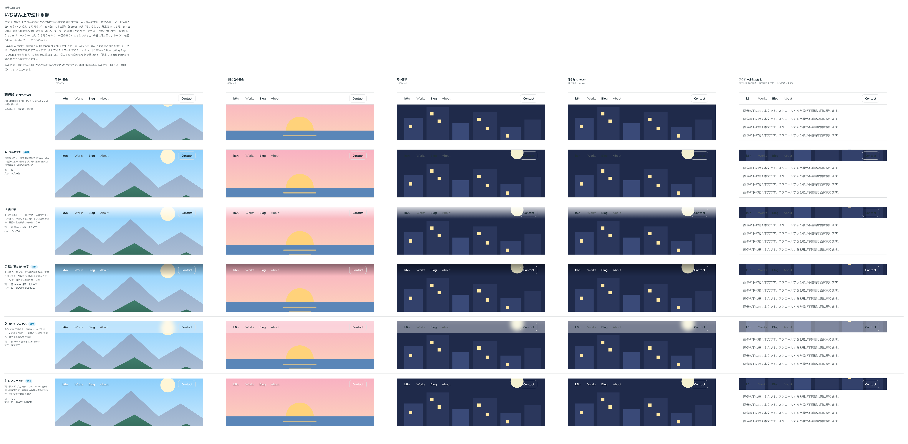

# 0455. いちばん上で透かす Navbar の文字の読ませ方は、transparentVariant で選ぶ

- ステータス: Accepted
- 日付: 2026-10-01
- ラウンド: 後半 軸 504

## 背景

Navbar をヒーロー画像に重ね、いちばん上では透かしてスクロールしたら白い面に戻す形（`stickyBackdrop="transparent-until-scroll"`）を足します。透かしているあいだは、画像の上に文字が載ります。画像は利用者が選ぶので、明るい・中間・暗い画像のどれでも文字が読めるように、守り方を決めます。出どころは、トリアージの F35 です。

## 候補

比較は、決めた時点のコミット `6e91044` の比較のストーリー（`design/stories/axis-504-navbar-transparent-top.stories.tsx`）です。列は「明るい画像」「中間の色の画像」「暗い画像」「行き先に hover」「スクロールしたあと」です。

| 案                         | 面                              | 文字                   |
| -------------------------- | ------------------------------- | ---------------------- |
| 現行版                     | 白い面と細い線（`solid`）       | 本文の色               |
| A 透かすだけ（採用・既定） | なし                            | 本文の色               |
| B 白い幕                   | 白 85% から透明へ（上から下へ） | 本文の色               |
| C 暗い幕と白い文字（採用） | 黒 45% から透明へ（上から下へ） | 白（淡い文字は白 80%） |
| D 淡いすりガラス（採用）   | 白 40%・後ろを 12px ぼかす      | 本文の色               |
| E 白い文字と影（採用）     | なし                            | 白・黒 40% の淡い影    |

## 決定

**A・C・D・E を `transparentVariant` で選べるようにし、既定は A（`plain`）にします。** 名前は A が `plain`、C が `scrim`、D が `frosted`、E が `text-shadow` です。B（白い幕）は作りません。

- A: 明るい画像向け。暗い画像では、使う側が文字の色を合わせます
- C: 写真の見出しの上で読めます。明るい画像では上端が暗くなります
- D: 画像の色が透けて見え、文字は本文の色のままです
- E: 画像をいちばん素のまま見せます。白い背景では読めません
- スクロールしたあとは、どの案も不透明な白い面と境目に戻ります

## 理由

ユーザーの返事の原文です。

> どのパターンも欲しいなと思いつつ、ACDEかなと。Bはユースケースが少なさそうなので、一旦作らないことにします。

## 却下した案と理由

- B 白い幕: 使う場面が少ないので、作りません。必要になったら足します

## 影響

- `src/components/navbar/Navbar.tsx`: `stickyBackdrop` に `transparent-until-scroll` を足し、`transparentVariant`（`plain` が既定・`scrim`・`frosted`・`text-shadow`）を持ちます
- `design/tokens.css`: 部品のトークン（`--navbar-scrim`・`--navbar-frosted-*`・`--navbar-on-image-fg` など）を足しました。比べるためだけの `--navbar-top-*` は、実装のコミット `57b7885` で畳んで消しました
- 比較のストーリーは消しました

## 原則への反映

原則 6 に、置かれる地で色を変える例として、画像の上の帯の文字を足しました。

## 比較画像

決めた時点のコミットは、比較が `6e91044`、実装が `57b7885` です。`git checkout 6e91044 && pnpm storybook` で、比較のストーリー（`Design Review/504 いちばん上で透ける帯`）を決めたときの部品のまま開けます。
