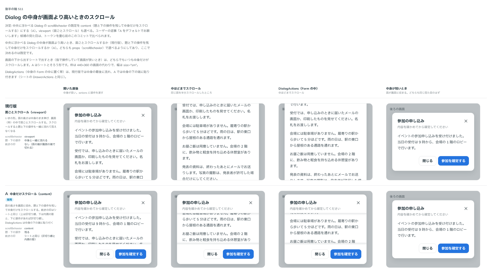

# 0457. 中央の Dialog は、題と下の操作を止めて中身だけスクロールするのが既定

- ステータス: Accepted
- 日付: 2026-10-02
- ラウンド: 後半 軸 511

## 背景

中央に浮かべる Dialog の中身が画面より高いとき、面ごとスクロールするか、題と下の操作を残して中身だけスクロールするかを決めました（トリアージ F31）。シートはすでに中身だけをスクロールします。

## 候補

比較は、決めた時点のコミット `f8c1d3e` の比較のストーリー（`design/stories/axis-511-dialog-scroll.stories.tsx`）です。列は「開いた直後」「中ほどまでスクロール」「DialogActions（Form の中）」「中身が短いとき」です。

| 案     | スクロールのしかた                                                                        |
| ------ | ----------------------------------------------------------------------------------------- |
| 現行版 | 面ごとスクロール（viewport）。題と下の操作も一緒に流れて見えなくなる                      |
| A      | 中身だけスクロール（content）。題と下の操作は残り、続きの印はシートと同じ（区切り線・影） |

## 決定

**A。中身だけスクロールする content を既定にします。** 面の高さは画面に収め、題と下の操作は止めます。面ごとスクロールする viewport も props（`scrollBehavior`）で選べます。`DialogActions`（中身の Form の中に置く帯）は、中身の下の端に貼り付きます（シートの `DrawerActions` と同じ）。AlertDialog は Dialog を包むので同じ見え方になります。

## 理由

ユーザーの返事の原文です。

> A をデフォルトでお願いします

題と下の操作が見えていれば、長い中身をスクロールしても、何の面か・どう終えるかを見失いません。シートと同じ形にそろうので、重なる面の挙動が揃います。

## 却下した案と理由

面ごとスクロールは、スクロールすると題と確定のボタンが画面の外へ流れます。選べる形として残し、既定にはしません。

## 影響

- `src/components/dialog/Dialog.tsx`: `scrollBehavior` の既定が content になります。高い Dialog の見え方が変わります（AlertDialog も同じ）。既定が変わることは破壊的変更にあたるかもしれませんが、0.x なので `feat:` のままにしました
- `src/internal/sheet/SheetMoreCue.tsx`・`use-more-cues.ts`・`src/internal/overlay/overlay-actions.tsx`: 続きの印と、中身に貼り付ける下の帯（`dialog-scroll`）を、シートと共有します
- Dialog の Docs に、中身が長いときの例を足しました
- `src/internal/overlay/overlay-actions.tsx`: 中身に貼り付けた帯の高さを、スクロールする中身の `scroll-padding-bottom` にします。Tab で帯の下に隠れた欄へ進むと、欄を帯の上まで送ります。帯の中にフォーカスがあるあいだは外します（開いた直後に帯のボタンへフォーカスしても、中身をスクロールさせないため）。シート・Inspector の帯も同じです。レビューで「お勧めで」と返事をもらいました
  - 欄ごとの `scroll-margin` では直りません。Chrome は入力欄にフォーカスしたとき、欄ではなくカーソルが見えるところまでしかスクロールしないためです

## 原則への反映

[原則 16](../principles.md#16-重なる面は指の動きで浮かべるかシートにする)に、中央の面もシートと同じく題と下の操作を止めて中身だけをスクロールする、を足しました。

## 比較画像

決めた時点のコミットは、比較が `f8c1d3e`、実装が `ec5558e`（直しは `0a9553c`）です。 `git checkout f8c1d3e && pnpm storybook` で、比較のストーリーを決めたときの部品のまま開けます。
