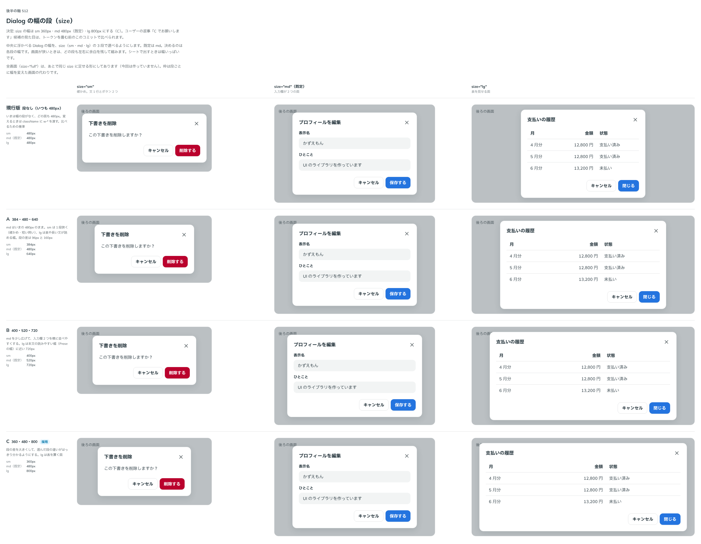

# 0458. Dialog の幅の段は sm 360・md 480（既定）・lg 800

- ステータス: Accepted
- 日付: 2026-10-02
- ラウンド: 後半 軸 512

## 背景

Dialog の幅がいつも 480px で、確かめの短い問いにも表を置く面にも同じ幅でした。`size`（sm・md・lg）の 3 段を足し、各段の幅を決めました（トリアージ F88）。

## 候補

比較は、決めた時点のコミット `e1ff491` の比較のストーリー（`design/stories/axis-512-dialog-size.stories.tsx`）です。列は sm（確かめ）・md（入力欄 2 つ）・lg（表）です。

| 案     | sm・md・lg         |
| ------ | ------------------ |
| 現行版 | 段なし（480 のみ） |
| A      | 384・480・640      |
| B      | 400・520・720      |
| C      | 360・480・800      |

## 決定

**C。sm は 360px、md は 480px（既定）、lg は 800px にします。** 画面が狭いときは、どの段も左右に余白を残して縮みます。シートで出すときは幅いっぱいです。全画面（`size="full"`）は「あとで」なので足していませんが、同じ props に足せる形です。

## 理由

ユーザーの返事の原文です。

> C でお願いします

段の差を大きくすると、選んだ段の違いがはっきり分かります。lg は表を置く面として十分な幅です。md は今の 480px のままなので、既定で見た目は変わりません。

## 却下した案と理由

A は段の差が小さく、lg でも表が窮屈です。B は md を広げるので、既定の見え方が変わります。

## 影響

- `src/components/dialog/Dialog.tsx`: `size`。幅は `design/tokens.css` の Dialog の幅のトークンです
- 全画面の段は backlog に残しました

## 原則への反映

反映なし。段の幅は部品ごとの値で、原則の文には現れません。

## 比較画像

決めた時点のコミットは、比較が `e1ff491`、実装が `d475fde`（直しは `ec0f385`）です。 `git checkout e1ff491 && pnpm storybook` で、比較のストーリーを決めたときの部品のまま開けます。
