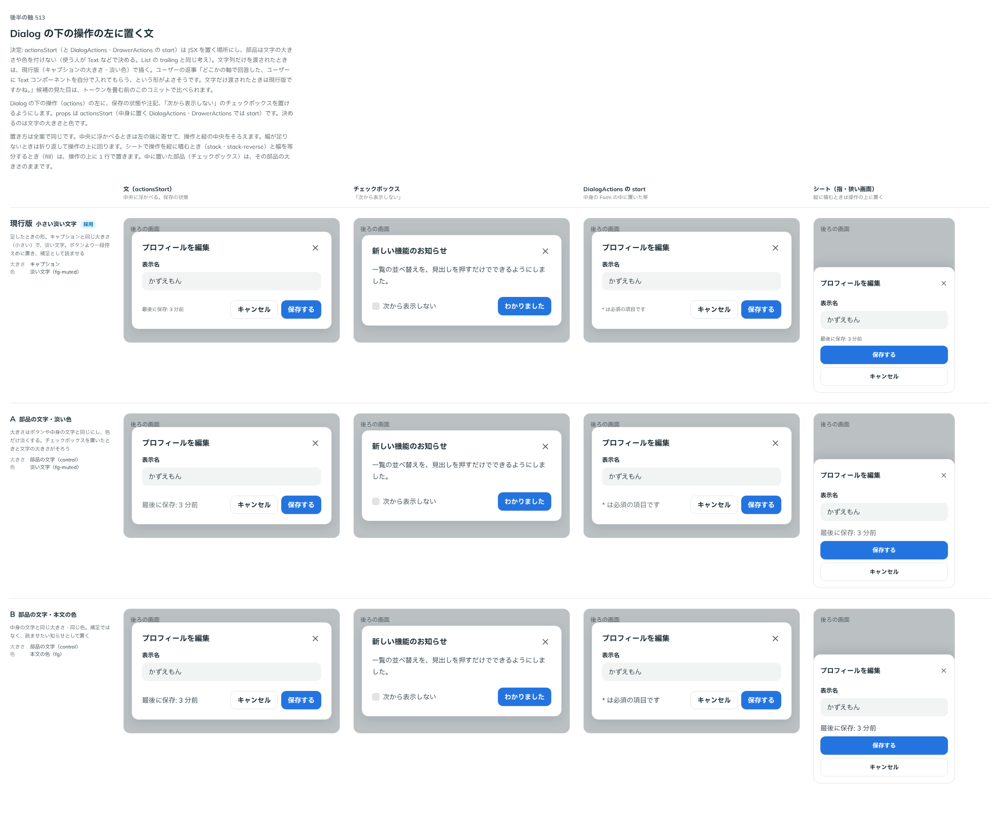

# 0459. 操作の左に置く文は、置き場だけを決める。文字だけのときはキャプションの大きさ・淡い色

- ステータス: Accepted
- 日付: 2026-10-02
- ラウンド: 後半 軸 513

## 背景

Dialog の下の操作の左に、保存の状態・注記・「次から表示しない」のチェックボックスを置く `actionsStart`（中身の中に置く `DialogActions`・`DrawerActions` では `start`）の、文字の大きさと色を決めました（トリアージ F120）。

## 候補

比較は、決めた時点のコミット `e1ff491` の比較のストーリー（`design/stories/axis-513-dialog-actions-start.stories.tsx`）です。列は「文」「チェックボックス」「DialogActions の start」「シート」です。

| 案     | 大きさ       | 色       |
| ------ | ------------ | -------- |
| 現行版 | キャプション | 淡い文字 |
| A      | 部品の文字   | 淡い文字 |
| B      | 部品の文字   | 本文の色 |

## 決定

**置き場だけを決め、要素を渡されたら文字の大きさや色は付けません。** 使う側が Text などで決めます（[ADR-0452](./0452-list-trailing.md) の List の trailing と同じ考えです）。文字だけを渡されたときは、現行版のキャプションの大きさ・淡い色で描きます。比較画像では現行版に採用の印が付いていますが、採るのは「文字だけのときの見た目」で、要素を渡したときは何も付けません。

**List の `trailing` も同じ決まりにそろえます。** 文字（数）だけを渡されたら、キャプションの大きさ・淡い色で描きます（[ADR-0452](./0452-list-trailing.md) の「中身の見た目は付けない」を、文字だけのときに限って置き換えます）。原則 20 に書いた「使う側が中身を置く枠」の決まりが、例に挙げた List の末尾と食い違わないようにするためです。レビューで「お勧めで」と返事をもらいました。

## 理由

ユーザーの返事の原文です。

> どこかの軸で回答した、ユーザーに Text コンポーネントを自分で入れてもらう、という形がよさそうです。文字だけ渡されたときは現行版ですかね。

## 却下した案と理由

A・B は、文字だけのときも一律に部品の文字にします。補足を補足として控えめに置く現行版のほうが、ボタンと並んだときの優先度が合います。

## 影響

- `src/internal/overlay/overlay-actions.tsx`: 文字列のときだけ、キャプションの大きさ・淡い色の包みを付けます
- 比べるための切り替えのトークン（`--overlay-actions-start-*`）は、決まったので畳みました
- `src/components/list/List.tsx`: `trailing` に文字（数）だけを渡したときに、キャプションの大きさ・淡い色を付けます。文字だけを渡していた項目は、見た目が小さく淡くなります

## 原則への反映

[原則 20](../principles.md#20-部品は知らないことを決めない)の「使う側が中身を置く枠」に、文字だけを渡されたときは既定の見た目で描く、を書き足しました。

## 比較画像

決めた時点のコミットは、比較が `e1ff491`、実装が `d475fde`（直しは `ec0f385`）です。 `git checkout e1ff491 && pnpm storybook` で、比較のストーリーを決めたときの部品のまま開けます。
