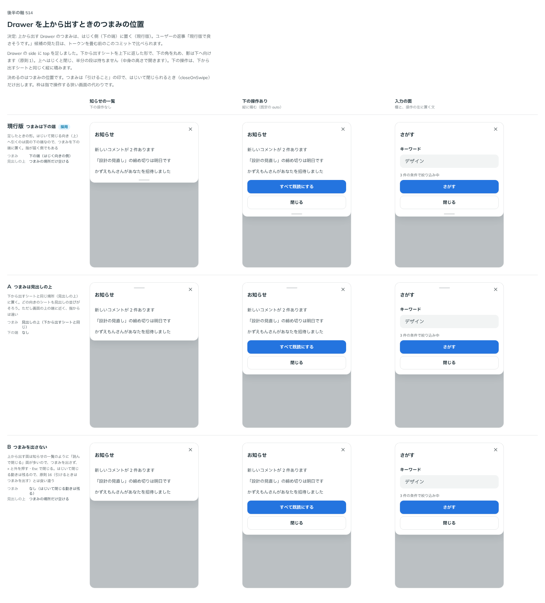

# 0460. 上から出す Drawer の取っ手は、はじく側（下の端）。半分の段は持たない

- ステータス: Accepted
- 日付: 2026-10-02
- ラウンド: 後半 軸 514

## 背景

Drawer に `side="top"` を足しました。下から出すシートを上下に返した形です。はじいて閉じる向きは上なので、つまみ（引けることの印）をどこに置くかを決めました（トリアージ F45）。

## 候補

比較は、決めた時点のコミット `f8c1d3e` の比較のストーリー（`design/stories/axis-514-drawer-top.stories.tsx`）です。列は「知らせの一覧」「下の操作あり」「入力の面」です。

| 案     | つまみ                           |
| ------ | -------------------------------- |
| 現行版 | 下の端（はじく向きの側）         |
| A      | 見出しの上（下から出すのと同じ） |
| B      | 出さない                         |

## 決定

**現行版。つまみは、はじく側（面の下の端）に置きます。** 半分の高さの段は持たず、中身の高さで開きます。下の操作のボタンは、下から出すシートと同じく縦に積みます。

## 理由

ユーザーの返事の原文です。

> 現行版で良さそうです。

はじいて閉じる向きの端にあるほうが、引けることが伝わり、指も届きます。見出しの上は画面の上の端に近く、指から遠くなります。

## 却下した案と理由

A は見出しの並びがそろいますが、指から遠く、引く向きと印の位置が逆になります。B は、はじいて閉じられるのに印がなく、「引けるときはつまみを出す」（[原則 16](../principles.md#16-重なる面は指の動きで浮かべるかシートにする)）と食い違います。

## 影響

- `src/components/drawer/Drawer.tsx`・`src/internal/sheet/SheetPopup.tsx`: 上から出す形のつまみの位置
- 比べるための切り替えのトークン（`--drawer-top-handle-*`）は畳みました
- `DrawerActions` は、上から出すときは下の安全領域の余白を付けません（`0a9553c`）

## 原則への反映

[原則 16](../principles.md#16-重なる面は指の動きで浮かべるかシートにする)の、シートのつまみについての文に、はじいて閉じる側の端に置く、を書き足しました。

## 比較画像

決めた時点のコミットは、比較が `f8c1d3e`、実装が `ec5558e`（直しは `0a9553c`）です。 `git checkout f8c1d3e && pnpm storybook` で、比較のストーリーを決めたときの部品のまま開けます。
