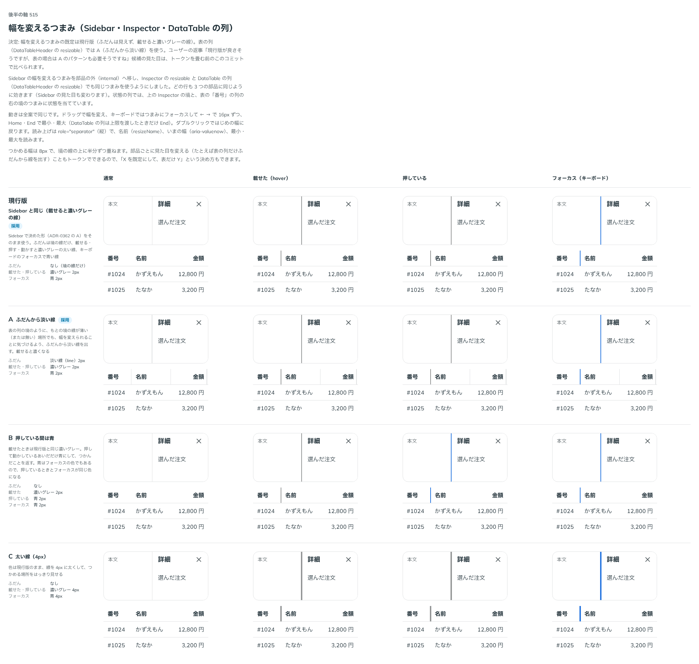

# 0461. 幅を変えるつまみは、ふだん見えず hover で線。表の列だけふだんも淡い線

- ステータス: Accepted
- 日付: 2026-10-02
- ラウンド: 後半 軸 515

## 背景

Sidebar の幅を変えるつまみ（[ADR-0362](./0362-sidebar-resize.md)）を共有の部品（`ResizeHandle`）にし、Inspector と DataTable の列でも使うことにしました。共有したつまみの見た目を、部品をまたいで決めました（トリアージ F46・F110）。

## 候補

比較は、決めた時点のコミット `e1ff491` の比較のストーリー（`design/stories/axis-515-resize-handle.stories.tsx`）です。列は「通常」「載せた」「押している」「フォーカス」で、上は Inspector の境、下は表の列の境です。

| 案     | 見た目                                                 |
| ------ | ------------------------------------------------------ |
| 現行版 | Sidebar と同じ。ふだんは見えず、載せると濃いグレーの線 |
| A      | ふだんから淡い線。載せると濃くなる                     |
| B      | 押している間だけ青                                     |
| C      | 太い線（4px）                                          |

## 決定

**既定は現行版です。** ふだんは見えず、載せる・押すと線が出ます（ADR-0362 と同じ）。**表の列（`DataTableHeader` の `resizable`）だけは A** で、ふだんから淡い線を出します。比較画像では現行版と A に採用の印が付いています。

レビューで、表の列のつまみを次のように直しました。

- 線は上下をセルの上下の余白の分だけ空け、見出しの上下の線に付けません（見出しの文字の行の高さにそろえます）。つかめる範囲はセルの高さいっぱいのままです
- 最後の列には、`resizable` でもつまみを出しません。表の端にあり、残りの幅を受け持つためです
- ふだんの線は `resizeLine` で消せます。既定は `resizable` に合わせて出します。列の境に縦の線を引いた表のように、幅を変えられることが見た目で分かるときに使います

## 理由

ユーザーの返事の原文です。

> 現行版が良さそうですが、表の場合は A のパターンも必要そうですね

レビューでの返事の原文です。

> 消せるようにしつつ、そもそもデザインとして、縦棒を上下にくっつかないようにしてほしいです

> 最後の列の右側に棒が出てきて調整できるのは違和感がありますね

> resize できるなら表示、できないなら非表示、props で上書き可能、かもですね

props の名前は、既定がほかの props（`resizable`）で決まるので、`show`・`hide` を付けない `resizeLine` にしました（[design/props.md](../props.md) の「出す／出さないの真偽値」）。

列の境目が見えない表では、幅を変えられることに気づけません。境の線がもとからある Sidebar や Inspector では、載せたときの線で足ります。

## 却下した案と理由

B は押している間の色がフォーカスと同じ青になり、見分けられません。C は太さが目立ちすぎます。

## 影響

- `src/internal/resize-handle/ResizeHandle.tsx`: 共有のつまみ。トークンは `--resize-handle-*`
- `src/components/data-table/DataTableHeader.tsx`: 表の列のつまみだけ、ふだんの色を淡い線にします。線の上下の空き（`--resize-handle-line-inset`）、最後の列でつまみを出さないこと、`resizeLine` もここです

## 原則への反映

[原則 16](../principles.md#16-重なる面は指の動きで浮かべるかシートにする)に、幅を変えられることの合図は、境目が見えないところではふだんから出す、を書き足しました。

## 比較画像

決めた時点のコミットは、比較が `e1ff491`、実装が `d475fde`（直しは `ec0f385`）です。 `git checkout e1ff491 && pnpm storybook` で、比較のストーリーを決めたときの部品のまま開けます。
