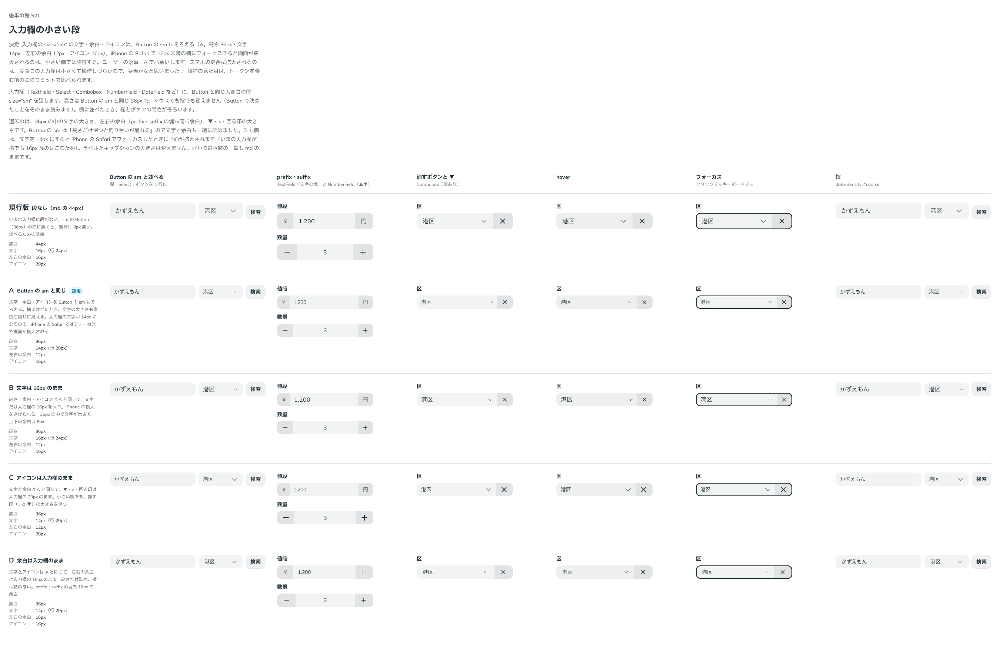

# 0463. 入力欄の size="sm" は Button の sm と同じ。小さい欄の画面拡大は許容する

- ステータス: Accepted
- 日付: 2026-10-02
- ラウンド: 後半 軸 521（トリアージ F109）

## 背景

入力欄（TextField・Select・Combobox・NumberField・DateField など）には段がなく、sm の Button（36px）の横に置くと、欄だけ 8px 高くなりました。Button の小さい段（[ADR-0424](./0424-button-size-sm.md)）と並べられる小さい段を足します。選ぶのは、36px の中の文字の大きさ、左右の余白、▼・×・回る印の大きさです。

## 候補

比較は、決めた時点のコミットの比較のストーリー（`design/stories/axis-521-field-size-sm.stories.tsx`）です。列は「Button の sm と並べる」「prefix・suffix」「消すボタンと ▼」「hover」「フォーカス」「指」です。

| 案        | 文字 | 左右の余白 | アイコン |
| --------- | ---- | ---------- | -------- |
| 現行版    | 16px | 16px       | 20px     |
| A（採用） | 14px | 12px       | 16px     |
| B         | 16px | 12px       | 16px     |
| C         | 14px | 12px       | 20px     |
| D         | 14px | 16px       | 16px     |

高さはどの案も 36px で、マウスでも指でも変えません。

## 決定

**A を採用します。** size="sm" の文字・余白・アイコンは Button の sm と同じです（高さ 36px・文字 14px・左右 12px・アイコン 16px）。横に並べたとき、文字の大きさも余白も同じに見えます。

iPhone の Safari は、16px 未満の欄にフォーカスすると画面を拡大します。小さい欄では、これを許容します。

TextField・MaskField の `size` はこれまで input の文字数を表していたので、意味が変わります（文字数から大きさの段へ）。破壊的変更です。文字数は `inputProps` で渡します。

## 理由

ユーザーの返事の原文です。

> A でお願いします。スマホの場合に拡大されるのは、実際この入力欄は小さくて操作しづらいので、妥当かなと思いました。

## 却下した案と理由

- B（文字は 16px のまま）: 拡大は避けられますが、36px の中で文字だけが大きく、Button の sm と並べたときに釣り合いません
- C・D（アイコンか余白だけ入力欄のまま）: 横に並べたとき、Button の sm と余白かアイコンがそろいません

## 影響

- `src/internal/field/field-styles.ts`・`src/internal/field/input-field-props.ts`: 入力欄の `size`（`md` | `sm`）。prefix・suffix の塊の余白、▼・×・回る印も sm の値になります
- `src/components/text-field/TextField.tsx`: `size` が文字数から大きさの段に変わります
- ラベルとキャプションの大きさ、浮かぶ選択肢の一覧（md のまま）は変えません
- prefix・suffix に置いたボタンも、欄の段に合わせて小さくなります（md のボタンを置いても sm の欄では sm の大きさ）。欄の中では欄の段にそろえるのが自然なので、このままにし、`size` の JSDoc に書きました（レビューで「お勧めで」）

## 原則への反映

[原則 11](../principles.md#11-文字の大きさは入力方式で切り替える)の「入力欄の値と選択肢は、指でも小さくしません」の文を、段ごとの書き方に書き換えました。標準の段は指でも小さくせず、小さい段はボタンの小さい段と同じ文字にして、画面の拡大を受け入れます。開いた選択肢は段によらず小さくしません。

## 比較画像

決めた時点のコミットは、比較が `94163ef`、実装が `dcae1fb` です。`git checkout 94163ef && pnpm storybook` で、比較のストーリーを決めたときの部品のまま開けます。
