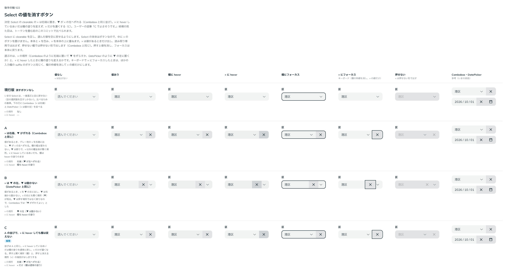

# 0464. Select の clearable の × は右端に置き、▼ は × の左へずれる。× に載せても欄の塗りは変えない

- ステータス: Accepted
- 日付: 2026-10-02
- ラウンド: 後半 軸 522（トリアージ F21）

## 背景

Select は一度選ぶと空に戻せませんでした。選んだ値を空に戻す × を足します。Select の本体はボタンなので、中に × のボタンを置けません。本体と × を包み、× を本体の上に重ねます。選ぶのは、× の場所と、× に hover したときに欄の塗りも変えるかです。

## 候補

比較は、決めた時点のコミットの比較のストーリー（`design/stories/axis-522-select-clear.stories.tsx`）です。列は「値なし」「値あり」「欄に hover」「× に hover」「欄にフォーカス」「× にフォーカス」「押せない」「Combobox・DatePicker（参考）」です。

| 案        | × の場所                           | × に hover したとき            |
| --------- | ---------------------------------- | ------------------------------ |
| 現行版    | なし                               | —                              |
| A         | 右端（▼ が左へずれる。Combobox）   | 欄も hover の塗り              |
| B         | ▼ の左（▼ は動かない。DatePicker） | 欄も hover の塗り              |
| C（採用） | A と同じ                           | × だけ濃くする。欄は通常の塗り |

## 決定

**C を採用します。** × は右端、▼ は × の左へずれます（Combobox と同じ）。欄の幅は変わりません。× に hover しているあいだは欄の塗りを通常に戻し、× だけを濃くします。

× は値があるときだけ出し、読み取り専用では出さず、押せない欄では押せない形で出します（Combobox と同じ）。押すと値を消し、フォーカスは本体に戻ります。キーボードで × にフォーカスしたときは、欄の枠線を消して × の線だけにします。

## 理由

ユーザーの返事の原文です。

> C でよさそうです。

## 却下した案と理由

- A: × に hover しても欄全体が hover の塗りのままなので、押すと開く場所（欄）と、押すと消える場所（×）の境目がはっきりしません
- B: 右端に ▼ が残るので Combobox と並びが変わります。▼ は押す場所ではなく飾りなので、ずらしてよいと判断しました

## 影響

- `src/components/select/Select.tsx`: `clearable`・`clearName`。本体と × を包み、× を本体の上に重ね、本体の右の余白を × の分だけ広げます。端のものが増えても欄の幅を変えない並び（[原則 8](../principles.md#8-入力欄の様式は編集できるかで決まる)）です

## 原則への反映

反映なし。端にもとからあるものが押せないとき、あとから出るボタンを端に置く並び（原則 8）の範囲内です。

## 比較画像

決めた時点のコミットは、比較が `206e075`、実装が `f8ea07f` です。`git checkout 206e075 && pnpm storybook` で、比較のストーリーを決めたときの部品のまま開けます。
