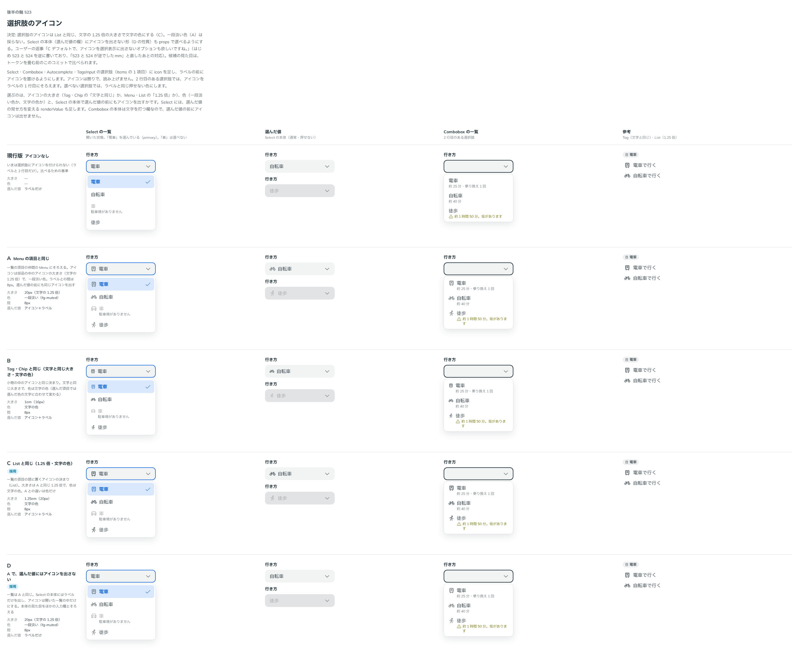

# 0465. 選択肢のアイコン（ListboxItem の icon）は、文字の 1.25 倍・文字の色

- ステータス: Accepted
- 日付: 2026-10-02
- ラウンド: 後半 軸 523（トリアージ F10）

## 背景

Select・Combobox・Autocomplete・TagsInput の選択肢（items の 1 項目）には、ラベルの前にアイコンを置く口がありませんでした。`icon` を足すにあたり、アイコンの大きさと色を決めます。アイコンは飾りで、読み上げません。2 行目のある選択肢では、アイコンをラベルの 1 行目にそろえます。選べない選択肢では、ラベルと同じ押せない色にします。

## 候補

比較は、決めた時点のコミットの比較のストーリー（`design/stories/axis-523-listbox-item-icon.stories.tsx`）です。列は「Select の一覧」「選んだ値」「Combobox の一覧」「参考（Tag・List）」です。

| 案        | 大きさ           | 色         | 選んだ値の前     |
| --------- | ---------------- | ---------- | ---------------- |
| 現行版    | アイコンなし     | —          | ラベルだけ       |
| A         | 1.25 倍          | 一段淡い色 | アイコン＋ラベル |
| B         | 1em（Tag・Chip） | 文字の色   | アイコン＋ラベル |
| C（採用） | 1.25 倍          | 文字の色   | アイコン＋ラベル |
| D         | A と同じ         | A と同じ   | ラベルだけ       |

## 決定

**C を採用します。** 選択肢のアイコンは、List の項目の頭のアイコンと同じく、文字の 1.25 倍で文字の色です。ラベルとの間は 8px です。Menu の項目と同じ一段淡い色（A）は採りません。

## 理由

ユーザーの返事の原文です。最初は 523 と 524 を逆に書き、「523 と 524 が逆でしたmm」と直しています。この決定の言葉は、524 の欄に書かれていました。

> 選択肢が常に下に出るようにできますか？

> story を見やすいようにしてほしいという意図でした。直してもらった後に選びます。

> C デフォルトで、アイコンを選択表示に出さないオプションも欲しいですね。

## 却下した案と理由

- A（一段淡い色）: Menu とは仲間になりますが、選んだ項目の文字が青のとき、アイコンだけ淡いままになります。List の項目と色の決め方がずれます
- B（1em）: Tag・Chip は小物なので文字と同じ大きさですが、一覧の項目は 1.25 倍の List に寄せます

## 影響

- `src/internal/listbox/listbox-styles.ts`: 項目の頭のアイコンの大きさ（1.25em）と色（文字の色）。比べるためのトークン（`--listbox-item-icon-*`）は畳みました
- `src/components/select/Select.tsx`: 選んだ値の前のアイコン

## 原則への反映

[原則 21](../principles.md#21-アイコンは文字に合わせる)の「小物や一覧の項目の頭に置くアイコン」に、選択肢も入ることが分かるよう書き直しました。

## 比較画像

決めた時点のコミットは、比較が `bbe5886`（見やすく直したのは `2d61686`）、実装が `fce31b3` です。`git checkout bbe5886 && pnpm storybook` で、比較のストーリーを決めたときの部品のまま開けます。
