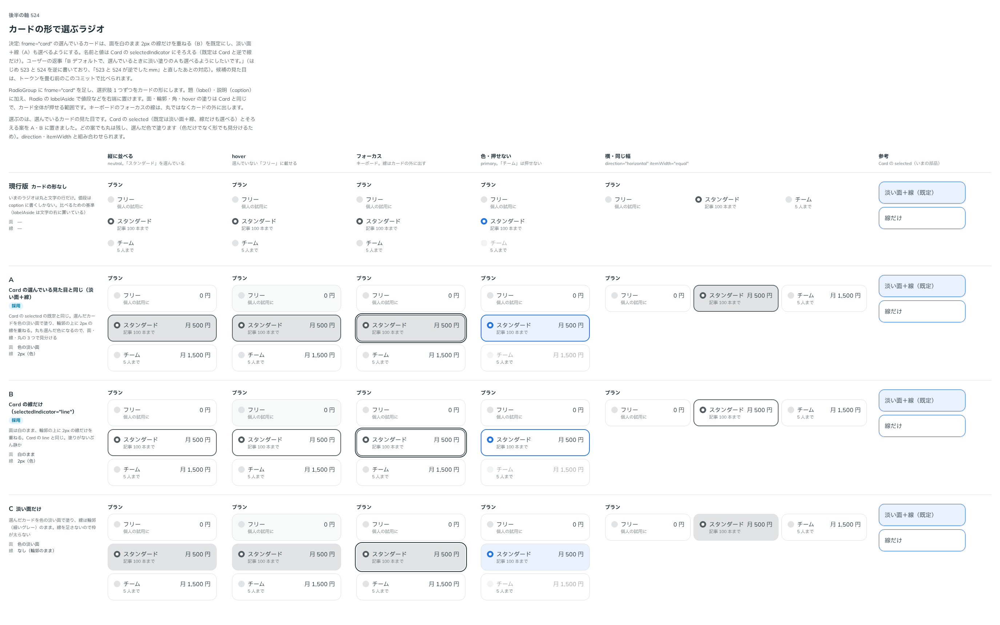

# 0467. カードの形のラジオの選んでいるカードは、白い面に 2px の線だけ。淡い面＋線は selectedIndicator="fill"

- ステータス: Accepted
- 日付: 2026-10-02
- ラウンド: 後半 軸 524（トリアージ F13）

## 背景

RadioGroup に frame="card" を足し、選択肢 1 つずつをカードの形にしました。選んでいるカードの見た目を決めます。Card の selected（既定は淡い面＋線、線だけも選べる）とそろえる案を A・B に置き、どの案でも丸は残します。

## 候補

比較は、決めた時点のコミットの比較のストーリー（`design/stories/axis-524-radio-card.stories.tsx`）です。列は「縦に並べる」「hover」「フォーカス」「色・押せない」「横・同じ幅」「参考（Card の selected）」です。

| 案        | 面             | 線                 |
| --------- | -------------- | ------------------ |
| 現行版    | カードの形なし | —                  |
| A         | 色の淡い面     | 2px（色）          |
| B（採用） | 白のまま       | 2px（色）          |
| C         | 色の淡い面     | なし（輪郭のまま） |

## 決定

**B を採用します。** 選んでいるカードは、面を白のまま、輪郭の上に 2px の線だけを重ねます。淡い面＋線（A）は `selectedIndicator="fill"` で選べます。

名前と値は Card にそろえます（`selectedIndicator`: `line` | `fill`）。ただし既定だけは Card（`fill`）と逆にします。選択肢の中に丸の印があるので、面まで塗らなくても選んでいることが分かるためです。

## 理由

ユーザーの返事の原文です。最初は 523 と 524 を逆に書き、「523 と 524 が逆でしたmm」と直しています。この決定の言葉は、523 の欄に書かれていました。

> B デフォルトで、選んでいるときに淡い塗りのAも選べるようにしたいです。

## 却下した案と理由

- C（淡い面だけ）: 線を足さないので枠が太らず静かですが、押せる範囲の輪郭と選んだ印が弱くなります

## 影響

- `src/components/radio/Radio.tsx`・`src/internal/choice/choice-styles.ts`・`src/internal/choice/choice-group-context.ts`: `selectedIndicator`（既定は `line`）。比べるためのトークン（`--radio-card-*`）は畳みました
- カードの形の選択肢を横に並べて高さをそろえたときも、中身を上に詰めます

## 原則への反映

[原則 6](../principles.md#6-色は役割で持つ)の「押して選ぶカード」の文を書き換えました。丸などの印が中にあるカードは線だけ、印がないカードは淡い面と線が既定です。

## 比較画像

決めた時点のコミットは、比較が `650a783`、実装が `3ddb35f` です。`git checkout 650a783 && pnpm storybook` で、比較のストーリーを決めたときの部品のまま開けます。
