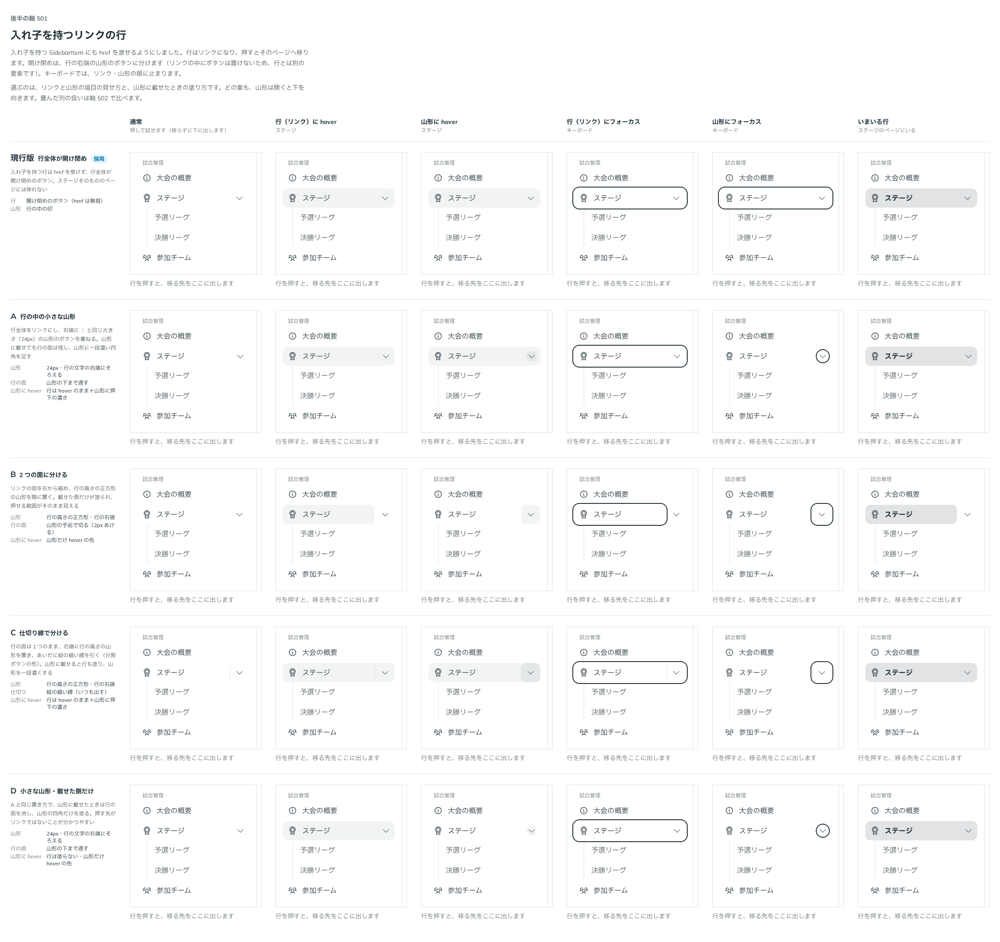
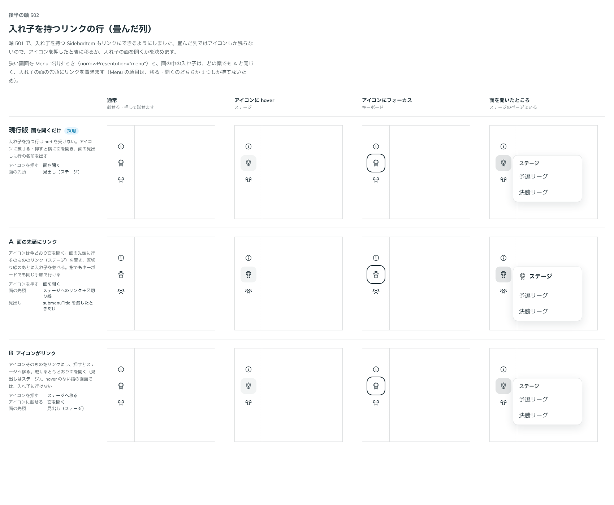

# 0469. 子を持つ SidebarItem はリンクにしない（現行版のまま）

- ステータス: Accepted
- 日付: 2026-10-02
- ラウンド: 後半 軸 501・502

## 背景

子（入れ子）を持つ `SidebarItem` は `href` を渡してもリンクにならず、行全体が開け閉めのボタンです。そのため、入れ子をまとめる行そのもののページ（たとえば「ステージ」の一覧ページ）には移れません。出どころは、トリアージの F96 です。

試作（`0ebd6bf`）では、子を持つ行も `href` を受けてリンクにし、開け閉めを行の右端の山形のボタンに分けました。リンクの中にボタンは置けないので、山形は行とは別の要素で、キーボードではリンク・山形の順に止まります。山形の名前は `toggleName` で渡す形にしました。そのうえで、広げた列でのリンクと山形の境目（軸 501）と、畳んだ列での扱い（軸 502）を比べました。

## 候補

### 軸 501: 広げた列での、リンクと山形の境目

| 案                         | 中身                                                                                                                 |
| -------------------------- | -------------------------------------------------------------------------------------------------------------------- |
| 現行版（採用）             | 行全体が開け閉めのボタン。`href` は受けず、山形は行の中の印                                                          |
| A 行の中の小さな山形       | 行全体をリンクにし、右端に ︙ と同じ大きさ（24px）の山形のボタンを重ねる。山形に載せても行の面は残し、山形を一段濃く |
| B 2 つの面に分ける         | リンクの面を右から縮め、行の高さの正方形の山形を隣に置く。載せた側だけを塗る                                         |
| C 仕切り線で分ける         | 行の面は 1 つのまま、右端に行の高さの山形を置き、あいだに縦の細い線を引く（分割ボタンの形）                          |
| D 小さな山形・載せた側だけ | A と同じ置き方で、山形に載せたときは行の面を消し、山形の四角だけを塗る                                               |

### 軸 502: 畳んだ列での、入れ子を持つリンクの行

| 案                 | 中身                                                                                                                             |
| ------------------ | -------------------------------------------------------------------------------------------------------------------------------- |
| 現行版（採用）     | アイコンに載せる・押すと横に面を開き、面の見出しに行の名前を出す。行そのものへは移れない                                         |
| A 面の先頭にリンク | アイコンは面を開く。面の先頭に行そのもののリンクを置き、区切り線のあとに入れ子を並べる。見出しは `submenuTitle` を渡したときだけ |
| B アイコンがリンク | アイコンを押すと行のページへ移り、載せると面を開く。hover のない指の画面では入れ子に行けない                                     |

試作では、狭い画面の Menu（`narrowPresentation="menu"`）と面の中の入れ子は、どの案でも A と同じく面の先頭にリンクを置く形にしていました。

## 決定

**どちらの軸も現行版のままにします。** 子を持つ `SidebarItem` はリンクにせず、行全体で開け閉めします。トリアージの F96 は採りません。

- 試作の山形のボタン、`toggleName`、比べるための切り替え、そのためのトークンは戻しました
- 入れ子をまとめる行のページが要るときは、まとめ方を変えます（たとえば、そのページを入れ子の 1 行目に置く、まとめの行を見出しの `SidebarSection` にする）

## 理由

ユーザーの返事の原文です。

> 501/502 は現行版とします。他のユースケースからつけ足したものですが、サンプルにおける［ステージ］はグループの名前であり、現時点ではページを作るのであればグルーピングを変更するのが適切であると判断しました。将来的にブラッシュアップの可能性はあります。

## 却下した案と理由

- 501 の A〜D、502 の A・B: 行が「移る」と「開く」の 2 つの役を持つことになり、境目の見せ方と、畳んだ列・狭い画面での扱いを別々に決める必要が出ます。見本の「ステージ」はグループの名前で、ページが要るならまとめ方を変えるほうが素直なので、今は採りません。将来見直す余地は残します（backlog）

## 影響

- `src/components/sidebar/`: 変わりません（`main` のまま）
- 試作と比較のストーリーは、戻したコミットで消えています

## 原則への反映

反映なし。今の Sidebar の振る舞いを変えない決定です。

## 比較画像

軸 501・502 の比較のストーリーを撮りました（現行版に「採用」の印）。

決めた時点のコミットは、比較が `a294709`、試作が `0ebd6bf`、試作を戻したのが `ecb50fb` です。
