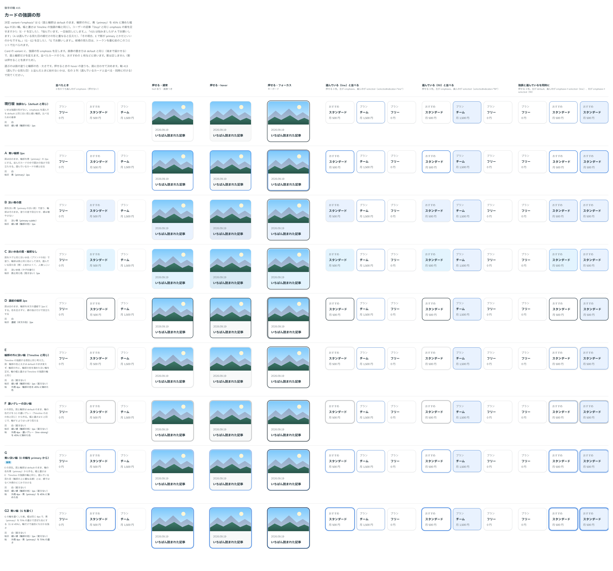

# 0470. Card の強調の形（variant="emphasis"）は輪郭の外の primary の淡い輪（G）

- ステータス: Accepted
- 日付: 2026-10-02
- ラウンド: 後半 軸 415

## 背景

Card の強調の形（`variant="emphasis"`）の見た目を決めました。並べたカードのうち 1 枚（おすすめのプランなど）を目立たせる形です。画像の置き方は default と同じ（端まで届かせる）で、影は足しません（影は押せることを表すため）。

同じ Card には選んでいる見た目（`selected`、[ADR-0403](./0403-card-selected.md)・[0404](./0404-card-selected-color.md)）があり、淡い面と線を重ねる形（fill）と、輪郭の上に線だけを重ねる形（line）を持ちます。強調と選んでいるカードが並んだとき、また 1 枚に両方が付いたときに紛れないことを条件にしました。

## 候補

比較は、比較のコミット `349db4c` の比較のストーリー（`design/stories/axis-415-card-emphasis.stories.tsx`）です。列は「並べたとき」「押せる・通常」「押せる・hover」「押せる・フォーカス」「選んでいる（line）と並べる」「選んでいる（fill）と並べる」「強調と選んでいるを同時に」です。

| 案        | 面                         | 輪郭                      | 輪郭の外の輪                         |
| --------- | -------------------------- | ------------------------- | ------------------------------------ |
| 現行版    | 白                         | 細線（輪郭の色）1px       | なし                                 |
| A         | 白                         | 青（primary）2px          | なし                                 |
| B         | 淡い青（primary の淡い面） | 細線（輪郭の色）1px       | なし                                 |
| C         | 淡い水色（タグの塗り）     | 面と同じ色（見えない）1px | なし                                 |
| D         | 白                         | 濃紺（本文の色）2px       | なし                                 |
| E         | 白                         | 細線（輪郭の色）1px       | 4px・輪郭の色を 45% に薄めた色       |
| F         | 白                         | 細線（輪郭の色）1px       | 4px・濃いグレー（line-strong）を 45% |
| G（採用） | 白                         | 細線（輪郭の色）1px       | 4px・青（primary）を 45% に薄めた色  |
| G2        | 白                         | 細線（輪郭の色）1px       | 4px・青（primary）を 70%             |

E〜G2 の輪の幅と濃さは、Timeline の強調する項目の輪（[ADR-0210](./0210-timeline-emphasis.md)）と同じです。E・F は「Timeline と同じ案を」という返事を受けて、G・G2 は「E で primary の色を」という返事を受けて足しました。

## 決定

**G にします。** 面と 1px の輪郭は default のまま変えず、輪郭の外に幅 4px の淡い輪を足します。輪の色は primary を 45% に混ぜた色で、幅と濃さは Timeline の強調の輪と同じです。押せるときの影・hover の塗り・押すと沈む動きは default の押せるカードと同じで、輪は影と重ねて描きます。

輪の色は Card の `color`（選んでいる見た目の色）と合わせました。`color` の前景の色（primary は青、secondary はピンクの前景用、neutral は strong の灰）を薄めて輪にします。既定の `color="primary"` で G の見た目になります。強調と選んでいる見た目を 1 枚に付けたときは、同じ色の輪と線になります。

## 理由

ユーザーの返事の原文です（括弧の中はその間にしたこと）。

> Step? と同じ emphasis の案を足せますか?

（E・F を足した）

> 悩んでいます。一旦後回しにします。

> 415 は悩みましたが A でお願いします

（A は、選んでいる見た目の線だけの形（line）と重なると伝えた）

> その場合、E で影が primary とかだといいのかもですね。

（G・G2 を足した）

> G でお願いします

A の青い輪郭は、選んでいる line の形と同じ青い線で、並べると見分けられませんでした。輪郭の外ににじむ輪にすると、選んでいる印（輪郭の上に重ねる線・面の塗り）とは線か外側のにじみかで分かれ、そのうえで A の「青で目立たせる」が残ります。

## 却下した案と理由

- A（青い輪郭 2px）: 選んでいるカードの線（line）と同じ青い線になり、強調と選んでいるが重なります
- B（淡い青の面）・C（淡い水色の面）: 面の塗りで目立たせるので、選んでいるカードの淡い面（fill）に置き換わって見えます
- D（濃紺の輪郭 2px）: 1 枚に強調と選んでいるを付けたとき、濃い輪郭が選んでいる線を隠します
- E（輪郭の色の淡い輪）: 輪が淡すぎて、並べたときに強調だと分かりません
- F（濃いグレーの淡い輪）: 輪は見えますが、グレーで、強調としての色がありません
- G2（青を 70% の輪）: 輪が濃く、キーボードのフォーカスの線に似ます

## 影響

- `src/components/card/Card.tsx`: `variant="emphasis"` は、面・輪郭・hover の塗りを default のまま変えず、輪郭の外に輪を描きます。輪の色は `color` の前景の色（部品の中の `--card-accent`。選んでいる線と共有）を薄めて作ります。`color` の JSDoc に、強調の輪の色にもなることを書きました
- `design/tokens.css`: `--card-emphasis-halo`（Timeline の強調の輪の幅）・`--card-emphasis-halo-mix`（Timeline の強調の輪の濃さ）を持ちます。比べるためだけに置いた `--card-emphasis-fill`・`--card-emphasis-fill-hover`・`--card-emphasis-line`・`--card-emphasis-line-width`・`--card-emphasis-halo-base` は、G の値に畳んで消しました
- Card の Docs に「強調の形」のストーリー（並べたとき・色ごとの押せる状態・選んでいるカードと並べた例）を足しました

## 原則への反映

**[原則 6](../principles.md#6-色は役割で持つ) の「選んでいることを示す印」の項の続きに、強調の文を足しました。** 並んだものの 1 つを目立たせる強調は、選んでいる印と分け、面や線は変えずに外側に部品の色の淡い輪を足す、という考えです。Timeline の強調（[ADR-0210](./0210-timeline-emphasis.md)、そのときは反映なし）で始まった形を、カードにも広げたので、原則の文にしました。数値（幅・濃さ）は書いていません。

## 比較画像

決めた時点のコミットは比較が `349db4c`、実装が `37505ee` です。`git checkout 349db4c && pnpm storybook` で、比較のストーリー（`Design Review/415 カードの強調の形`）を決めたときの部品のまま開けます。
